# 图神经网络

1. [2020大风口！什么是图神经网络？有什么用？终于有人讲明白了](https://cloud.tencent.com/developer/article/1576402)
2. 《深入浅出图神经网络》
3. [图神经网络从入门到入门](https://zhuanlan.zhihu.com/p/136521625)
4. [图神经网络(GNN)的简介](https://developer.aliyun.com/article/694432)
5. [简单的图神经网络介绍](https://www.jiqizhixin.com/articles/2019-02-15-14)
6. [初探GNN：《The Graph Neural Network Model 》](https://zhuanlan.zhihu.com/p/76290138)
7. [图神经网络：The Graph Neural Network Model](https://zhuanlan.zhihu.com/p/85768094)

## 图的相关概念

### 图和属性图

**要了解图神经网络，首先要了解图。**图G=(V,E)是由节点（Vertex）和边（Edge）组成的，如下图所示。一般图中的节点表示实体对象（比如一个用户、一件商品、一辆车、一张银行卡等都可以作为节点），边(v1,v2)代表事件或者实体之间的特殊关系（比如用户和商品之间的购买关系）。

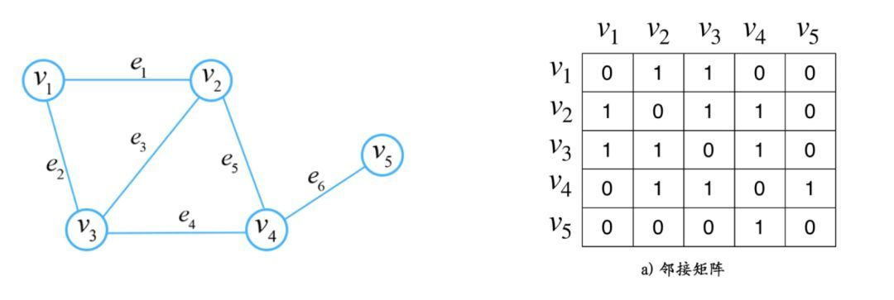

**图的基本类型：**

1. 有向图和无向图：边是否存在方向性
2. 非加权图和加权图：边是否有实数或权重与之对应，且该权重可以表示两地之间的距离、运输成本等。
3. 连通图和非连通图：是否存在孤立的顶点
4. 二部图

**[图的表示：](https://www.cnblogs.com/BlueMountain-HaggenDazs/p/4268207.html)**

在数学中，我们一般使用**邻接矩阵**来表示图，如上图右边所示。邻接矩阵中的值为 1 表示节点之间有边，即有连接关系。所以邻接矩阵其实很好的将图的这种结构信息表达出来了。**无向图的邻接矩阵是眼对角线对称的。**另外，**邻居**指的就是和某个顶点相邻的所有**顶点**，**度**就是相邻所有顶点的**个数**。例如上图中，顶点v1的邻居有v2和v3，他的度是2。

**此外，关联矩阵也是表示图的一种方式。**

**图的几个重要类别：**

1. 同构图（Homogeneous Graph）
2. 异构图（heterogeneous Graph）：更好地贴近现实
3. 属性图（property Graph）：常用的工业级图数据表达方式
4. 非显示图（）：3D点云

还要介绍一个概念是**属性图**。就是说，**图中的节点和边都带有属性（这是一种信息）**。如下图所示：

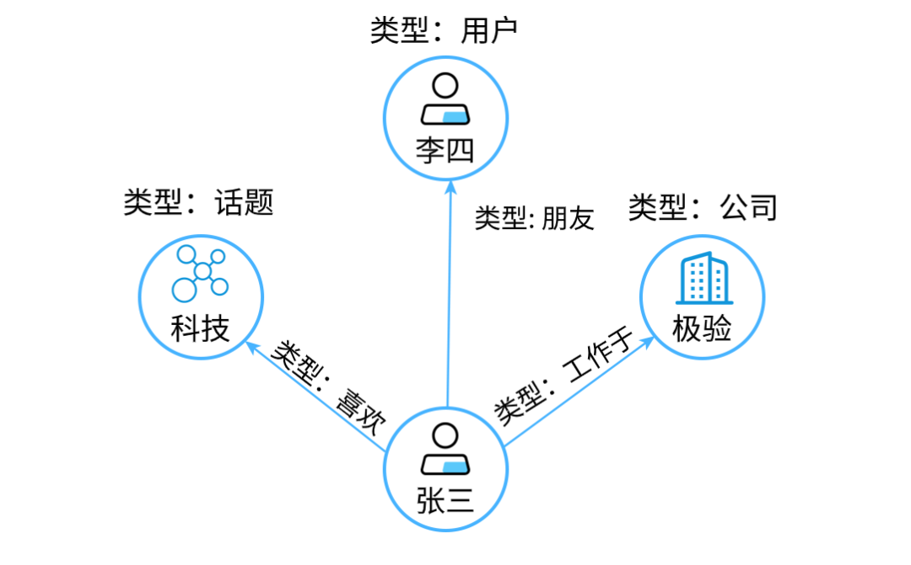

这个图里的用户节点有姓名、性别，话题节点具体的话题类别，公司节点有名称，注册时间等属性信息。边也可以有属性信息，比如开始工作时间是边“工作于”的一种属性。所以，属性图就是节点和边带有自己的属性信息，同时每个节点又有自己的拓扑结构信息。**这是工业界最常用的一种图表示方法，因为我们需要更丰富的信息。**

**而图神经网络就是将图数据和神经网络进行结合，在图数据上面进行端对端的计算。**

## 图神经网络的计算机制

单层的神经网络计算过程：

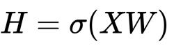

相比较于神经网络最基本的网络结构全连接层（MLP），**特征矩阵乘以权重矩阵**，图神经网络多了一个**邻接矩阵**。计算形式很简单，**三个矩阵相乘再加上一个非线性变换**。

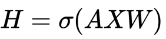

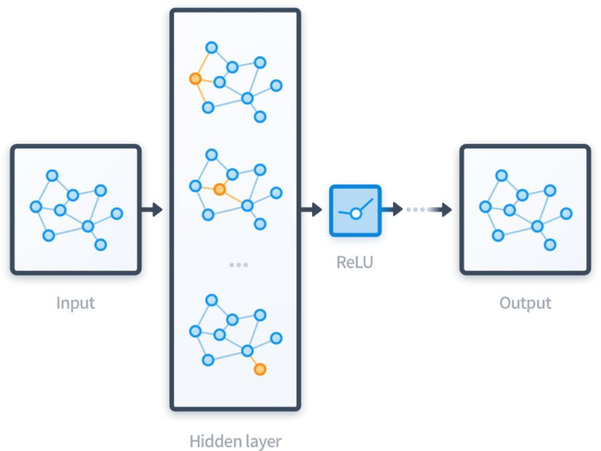

**图神经网络的计算过程总结起来就是聚合邻居**。如下面的动图所示，每个节点都在接收邻居的信息。为了更加全面的刻画每个节点，除了节点自身的属性信息，还需要更加全面的结构信息。所以要聚合邻居，邻居的邻居.....

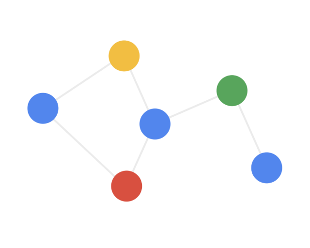

图神经网络是直接在图上进行计算，整个计算的过程，沿着图的结构进行，这样处理的好处是能够很好的保留图的结构信息。**而能够对结构信息进行学习，正是图神经网络的能力所在.**

### 图神经网络的主要应用

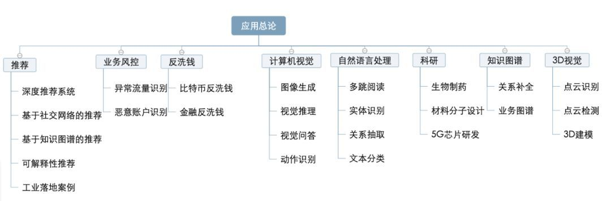

### 主流图神经网络方法

1. Graph Convolution Networks(GCN)
2. Graph Sample and Aggregate(GraphSAGE)
3. Graph Attention Networks(GAT)
4. 无监督的节点表示学习（Unsupervised Node Representation）
   1. Graph Auto-Encoder(GAE)
5. Graph Pooling
   1. DiffPool
   2. 

## 简单程序示例

使用的代码来自GitHub仓库[Link](https://github.com/mtiezzi/gnn)，以其中的一个[简单案例](https://github.com/mtiezzi/gnn/blob/master/examples/GNN_simple.py)进行讲述。

### 导入包

```python
import tensorflow as tf
import numpy as np
import gnn.gnn_utils as gnn_utils
import gnn.GNN as GNN
import Net_Simple as n

import networkx as nx
import scipy as sp

import matplotlib.pyplot as plt
```

### 配置(这个暂时还没看懂)

```python
##### GPU & stuff config
import os

os.environ['CUDA_VISIBLE_DEVICES'] = "0"
config = tf.ConfigProto()
config.gpu_options.allow_growth = True
```

### 创建图数据

**图1的创建**

```python
# 图1的创建
# 图的边集合列表E - last column is the id of the graph to which the arc belongs
e = [[0, 1, 0], [0,2, 0], [0, 4, 0], [1, 2, 0], [1, 3, 0], [2, 3, 0], [2, 4, 0]]

# 无向图, 增加另一个方向 -> 也就是说，上边e有边[0,1,0],因为是无向图，所以将边[1,0,0]也增加进来
# e = <class 'list'>: [[0, 1, 0], [0, 2, 0], [0, 4, 0], [1, 2, 0], [1, 3, 0], [2, 3, 0], [2, 4, 0], [1, 0, 0], [2, 0, 0], [4, 0, 0], [2, 1, 0], [3, 1, 0], [3, 2, 0], [4, 2, 0]]
e.extend([[i, j, num] for j, i, num in e])

# 重新排序，可以看做从0节点开始，他的邻居有谁，然后是1节点的邻居有谁，最后是4节点。
e = sorted(e)
# e = <class 'list'>: [[0, 1, 0], [0, 2, 0], [0, 4, 0], [1, 0, 0], [1, 2, 0], [1, 3, 0], [2, 0, 0], [2, 1, 0], [2, 3, 0], [2, 4, 0], [3, 1, 0], [3, 2, 0], [4, 0, 0], [4, 2, 0]]

# E边集合，将原本的e转换成多维数组
E = np.asarray(e)

# 节点的数量，但是这里为什么用edges表示，而不用nodes或vetex。
edges = 5

# creating node features - simply one-hot values
# 创建节点特征 - 简单的 one-hot 值
# 这里是生成了一个维度为5的单位矩阵
N = np.eye(edges, dtype=np.float32)

# adding column thta represent the id of the graph to which the node belongs
# 增加一列，表明这个节点属于那个图
N = np.concatenate((N, np.zeros((edges,1), dtype=np.float32)),  axis=1 )


# visualization graph
# 可视化图，这里用到了模块networkx，其可以用来构建图网络结构
def plot_graph(E, N):
    g = nx.Graph()
    g.add_nodes_from(range(N.shape[0]))
    g.add_edges_from(E[:, :2])
    nx.draw(g, cmap=plt.get_cmap('Set1'), with_labels=True)
    plt.show()

plot_graph(E,N)
```

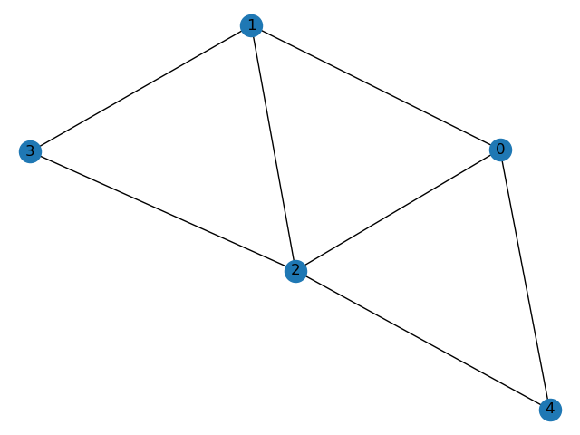

**图2的创建**

```python
# 图2的创建
# 边结合，最后一列是图的id
e1 = [[0, 2, 1], [0,3,1], [1, 2,1], [1,3,1], [2,3,1]]
# 无向图
e1.extend([[i, j, num] for j, i, num in e1])

# reindexing node ids based on the dimension of previous graph (using unique ids)
e2 = [[a + N.shape[0], b + N.shape[0], num] for a, b, num in e1]
#reorder
e2 = sorted(e2)

edges_2 = 4

# Plot second graph
E1 = np.asarray(e1)

N1 = np.eye(edges_2,  dtype=np.float32)
N1 = np.concatenate((N1, np.zeros((edges_2,1), dtype=np.float32)),  axis=1 )

plot_graph(E1,N1)
```

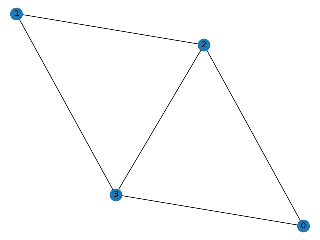

**图1和图2一起做出**

```python
E = np.concatenate((E, np.asarray(e2)), axis=0)

N_tot = np.eye(edges + edges_2,  dtype=np.float32)
N_tot = np.concatenate((N_tot, np.zeros((edges + edges_2,1), dtype=np.float32)),  axis=1)

plot_graph(E, N_tot)
```

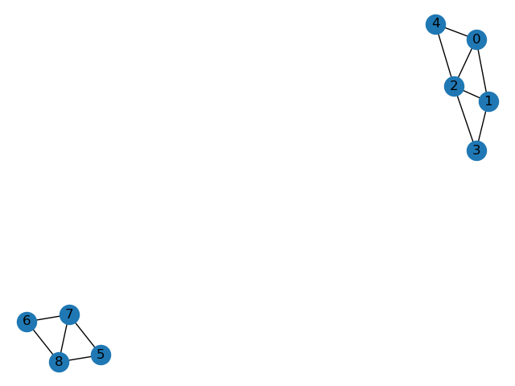

### GNN的输入

```python
# Create Input to GNN
# 将之前创建的图1和图2的数据的融合结果进行转换
# 大家去看一下gnn_utils.from_EN_to_GNN()的具体用法，我把其实现步骤复制到下方了
inp, arcnode, graphnode = gnn_utils.from_EN_to_GNN(E, N_tot)
labels = np.random.randint(2, size=(N_tot.shape[0]))

labels = np.eye(max(labels)+1, dtype=np.int32)[labels]  # one-hot encoding of labels

def from_EN_to_GNN(E, N):
    """
    :param E: # E matrix - matrix of edges : [[id_p, id_c, graph_id],...]
    :param N: # N matrix - [node_features, graph_id (to which the node belongs)]
    :return: # L matrix - list of graph targets [tar_g_1, tar_g_2, ...]
    """
    N_full = N
    N = N[:, :-1]  # avoid graph_id
    e = E[:, :2]  # take only first tow columns => id_p, id_c
    feat_temp = np.take(N, e, axis=0)  # take id_p and id_c  => (n_archs, 2, label_dim)
    feat = np.reshape(feat_temp, [len(E), -1])  # (n_archs, 2*label_dim) => [[label_p, label_c], ...]
    # creating input for gnn => [id_p, id_c, label_p, label_c]
    inp = np.concatenate((E[:, :2], feat), axis=1)
    # creating arcnode matrix, but transposed
    """
    1 1 0 0 0 0 0 
    0 0 1 1 0 0 0
    0 0 0 0 1 1 1    

    """  # for the indices where to insert the ones, stack the id_p and the column id (single 1 for column)
    arcnode = SparseMatrix(indices=np.stack((E[:, 0], np.arange(len(E))), axis=1),
                           values=np.ones([len(E)]).astype(np.float32),
                           dense_shape=[len(N), len(E)])

    # get the number of graphs => from the graph_id
    num_graphs = int(max(N_full[:, -1]) + 1)
    # get all graph_ids
    g_ids = N_full[:, -1]
    g_ids = g_ids.astype(np.int32)

    # creating graphnode matrix => create identity matrix get row corresponding to id of the graph
    # graphnode = np.take(np.eye(num_graphs), g_ids, axis=0).T
    # substitued with same code as before
    graphnode = SparseMatrix(indices=np.stack((g_ids, np.arange(len(g_ids))), axis=1),
                             values=np.ones([len(g_ids)]).astype(np.float32),
                             dense_shape=[num_graphs, len(N)])

    # print(graphnode.shape)

    return inp, arcnode, graphnode
```

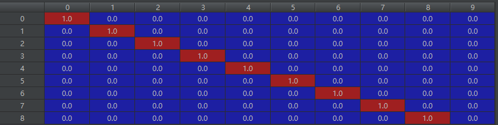

**疑惑：**节点（5,6，7，8）的图节点的id应该是1吧！表现在这个矩阵里最后一列相应的地方应该是1而不是0.我是这样认为的。

### GNN模型

```python
import tensorflow as tf
import numpy as np
import datetime as time

# class for the core of the architecture
class GNN:
    def __init__(self, net,  input_dim, output_dim, state_dim, max_it=50, optimizer=tf.train.AdamOptimizer, learning_rate=0.01, threshold=0.01, graph_based=False,
                 param=str(time.datetime.now().strftime('%Y-%m-%d_%H-%M-%S')), config=None, tensorboard=False, mask_flag=False):
        """
               create GNN instance. Feed this parameters:

               :net:  Net instance - it contains state network, output network, initialized weights, loss function and metric;
               :input_dim: dimension of the input
               :output_dim: dimension of the output
               :state_dim: dimension for the state
               :max_it:  maximum number of iteration of the state convergence procedure
               :optimizer:  optimizer instance
               :learning_rate: learning rate value
               :threshold:  value to establish the state convergence
               :graph_based: flag to denote a graph based problem
               :param: name of the experiment
               :config: ConfigProto protocol buffer object, to set configuration options for a session
               :tensorboard:  boolean flag to activate tensorboard
               """

        np.random.seed(0)
        tf.set_random_seed(0)
        self.tensorboard = tensorboard
        self.max_iter = max_it
        self.net = net
        self.optimizer = optimizer(learning_rate, name="optim")
        self.state_threshold = threshold
        self.input_dim = input_dim
        self.output_dim = output_dim
        self.state_dim = state_dim
        self.graph_based = graph_based
        self.mask_flag = mask_flag
        self.build()

        self.session = tf.Session(config=config)
        #self.session = tf.Session()
        self.session.run(tf.global_variables_initializer())
        self.init_l = tf.local_variables_initializer()

        # parameter to monitor the learning via tensorboard and to save the model
        if self.tensorboard:
            self.merged_all = tf.summary.merge_all(key='always')
            self.merged_train = tf.summary.merge_all(key='train')
            self.merged_val = tf.summary.merge_all(key='val')
            self.writer = tf.summary.FileWriter('tmp/' + param, self.session.graph)
        # self.saver = tf.train.Saver()
        # self.save_path = "tmp/" + param + "saves/model.ckpt"

    def VariableState(self):
        '''Define placeholders for input, output, state, state_old, arch-node conversion matrix'''
        # placeholder for input and output

        self.comp_inp = tf.placeholder(tf.float32, shape=(None, self.input_dim), name="input")
        self.y = tf.placeholder(tf.float32, shape=(None, self.output_dim), name="target")

        if self.mask_flag:
            self.mask = tf.placeholder(tf.float32, name="mask")

        # state(t) & state(t-1)
        self.state = tf.placeholder(tf.float32, shape=(None, self.state_dim), name="state")
        self.state_old = tf.placeholder(tf.float32, shape=(None, self.state_dim), name="old_state")

        # arch-node conversion matrix
        self.ArcNode = tf.sparse_placeholder(tf.float32, name="ArcNode")

        # node-graph conversion matrix
        if self.graph_based:
            self.NodeGraph = tf.sparse_placeholder(tf.float32, name="NodeGraph")
        else:
            self.NodeGraph = tf.placeholder(tf.float32, name="NodeGraph")

    def build(self):
        '''build the architecture, setting variable, loss, training'''
        # network
        self.VariableState()
        self.loss_op = self.Loop()

        # loss
        with tf.variable_scope('loss'):
            if self.mask_flag:
                self.loss = self.net.Loss(self.loss_op[0], self.y, mask=self.mask)
                self.val_loss = self.net.Loss(self.loss_op[0], self.y, mask=self.mask)
            else:
                self.loss = self.net.Loss(self.loss_op[0], self.y)
                # val loss
                self.val_loss = self.net.Loss(self.loss_op[0], self.y)

            if self.tensorboard:
                self.summ_loss = tf.summary.scalar('loss', self.loss, collections=['train'])
                self.summ_val_loss = tf.summary.scalar('val_loss', self.val_loss, collections=['val'])

        # optimizer
        with tf.variable_scope('train'):
            self.grads = self.optimizer.compute_gradients(self.loss)
            self.train_op = self.optimizer.apply_gradients(self.grads, name='train_op')
            if self.tensorboard:
                for index, grad in enumerate(self.grads):
                    tf.summary.histogram("{}-grad".format(self.grads[index][1].name), self.grads[index],
                                         collections=['always'])

        # metrics
        with tf.variable_scope('metrics'):
            if self.mask_flag:
                self.metrics = self.net.Metric(self.y, self.loss_op[0], mask=self.mask)
            else:
                self.metrics = self.net.Metric(self.y, self.loss_op[0])

        # val metric
        with tf.variable_scope('val_metric'):
            if self.mask_flag:
                self.val_met = self.net.Metric(self.y, self.loss_op[0], mask=self.mask)
            else:
                self.val_met = self.net.Metric(self.y, self.loss_op[0])
            if self.tensorboard:
                self.summ_val_met = tf.summary.scalar('val_metric', self.val_met, collections=['always'])

    def convergence(self, a, state, old_state, k):
        with tf.variable_scope('Convergence'):
            # body of the while cicle used to iteratively calculate state

            # assign current state to old state
            old_state = state

            # grub states of neighboring node
            gat = tf.gather(old_state, tf.cast(a[:, 1], tf.int32))

            # slice to consider only label of the node and that of it's neighbor
            # sl = tf.slice(a, [0, 1], [tf.shape(a)[0], tf.shape(a)[1] - 1])
            # equivalent code
            sl = a[:, 2:]

            # concat with retrieved state
            inp = tf.concat([sl, gat], axis=1)

            # evaluate next state and multiply by the arch-node conversion matrix to obtain per-node states
            layer1 = self.net.netSt(inp)
            state = tf.sparse_tensor_dense_matmul(self.ArcNode, layer1)

            # update the iteration counter
            k = k + 1
        return a, state, old_state, k

    def condition(self, a, state, old_state, k):
        # evaluate condition on the convergence of the state
        with tf.variable_scope('condition'):
            # evaluate distance by state(t) and state(t-1)
            outDistance = tf.sqrt(tf.reduce_sum(tf.square(tf.subtract(state, old_state)), 1) + 0.00000000001)
            # vector showing item converged or not (given a certain threshold)
            checkDistanceVec = tf.greater(outDistance, self.state_threshold)

            c1 = tf.reduce_any(checkDistanceVec)
            c2 = tf.less(k, self.max_iter)

        return tf.logical_and(c1, c2)


    def Loop(self):
        # call to loop for the state computation and compute the output
        # compute state
        with tf.variable_scope('Loop'):
            k = tf.constant(0)
            res, st, old_st, num = tf.while_loop(self.condition, self.convergence,
                                                 [self.comp_inp, self.state, self.state_old, k])
            if self.tensorboard:
                self.summ_iter = tf.summary.scalar('iteration', num, collections=['always'])

            if self.graph_based:
                # stf = tf.transpose(tf.matmul(tf.transpose(st), self.NodeGraph))

                stf = tf.sparse_tensor_dense_matmul(self.NodeGraph, st)
            else:
                stf = st
            out = self.net.netOut(stf)

        return out, num

    def Train(self, inputs, ArcNode, target, step, nodegraph=0.0, mask=None):
        ''' train methods: has to receive the inputs, arch-node matrix conversion, target,
        and optionally nodegraph indicator '''

        # Creating a SparseTEnsor with the feeded ArcNode Matrix
        arcnode_ = tf.SparseTensorValue(indices=ArcNode.indices, values=ArcNode.values,
                                        dense_shape=ArcNode.dense_shape)
        if self.graph_based:
            nodegraph = tf.SparseTensorValue(indices=nodegraph.indices, values=nodegraph.values,
                                        dense_shape=nodegraph.dense_shape)

        if self.mask_flag:
            fd = {self.NodeGraph: nodegraph, self.comp_inp: inputs,
                  self.state: np.zeros((ArcNode.dense_shape[0], self.state_dim)),
                  self.state_old: np.ones((ArcNode.dense_shape[0], self.state_dim)),
                  self.ArcNode: arcnode_, self.y: target, self.mask: mask}
        else:

            fd = {self.NodeGraph: nodegraph, self.comp_inp: inputs, self.state: np.zeros((ArcNode.dense_shape[0], self.state_dim)),
                  self.state_old: np.ones((ArcNode.dense_shape[0], self.state_dim)),
                  self.ArcNode: arcnode_, self.y: target}
        if self.tensorboard:
            _, loss, loop, merge_all, merge_tr = self.session.run(
                [self.train_op, self.loss, self.loss_op, self.merged_all, self.merged_train],
                feed_dict=fd)
            if step % 100 == 0:
                self.writer.add_summary(merge_all, step)
                self.writer.add_summary(merge_tr, step)
        else:
            _, loss, loop = self.session.run(
                [self.train_op, self.loss, self.loss_op],
                feed_dict=fd)

        return loss, loop[1]

    def Validate(self, inptVal, arcnodeVal, targetVal, step, nodegraph=0.0, mask=None):
        """ Takes care of the validation of the model - it outputs, regarding the set given as input,
         the loss value, the accuracy (custom defined in the Net file), the number of iteration
         in the convergence procedure """

        arcnode_ = tf.SparseTensorValue(indices=arcnodeVal.indices, values=arcnodeVal.values,
                                        dense_shape=arcnodeVal.dense_shape)
        if self.graph_based:
            nodegraph = tf.SparseTensorValue(indices=nodegraph.indices, values=nodegraph.values,
                                        dense_shape=nodegraph.dense_shape)

        if self.mask_flag:
            fd_val = {self.NodeGraph: nodegraph, self.comp_inp: inptVal,
                      self.state: np.zeros((arcnodeVal.dense_shape[0], self.state_dim)),
                      self.state_old: np.ones((arcnodeVal.dense_shape[0], self.state_dim)),
                      self.ArcNode: arcnode_,
                      self.y: targetVal,
                      self.mask: mask}
        else:

            fd_val = {self.NodeGraph: nodegraph, self.comp_inp: inptVal,
                      self.state: np.zeros((arcnodeVal.dense_shape[0], self.state_dim)),
                      self.state_old: np.ones((arcnodeVal.dense_shape[0], self.state_dim)),
                      self.ArcNode: arcnode_,
                      self.y: targetVal}

        if self.tensorboard:
            loss_val, loop, merge_all, merge_val, metr = self.session.run(
                [self.val_loss, self.loss_op, self.merged_all, self.merged_val, self.metrics], feed_dict=fd_val)
            self.writer.add_summary(merge_all, step)
            self.writer.add_summary(merge_val, step)
        else:
            loss_val, loop, metr = self.session.run(
                [self.val_loss, self.loss_op, self.metrics], feed_dict=fd_val)
        return loss_val, metr, loop[1]

    def Evaluate(self, inputs, st, st_old, ArcNode, target):
        '''evaluate method with initialized state -- not used for the moment: has to receive the inputs,
        initialization for state(t) and state(t-1),
        arch-node matrix conversion, target -- gives as output the accuracy on the set given as input'''

        arcnode_ = tf.SparseTensorValue(indices=ArcNode.indices, values=ArcNode.values,
                                        dense_shape=ArcNode.dense_shape)

        fd = {self.comp_inp: inputs, self.state: st, self.state_old: st_old,
              self.ArcNode: arcnode_, self.y: target}
        _ = self.session.run([self.init_l])
        met = self.session.run([self.metrics], feed_dict=fd)
        return met

    def Evaluate(self, inputs, ArcNode, target, nodegraph=0.0):
        '''evaluate methods: has to receive the inputs,  arch-node matrix conversion, target
         -- gives as output the accuracy on the set given as input'''

        arcnode_ = tf.SparseTensorValue(indices=ArcNode.indices, values=ArcNode.values,
                                        dense_shape=ArcNode.dense_shape)
        if self.graph_based:
            nodegraph = tf.SparseTensorValue(indices=nodegraph.indices, values=nodegraph.values,
                                        dense_shape=nodegraph.dense_shape)


        fd = {self.NodeGraph: nodegraph, self.comp_inp: inputs, self.state: np.zeros((ArcNode.dense_shape[0], self.state_dim)),
              self.state_old: np.ones((ArcNode.dense_shape[0], self.state_dim)),
              self.ArcNode: arcnode_, self.y: target}
        _ = self.session.run([self.init_l])
        met = self.session.run([self.metrics], feed_dict=fd)
        return met

    def Predict(self, inputs, st, st_old, ArcNode):
        ''' predict methods with initialized state -- not used for the moment:: has to receive the inputs,
         initialization for state(t) and state(t-1),
         arch-node matrix conversion -- gives as output the output values of the output function (all the nodes output
         for all the graphs (if node-based) or a single output for each graph (if graph based) '''

        arcnode_ = tf.SparseTensorValue(indices=ArcNode.indices, values=ArcNode.values,
                                        dense_shape=ArcNode.dense_shape)
        fd = {self.comp_inp: inputs, self.state: st, self.state_old: st_old,
              self.ArcNode: arcnode_}
        pr = self.session.run([self.loss_op], feed_dict=fd)
        return pr[0]

    def Predict(self, inputs, ArcNode, nodegraph=0.0):
        ''' predict methods: has to receive the inputs, arch-node matrix conversion -- gives as output the output
         values of the output function (all the nodes output
         for all the graphs (if node-based) or a single output for each graph (if graph based) '''

        arcnode_ = tf.SparseTensorValue(indices=ArcNode.indices, values=ArcNode.values,
                                        dense_shape=ArcNode.dense_shape)
        fd = {self.comp_inp: inputs, self.state: np.zeros((ArcNode.dense_shape[0], self.state_dim)),
              self.state_old: np.ones((ArcNode.dense_shape[0], self.state_dim)),
              self.ArcNode: arcnode_}
        pr = self.session.run([self.loss_op], feed_dict=fd)
        return pr[0]
```