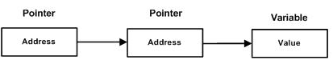

# 指针

1. [菜鸟教程 C++ 指针](https://www.runoob.com/cplusplus/cpp-pointers.html)


## What is pointer（什么是指针）

每一个变量都有一个内存位置，每一个内存位置都定义了可使用连字号（&）运算符访问的地址，它表示了在内存中的一个地址。

[demo1.cpp](./004_pointer/demo1.cpp)
```C++

#include <iostream>
 
using namespace std;
 
int main ()
{
   int  var1;
   char var2[10];
 
   cout << "var1 变量的地址： ";
   cout << &var1 << endl; // &: 取地址符号
 
   cout << "var2 变量的地址： ";
   cout << &var2 << endl;
 
   return 0;
}
```

而指针是一个变量，其值为另一个变量的地址，即，内存位置的直接地址。就像其他变量或常量一样，必须在使用指针存储其他变量地址之前，对其进行声明。**星号是用来指定一个变量是指针。**

```C++
int    *ip;    /* 一个整型的指针 */
double *dp;    /* 一个 double 型的指针 */
float  *fp;    /* 一个浮点型的指针 */
char   *ch;    /* 一个字符型的指针 */
```

所有指针的值的实际数据类型，不管是整型、浮点型、字符型，还是其他的数据类型，都是一样的，都是一个代表内存地址的长的十六进制数。不同数据类型的指针之间唯一的不同是，指针所指向的变量或常量的数据类型不同。

## 指针的简单使用

使用指针时会频繁进行以下几个操作：定义一个指针变量、把变量地址赋值给指针、访问指针变量中可用地址的值。这些是通过使用一元运算符 `*` 来返回位于操作数所指定地址的变量的值。

在定义的时候，`*` 表示这是一个指针，在使用的时候，`*` 表示指针指向的值。

[demo2.cpp](./004_pointer/demo2.cpp)
```C++
#include <iostream>
 
using namespace std;
 
int main ()
{
   int  var = 20;   // 实际变量的声明
   int  *ip;        // 指针变量的声明
 
   ip = &var;       // 在指针变量中存储 var 的地址
 
   cout << "Value of var variable: ";
   cout << var << endl;
 
   // 输出在指针变量中存储的地址
   cout << "Address stored in ip variable: ";
   cout << ip << endl;
 
   // 访问指针中地址的值
   cout << "Value of *ip variable: ";
   cout << *ip << endl;
 
   return 0;
}
```

当上面的代码被编译和执行时，它会产生下列结果：
```
Value of var variable: 20
Address stored in ip variable: 0xbfc601ac
Value of *ip variable: 20
```

## Null指针

在变量声明的时候，如果没有确切的地址可以赋值，为指针变量赋一个 NULL 值是一个良好的编程习惯。赋为 NULL 值的指针被称为空指针。

NULL 指针是一个定义在标准库中的值为零的常量。

[demo3.cpp](./004_pointer/demo3.cpp)
```C++
#include <iostream>

using namespace std;

int main ()
{
   int  *ptr = NULL;

   cout << "ptr 的值是 " << ptr ;
 
   return 0;
}
```
执行结果：
```
ptr 的值是 0
```

在大多数的操作系统上，程序不允许访问地址为 0 的内存，因为该内存是操作系统保留的。然而，内存地址 0 有特别重要的意义，它表明该指针不指向一个可访问的内存位置。但按照惯例，如果指针包含空值（零值），则假定它不指向任何东西。

如需检查一个空指针，您可以使用 if 语句，如下所示：

```
if(ptr)     /* 如果 ptr 非空，则完成 */
if(!ptr)    /* 如果 ptr 为空，则完成 */
```

## 指针的算术运算

指针是一个用数值表示的地址。因此，可以对指针执行算术运算。可以对指针进行四种算术运算：`++、--、+、-`。

假设 ptr 是一个指向地址 1000 的整型指针，是一个 32 位的整数，对该指针执行下列的算术运算：`ptr++`。在执行完上述的运算之后，ptr 将指向位置 `1004`，因为 ptr 每增加一次，它都将指向`下一个整数位置`，即当前位置往后移 `4 个字节`。这个运算会在不影响内存位置中实际值的情况下，移动指针到下一个内存位置。如果 ptr 指向一个地址为 1000 的字符，上面的运算会导致指针指向位置 1001，因为下一个字符位置是在 1001。

### 递增一个指针

在程序中使用指针代替数组，因为变量指针可以递增，而数组不能递增，因为数组是一个常量指针。下面的程序递增变量指针，以便顺序访问数组中的每一个元素：

[demo4.cpp](./004_pointer/demo4.cpp)
```C++

#include <iostream>
 
using namespace std;
const int MAX = 3;
 
int main ()
{
   int  var[MAX] = {10, 100, 200};
   int  *ptr;
 
   // 指针中的数组地址
   ptr = var;
   for (int i = 0; i < MAX; i++)
   {
      cout << "Address of var[" << i << "] = ";
      cout << ptr << endl;
 
      cout << "Value of var[" << i << "] = ";
      cout << *ptr << endl;
 
      // 移动到下一个位置
      ptr++;
   }
   return 0;
}
```
执行结果：
```
Address of var[0] = 0x61fefc
Value of var[0] = 10
Address of var[1] = 0x61ff00
Value of var[1] = 100
Address of var[2] = 0x61ff04
Value of var[2] = 200
```

### 递减一个指针

[demo5.cpp](./004_pointer/demo5.cpp)
```C++
#include <iostream>
 
using namespace std;
const int MAX = 3;
 
int main ()
{
   int  var[MAX] = {10, 100, 200};
   int  *ptr;
 
   // 指针中最后一个元素的地址
   ptr = &var[MAX-1];
   for (int i = MAX; i > 0; i--)
   {
      cout << "Address of var[" << i << "] = ";
      cout << ptr << endl;
 
      cout << "Value of var[" << i << "] = ";
      cout << *ptr << endl;
 
      // 移动到下一个位置
      ptr--;
   }
   return 0;
}
```
执行结果：
```
Address of var[3] = 0x61ff04
Value of var[3] = 200
Address of var[2] = 0x61ff00
Value of var[2] = 100
Address of var[1] = 0x61fefc
Value of var[1] = 10
```

### 指针的比较

指针可以用关系运算符进行比较，如 ==、< 和 >。如果 p1 和 p2 指向两个相关的变量，比如同一个数组中的不同元素，则可对 p1 和 p2 进行大小比较。

[demo6.cpp](./004_pointer/demo6.cpp)
```C++

#include <iostream>
 
using namespace std;
const int MAX = 3;
 
int main ()
{
   int  var[MAX] = {10, 100, 200};
   int  *ptr;
 
   // 指针中第一个元素的地址
   ptr = var;
   int i = 0;
   while ( ptr <= &var[MAX - 1] )
   {
      cout << "Address of var[" << i << "] = ";
      cout << ptr << endl;
 
      cout << "Value of var[" << i << "] = ";
      cout << *ptr << endl;
 
      // 指向上一个位置
      ptr++;
      i++;
   }
   return 0;
}
```
执行结果：
```
Address of var[0] = 0x61fefc
Value of var[0] = 10
Address of var[1] = 0x61ff00
Value of var[1] = 100
Address of var[2] = 0x61ff04
Value of var[2] = 200
```

## 指针 vs 数组

指针和数组是密切相关的。事实上，指针和数组在很多情况下是可以互换的。例如，一个指向数组开头的指针，可以通过使用指针的算术运算或数组索引来访问数组。
[demo4.cpp](./004_pointer/demo4.cpp)
[demo5.cpp](./004_pointer/demo5.cpp)

然而，指针和数组并不是完全互换的.`var 是一个指向数组开头的常量，不能作为左值。`
```C++
#include <iostream>
 
using namespace std;
const int MAX = 3;
 
int main ()
{
   int  var[MAX] = {10, 100, 200};
 
   for (int i = 0; i < MAX; i++)
   {
      *var = i;    // 这是正确的语法
      var++;       // 这是不正确的
   }
   return 0;
}
```

## 指针数组

可能有一种情况，想要让数组存储指向 int 或 char 或其他数据类型的指针。下面是一个指向整数的指针数组的声明：

`int *ptr[MAX];`

在这里，把 ptr 声明为一个数组，由 MAX 个整数指针组成。因此，ptr 中的每个元素，都是一个指向 int 值的指针。下面的实例用到了三个整数，它们将存储在一个指针数组中，如下所示：

[demo7.cpp](./004_pointer/demo7.cpp)
```C++
#include <iostream>
 
using namespace std;
const int MAX = 3;
 
int main ()
{
   int  var[MAX] = {10, 100, 200};
   int *ptr[MAX];
 
   for (int i = 0; i < MAX; i++)
   {
      ptr[i] = &var[i]; // 赋值为整数的地址
   }
   for (int i = 0; i < MAX; i++)
   {
      cout << "Value of var[" << i << "] = ";
      cout << *ptr[i] << endl;
   }
   return 0;
}
```

执行结果：
```
Value of var[0] = 10
Value of var[1] = 100
Value of var[2] = 200
```

## 指向指针的指针

指向指针的指针是一种多级间接寻址的形式，或者说是一个指针链。

指针的指针就是将指针的地址存放在另一个指针里面。

通常，一个指针包含一个变量的地址。当我们定义一个指向指针的指针时，第一个指针包含了第二个指针的地址，第二个指针指向包含实际值的位置。



一个指向指针的指针变量必须如下声明，即在变量名前放置两个星号。例如，下面声明了一个指向 int 类型指针的指针：

`int **var;`

当一个目标值被一个指针间接指向到另一个指针时，访问这个值需要使用两个星号运算符，如下面实例所示：

[demo8.cpp](./004_pointer/demo8.cpp)
```C++

#include <iostream>
 
using namespace std;
 
int main ()
{
    int  var;
    int  *ptr;
    int  **pptr;
 
    var = 3000;
 
    // 获取 var 的地址
    ptr = &var;
 
    // 使用运算符 & 获取 ptr 的地址
    pptr = &ptr;
 
    // 使用 pptr 获取值
    cout << "var 值为 :" << var << endl;
    cout << "*ptr 值为:" << *ptr << endl;
    cout << "**pptr 值为:" << **pptr << endl;
 
    return 0;
}
```

执行结果：
```
var 值为 :3000
*ptr 值为:3000
**pptr 值为:3000
```

## 传递指针给函数

C++ 允许传递指针给函数，只需要简单地声明函数参数为指针类型即可。

下面的实例中，传递一个无符号的 long 型指针给函数，并在函数内改变这个值：

[demo9.cpp](./004_pointer/demo9.cpp)
```C++
#include <iostream>
#include <ctime>
 
using namespace std;
 
// 在写函数时应习惯性的先声明函数，然后在定义函数
void getSeconds(unsigned long *par);
 
int main ()
{
   unsigned long sec;
 
 
   getSeconds( &sec );
 
   // 输出实际值
   cout << "Number of seconds :" << sec << endl;
 
   return 0;
}
 
void getSeconds(unsigned long *par)
{
   // 获取当前的秒数
   *par = time( NULL );
   return;
}
}
```

执行结果：
```
Number of seconds :1618746666
```

能接受指针作为参数的函数，也能接受数组作为参数，如下所示：
[demo10.cpp](./004_pointer/demo10.cpp)
```C++

#include <iostream>
using namespace std;
 
// 函数声明
double getAverage(int *arr, int size);
 
int main ()
{
   // 带有 5 个元素的整型数组
   int balance[5] = {1000, 2, 3, 17, 50};
   double avg;
 
   // 传递一个指向数组的指针作为参数
   avg = getAverage( balance, 5 ) ;
 
   // 输出返回值
   cout << "Average value is: " << avg << endl; 
    
   return 0;
}
 
double getAverage(int *arr, int size)
{
  int    i, sum = 0;       
  double avg;          
 
  for (i = 0; i < size; ++i)
  {
    sum += arr[i];
   }
 
  avg = double(sum) / size;
 
  return avg;
}
```

执行结果：
```
Average value is: 214.4
```

## 从函数返回指针

C++ 不支持在函数外返回局部变量的地址，除非定义局部变量为 static变量。

现在，让我们来看下面的函数，它会生成 10 个随机数，并使用表示指针的数组名（即第一个数组元素的地址）来返回它们，具体如下：
[demo11.cpp](./004_pointer/demo11.cpp)
```C++
#include <iostream>
using namespace std;
 
// 函数声明
double getAverage(int *arr, int size);
 
int main ()
{
   // 带有 5 个元素的整型数组
   int balance[5] = {1000, 2, 3, 17, 50};
   double avg;
 
   // 传递一个指向数组的指针作为参数
   avg = getAverage( balance, 5 ) ;
 
   // 输出返回值
   cout << "Average value is: " << avg << endl; 
    
   return 0;
}
 
double getAverage(int *arr, int size)
{
  int    i, sum = 0;       
  double avg;          
 
  for (i = 0; i < size; ++i)
  {
    sum += arr[i];
   }
 
  avg = double(sum) / size;
 
  return avg;
}
```
执行结果：
```
18930
1762
11979
31450
27517
31377
19471
13911
2663
2026
*(p + 0) : 18930
*(p + 1) : 1762
*(p + 2) : 11979
*(p + 3) : 31450
*(p + 4) : 27517
*(p + 5) : 31377
*(p + 6) : 19471
*(p + 7) : 13911
*(p + 8) : 2663
*(p + 9) : 2026
```