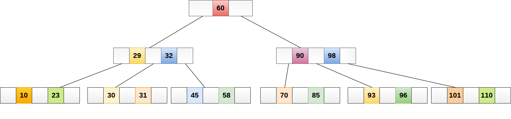
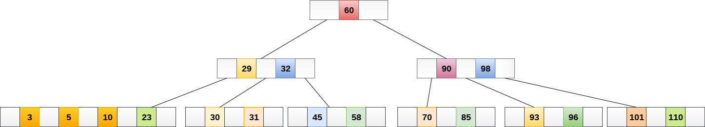
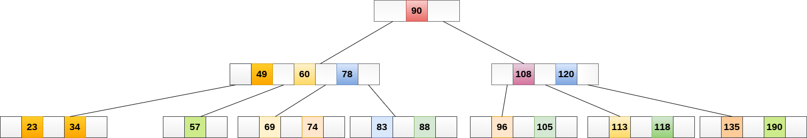
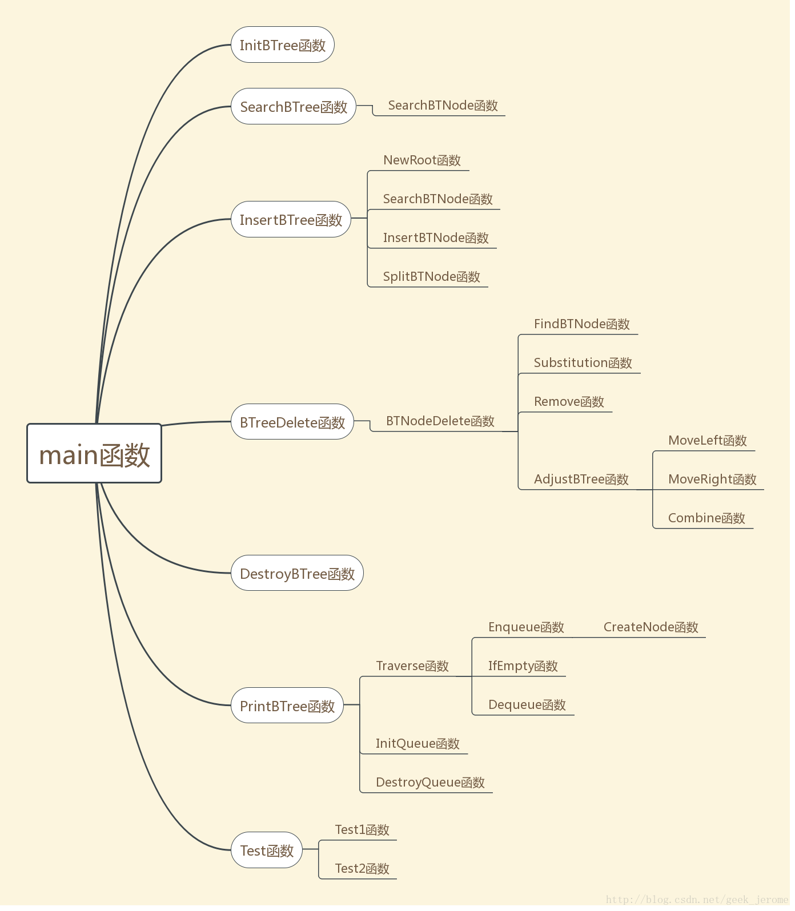

# B-/B树

## 参考

1. [一文详解 B-树，B+树，B*树](https://zhuanlan.zhihu.com/p/98021010)
2. [B树自在人心，看不懂，我当场把这个树吃掉！](https://www.bilibili.com/video/BV1Aa4y1j7a4?from=search&seid=14450198600630848187)
3. [B树](https://www.yiibai.com/data_structure/b-tree.html)

## 什么是B-/B树

**B-树是一种多路搜索树（并不一定是二叉的）**。1970年，`R.Bayer`和`E.mccreight`提出了一种适用于`外查找`的树，它是一种`平衡`的多叉树，称为B树（或B-树、B_树）。

B树可广泛用于磁盘访问。B-树中所有结点中`孩子结点个数的最大值成为B-树的阶`，通常用`M`表示，从查找效率考虑，一般要求`M>=3`。 M阶树`顺序`的B树最多可以有`M-1`个键和`M`个子树。 使用B树的主要原因之一是它能够在单个节点中存储大量键，并且通过保持树的高度相对较小来存储大键值。

`排序M的B树`包含M阶树的所有属性。 此外，它还包含以下属性。

1. B树中的每个节点最多包含`M`个子节点。
2. 除根节点和叶节点外，B树中的每个节点至少包含`M/2个`子节点。
3. 根节点必须至少有`2`个节点。
4. `所有叶节点必须处于同一级别`。
   
所有节点都不必包含相同数量的子节点，但每个节点必须具有`M/2`个节点数。在下图中显示了`4阶`B树。



## 查找或搜索操作

在B树中搜索类似于二叉搜索树中的搜索。 例如，如果在以下B树中搜索数据项：`49`。 该过程将如下所示：

- 将数据项`49`与根节点`78`进行比较。因为`49 <78`因此，移动到其左子树。
- 因为，`40 <49 <56`，遍历右子树`40`。
- `49> 45`，向右移动。 
- 比较`49`。找到匹配，则返回。
  
在B树中搜索取决于树的高度。 搜索算法需要`O(log n)`时间来搜索B树中的任何元素。


## 插入

插入在叶节点级别完成。要将项目插入B树，需要遵循以下算法。

- 遍历B树以找到可插入节点的适当叶节点。
- 如果叶节点包含少于`M-1`个键，则按递增顺序插入元素。
- 否则，如果叶节点包含`M-1个`个键，则按照以下步骤操作。
  - 按元素的递增顺序插入新元素。
  - 将节点拆分为中间的两个节点。
  - 将中值元素推送到其父节点。
  - 如果父节点还包含`M-1个`键，则按照相同的步骤将其拆分。

**示例**：

将节点`8`插入到下图所示的`5阶B树`中。



`8`将插入`5`的右侧，因此插入`8`。


该节点现在包含`5`个键，大于`(5 -1 = 4)`个键。 因此，将节点从中间分开，即`8`，并将其推到其父节点，如下所示。


## 删除

[B-树的删除过程](https://blog.csdn.net/li_canhui/article/details/85307195)

在B-树中删除节点时，可能会发生向兄弟节点借元素，和孩子节点交换元素，甚至节点合并的过程。需要遵循以下算法才能从B树中删除节点。

**删除叶节点**

- 找到叶节点。
- 如果叶节点中有多于`M/2`个键，则从节点中删除所需的键。
- 如果叶节点不包含`M/2`个键，则通过从左右兄弟中获取元素来完成键。
  - 如果左侧兄弟包含多于`M/2`个元素，则将其最大元素推送到其父元素，并将插入元素向下移动到删除键的节点。
  - 如果右侧兄弟包含多于`M/2`个元素，则将其最小元素向上推送到父节点，并将插入元素向下移动到删除键的节点。
  - 如果兄弟节点都不包含多于`M/2`个元素，则通过连接两个叶节点和父节点的插入元素来创建新的叶节点。
  - 如果父节点的节点少于`M/2`，那么也应在父节点上应用上述过程。
  
**删除内部节点**

- 如果要删除的节点是内部节点，则将节点替换为其有序后继或前一个节点。 由于后继或前任将始终位于叶节点上，因此该过程将类似于从叶节点中删除节点。

**示例1**

从下图所示的`5阶B树`中删除节点：`53`。


元素`49`的右子节点中存在`53`，则删除它。



现在，`57`是唯一留在节点中的元素，在`5阶B树`中必须存在的最小元素数是`2`。它小于左边和右边子树中的元素 因此，也不足以将其与父母的左兄弟和干预元素合并，即`49`。

最终的B树如下所示。


## B树的应用

B树用于索引数据并提供对存储在磁盘上的实际数据的快速访问，因为存储在磁盘上的大型数据库中存储的值的访问是非常耗时的过程。

在最坏的情况下，搜索包含`n`个键值的未索引和未排序的数据库需要`O(n)`运行时间。 但是，如果使用B树来索引此数据库，则在最坏的情况下将在`O(log n)`时间内搜索它。

## B树的Code实例

[参考:C语言-B树（B-树）的完整实现](https://blog.csdn.net/geek_jerome/article/details/78895289)



### B树的抽象数据类型定义

```C++
ADT BTree{
    数据对象：D是具有相同特性的数据元素的集合
    数据关系：R1={<ai-1,ai>|ai-1,ai∈D，i=2，...,n}
                R2={<ptr[i-1],ptr[i]>|i=1...,n}
    约定a1|key[1]为关键字数组头，an|key[p-<keynum]为关键字数组尾
    约定ptr[i]为结点的第i个子树
    基本操作：
    InitBTree(t)
    初始条件：B树已定义
    操作结果：初始化B树
    SearchBTNode(BTNode *p,KeyType k)
    初始条件：结点p已存在
    操作结果：在结点p中查找关键字k的插入位置i 
    Result SearchBTree(BTree t,KeyType k)
    初始条件：B树已存在
    操作结果：在B树查找关键字k的插入位置，返回查找结果
    InsertBTNode(BTNode *&p,int i,KeyType k,BTNode *q)
    初始条件：结点p和结点q已存在，0<i<p->keynum
    操作结果：将关键字k和结点q分别插入到p->key[i+1]和p->ptr[i+1]中
    SplitBTNode(BTNode *&p,BTNode *&q)
    初始条件：结点p和结点q已存在
    操作结果：将结点p分裂成两个结点,前一半保留,后一半移入结点q
    NewRoot(BTNode *&t,KeyType k,BTNode *p,BTNode *q)
    初始条件：结点t,p,q已存在
    操作结果：生成新的根结点t,原p和q为子树指针
    InsertBTree(BTree &t,int i,KeyType k,BTNode *p)
    初始条件：结点p和结点t已存在，0<i<p->keynum
    操作结果：在B树t中插入关键字k
    Remove(BTNode *p,int i)
    初始条件：结点p已存在，0<i<p->keynum
    操作结果：p结点删除key[i]和它的孩子指针ptr[i]
    Substitution(BTNode *p,int i)
    初始条件：结点p已存在，0<i<p->keynum
    操作结果：查找替代值
    MoveRight(BTNode *p,int i)
    初始条件：结点p已存在，0<i<p->keynum
    操作结果：结点调整右移操作
    MoveLeft(BTNode *p,int i)
    初始条件：结点p已存在，0<i<p->keynum
    操作结果：结点调整左移操作
    Combine(BTNode *p,int i)
    初始条件：结点p已存在，0<i<p->keynum
    操作结果：结点调整合并操作
    AdjustBTree(BTNode *p,int i)
    初始条件：结点p已存在，0<i<p->keynum
    操作结果：B树调整操作
    BTNodeDelete(BTNode *p,KeyType k)
    初始条件：结点p已存在
    操作结果：在结点p中删除关键字k
    BTreeDelete(BTree &t,KeyType k)
    初始条件：B树t已存在
    操作结果：在B树t中删除关键字k
    DestroyBTree(BTree &t)
    初始条件：B树t已存在
    操作结果：递归释放B树
    PrintBTree(BTree t)
    初始条件：B树t已存在
    操作结果：遍历打印B树
}ADT BTree
```

### 代码文件

1. [头文件](./006_Tree/BTree.h)：定义了需要用到的数据类型，结构体类型，以及所有函数接口;
2. [main](./006_Tree/BTree.cpp):函数的具体实现，main函数和两个测试案例。