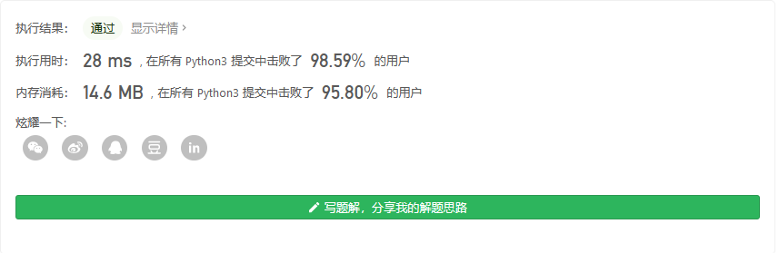
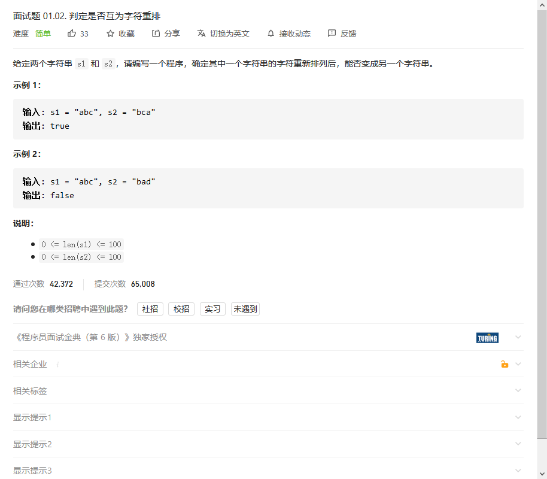
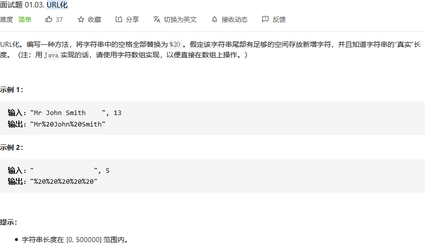
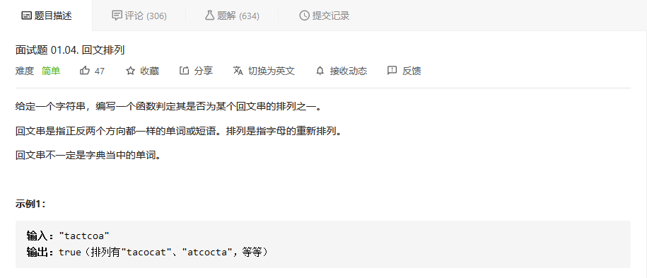
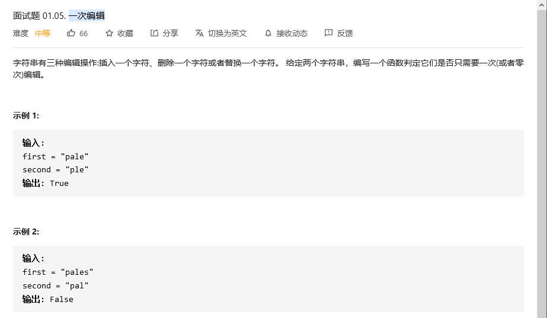

# 程序员面试金典

## 判定字符是否唯一


```python
class Solution:
    def isUnique(self, astr: str) -> bool:
        hash = [0]*30
        for i in astr:
            if hash[ord(i)-100]==0:
                hash[ord(i)-100]+=1
            else:
                return False
        return True
```

我用的是hash的思想，速度快。



## 判定是否互为字符重排



```python
class Solution:
    def CheckPermutation(self, s1: str, s2: str) -> bool:
        hash1 = [0]*30
        hash2 = [0]*30
        for i in s1:
            hash1[ord(i)-100]+=1
        for i in s2:
            hash2[ord(i)-100]+=1
        if hash1 == hash2:
            return True
        return False
```

我用的是hash的思想。


也可以用排序的思想，将两个字符串排序后，看他们是否相等，相等则是可以重排的，否则不可以重排。

## URL化



```python
class Solution:
    def replaceSpaces(self, S: str, length: int) -> str:
        S = S[:length]
        return S.replace(' ','%20')
```


## 回文排列



```python
class Solution:
    def canPermutePalindrome(self, s: str) -> bool:
        hash = [0]*70
        for i in s:
            hash[ord(i)-100] += 1
        oo = 0
        i = len(hash)
        while(oo<2 and i>0):
            if hash[i-1]%2!=0:
                oo+=1
            i -=1
        if oo<2:
            return True
        return False
```


## 一次编辑



```python
class Solution:
    def oneEditAway(self, first: str, second: str) -> bool:
        f1 = len(first)
        s2 = len(second)
        
        if abs(f1-s2)>1: # 长度差大于1的肯定不行
            return False
        elif f1==0 or s2==0: # 长度为0的特例
            return True

        # 时序对齐中的DTW算法，只要其距离大于1则说明不行，否则是可以的
        D = [[0 if i==0 and j ==0 else float('inf') for i in range(f1+1) ] for j in range(s2+1)]
        for i in range(s2):
            for j in range(f1):
                dist = 1 if first[j]!=second[i] else 0
                D[i+1][j+1] = dist + min([D[i][j],D[i+1][j],D[i][j+1]]) 
        if D[s2][f1]>1:
            return False
        return True
```

这个方法只是能够实现目标，效果差了一点。

