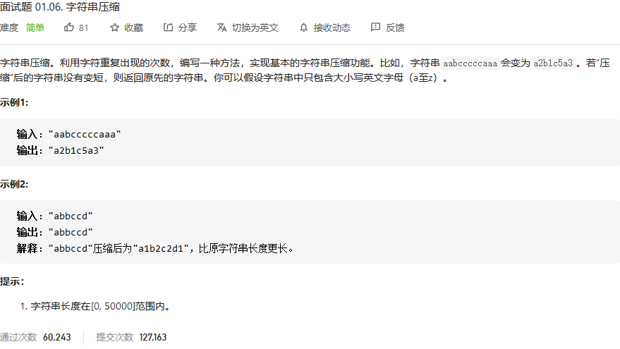
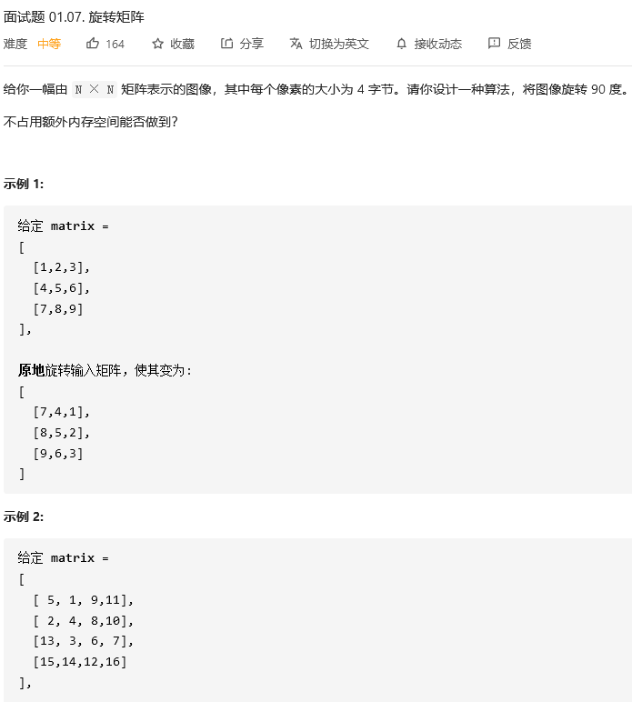
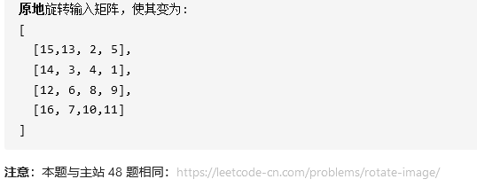
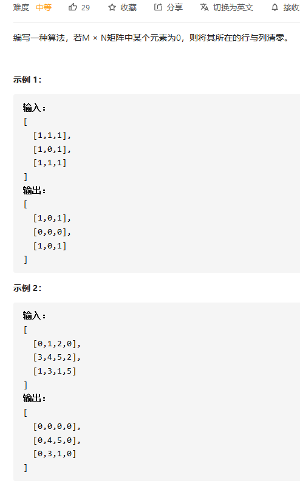
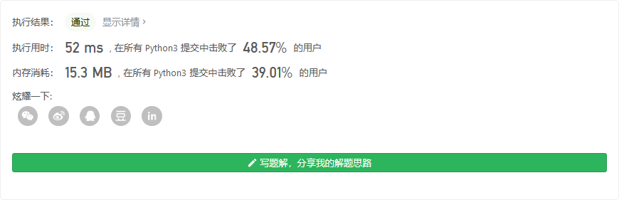

## 字符串压缩



```python
class Solution:
    def compressString(self, S: str) -> str:
        stack1 = [0]
        mid = 0
        lens = 0
        length = -2
        for i in S:
            if mid == i:
                lens +=1
            else:
                mid = i
                stack1.append(str(lens))
                lens=1
                stack1.append(i)
                length += 2
        stack1.append(str(lens))
        length += 2
        
        if length<len(S):
            s = ''.join(stack1[2:])
            return s
        return S 
```

栈的思想，只不过没有出栈，都是进栈。


## 旋转矩阵





```python

```


## 零矩阵



```python
class Solution:
    def setZeroes(self, matrix: List[List[int]]) -> None:
        """
        Do not return anything, modify matrix in-place instead.
        """
        zerospos = []
        rownums = len(matrix)
        colnums = len(matrix[0])
        for i in range(rownums):
            for j in range(colnums):
                if matrix[i][j]==0:
                    zerospos.append((i,j))
        for tup in zerospos:
            matrix[tup[0]]=[0]*colnums
            j = tup[1]
            for i in range(rownums):
                matrix[i][j]=0

        return matrix
```

