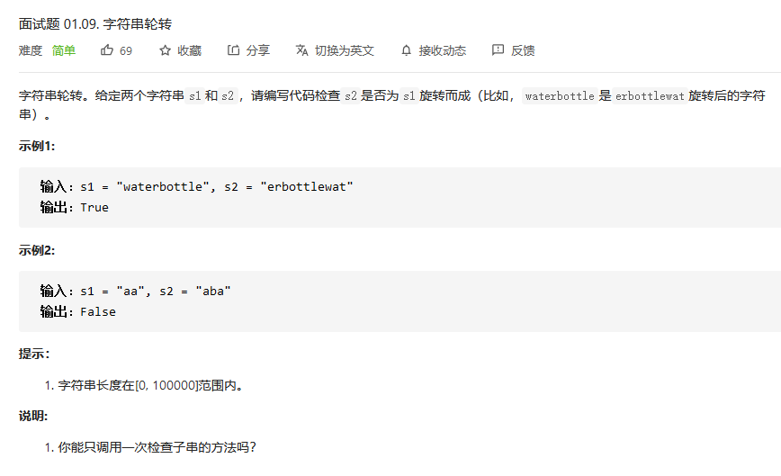
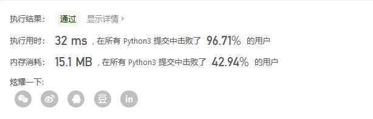
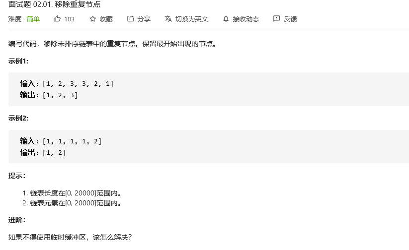
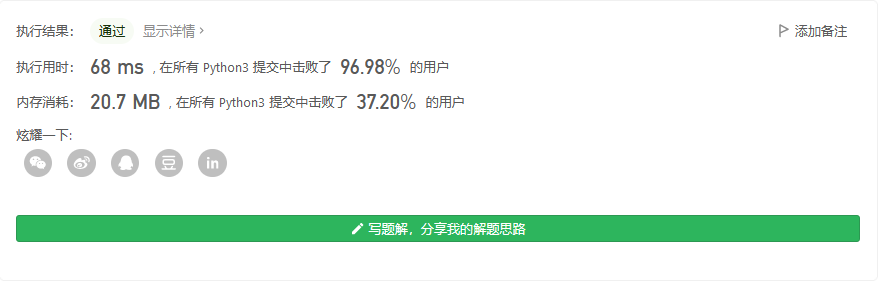

# 程序员面试金典

## 字符串压缩


```python
class Solution:
    def compressString(self, S: str) -> str:
        stack1 = [0]
        mid = 0
        lens = 0
        length = -2
        for i in S:
            if mid == i:
                lens +=1
            else:
                mid = i
                stack1.append(str(lens))
                lens=1
                stack1.append(i)
                length += 2
        stack1.append(str(lens))
        length += 2
        
        if length<len(S):
            s = ''.join(stack1[2:])
            return s
        return S 
```

栈的思想，只不过没有出栈，都是进栈。


## 旋转矩阵


```python

```


## 零矩阵


```python
class Solution:
    def setZeroes(self, matrix: List[List[int]]) -> None:
        """
        Do not return anything, modify matrix in-place instead.
        """
        zerospos = []
        rownums = len(matrix)
        colnums = len(matrix[0])
        for i in range(rownums):
            for j in range(colnums):
                if matrix[i][j]==0:
                    zerospos.append((i,j))
        for tup in zerospos:
            matrix[tup[0]]=[0]*colnums
            j = tup[1]
            for i in range(rownums):
                matrix[i][j]=0

        return matrix
```


## 字符串轮转



```python
class Solution:
    def isFlipedString(self, s1: str, s2: str) -> bool:
        # 一些特例
        if len(s1) != len(s2): # 两个字符串长度不相等肯定不能旋转得到
            return False
        if s1 == s2: # 两个字符串相同肯定可以
            return True
        if s1 == '' or s2 == '': # 空字符串
            if s1 == '' and s2 == '':
                return True
            else:
                return False

        # 普遍
        for i in range(1,len(s1)):
            if s1[:i] == s2[len(s1)-i:] and  s1[i:] ==s2[:len(s1)-i]:
                return True
        return False
```


**提高：**

1. 我的想法是像手指缝隙一样在各个部位截断，比较两个截断的部分是否一样。
2. 先判断长度是否相同，不相同返回false，其次拼接两个s2，则如果是由s1旋转而成，则拼接后的s一定包含s1.`        String s = s2 + s2;
        return s.contains(s1);`




## 移除重复节点



```python
# Definition for singly-linked list.
# class ListNode:
#     def __init__(self, x):
#         self.val = x
#         self.next = None

class Solution:
    def removeDuplicateNodes(self, head: ListNode) -> ListNode:
        if not head:
            return head
        occurred = {head.val}
        pos = head
        # 枚举前驱节点
        while pos.next:
            # 当前待删除节点
            cur = pos.next
            if cur.val not in occurred:
                occurred.add(cur.val)
                pos = pos.next
            else:
                pos.next = pos.next.next
        return head
```

使用的是哈希的思想，说实话，我有点爱上哈希了^-^。

