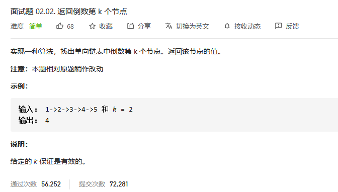
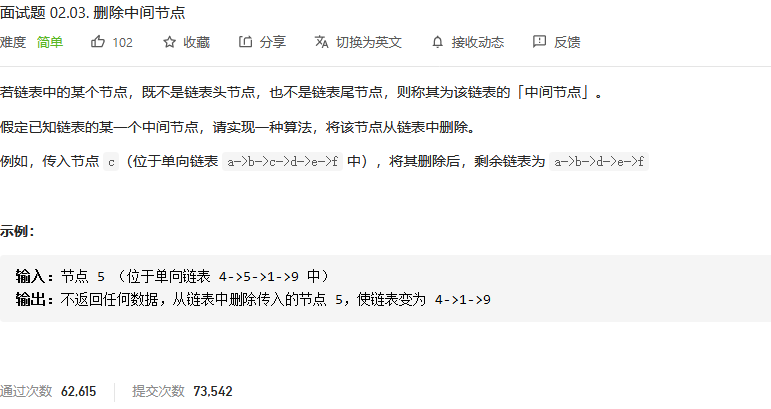
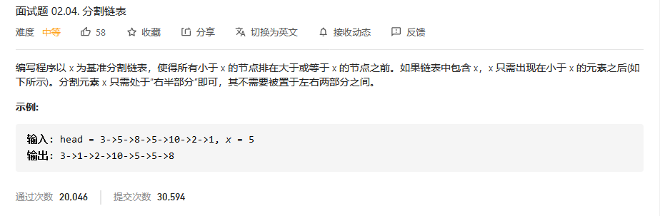
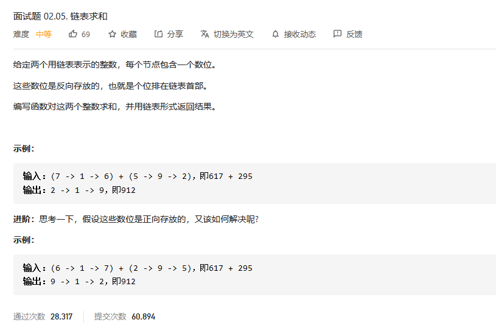
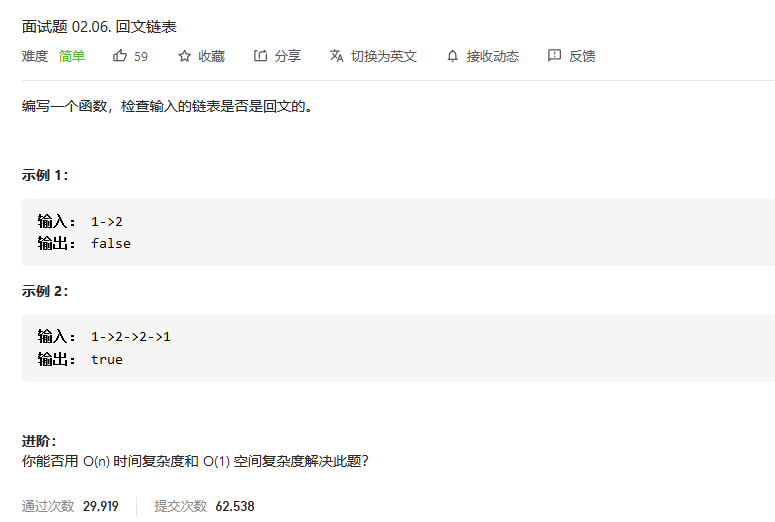

# 程序员面试金典

## 返回倒数第 k 个节点



```python
class Solution:
    def kthToLast(self, head: ListNode, k: int) -> int:
        # 队列，只需要一个尾指针就可以了
        knode = [-1]*k
        rear = 0

        pos = head
        knode[rear] = pos.val
        rear = (rear+1)%k
        while(pos.next != None):
            pos = pos.next
            knode[rear] = pos.val
            rear = (rear+1)%k
        return knode[rear%k]
```


## 删除中间节点



```python
# Definition for singly-linked list.
# class ListNode:
#     def __init__(self, x):
#         self.val = x
#         self.next = None

class Solution:
    def deleteNode(self, node):
        """
        :type node: ListNode
        :rtype: void Do not return anything, modify node in-place instead.
        """
        node.val = node.next.val
        node.next = node.next.next
```

在这里我纠结了好久，原来他直接输入的node就是要删除的那个节点。我还以为是原本的、完整的链表呢。


## 分割链表



```python

```


## 链表求和



```python
# Definition for singly-linked list.
# class ListNode:
#     def __init__(self, x):
#         self.val = x
#         self.next = None

class Solution:
    def addTwoNumbers(self, l1: ListNode, l2: ListNode) -> ListNode:
        C = 0
        ACC = ListNode((l1.val + l2.val + C)%10)
        C = 0 if (l1.val + l2.val+C) < 10 else 1

        pos = ACC
        while(l1.next != None or l2.next != None):
            if(l1.next != None and l2.next != None):
                l1 = l1.next
                l2 = l2.next
                pos.next = ListNode((l1.val + l2.val + C)%10)
                pos = pos.next
                C = 0 if (l1.val + l2.val +C) < 10 else 1
            elif l1.next == None and l2.next != None:
                l2 = l2.next
                pos.next = ListNode((l2.val + C)%10)
                pos = pos.next
                C = 0 if (l2.val+C) < 10 else 1
            elif l2.next == None and l1.next != None:
                l1 = l1.next
                pos.next = ListNode((l1.val + C)%10)
                pos = pos.next
                C = 0 if (l1.val + C) < 10 else 1
        if C ==1:
            pos.next = ListNode(1)
        return ACC
```

解决这道题主要依靠的是我之前学习单片机的时候了解的**汇编编程**。在这里设置一个累加器ACC存放每一次累加和除以10的余数，从而构成两边，C存储是否进位。


## 回文链表



```python

```

