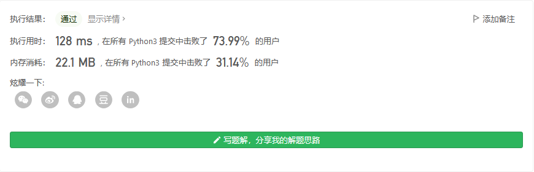

# 程序员面试金典

## 链表相交


```python

```


## 环路检测


```python

```


## 三合一


```python
class TripleInOne:

    def __init__(self, stackSize: int):
        self.stackSize = stackSize
        self.stack = [[],[],[]]
        self.stacklen = [0,0,0]


    def push(self, stackNum: int, value: int) -> None:
        if self.stacklen[stackNum] == self.stackSize:
            pass
        else:
            self.stack[stackNum].append(value)
            self.stacklen[stackNum] += 1


    def pop(self, stackNum: int) -> int:
        if self.stacklen[stackNum] == 0:
            return -1
        else:
            self.stacklen[stackNum] -= 1
            return self.stack[stackNum].pop()


    def peek(self, stackNum: int) -> int:
        if self.stacklen[stackNum] == 0:
            return -1
        else:
            return self.stack[stackNum][-1]


    def isEmpty(self, stackNum: int) -> bool:
        if self.stacklen[stackNum] == 0:
            return True
        else:
            return False

# Your TripleInOne object will be instantiated and called as such:
# obj = TripleInOne(stackSize)
# obj.push(stackNum,value)
# param_2 = obj.pop(stackNum)
# param_3 = obj.peek(stackNum)
# param_4 = obj.isEmpty(stackNum)
```



## 栈的最小值


```python
class MinStack:

    def __init__(self):
        """
        initialize your data structure here.
        """
        self.stackmin = []
        self.stack = []
        self.stacklen = 0


    def push(self, x: int) -> None:
        self.stack.append(x)
        self.stacklen += 1
        if not self.stackmin:
            self.stackmin.append(x)
        elif x<self.stackmin[-1]:
            self.stackmin.append(x)
        elif self.stackmin[-1]<=x:
            self.stackmin.append(self.stackmin[-1])


    def pop(self) -> None:
        if self.stacklen == 0:
            pass
        else:
            self.stack.pop()
            self.stackmin.pop()
            self.stacklen -=1

    def top(self) -> int:
        return self.stack[-1]


    def getMin(self) -> int:
        return self.stackmin[-1]


# Your MinStack object will be instantiated and called as such:
# obj = MinStack()
# obj.push(x)
# obj.pop()
# param_3 = obj.top()
# param_4 = obj.getMin()
```


## 堆盘子


```python
class StackOfPlates:

    def __init__(self, cap: int):
        self.stack = [] # 所有的栈
        self.stacklen = [] # 每个栈的长度
        self.cap = cap # 每个占的容量
        
    def push(self, val: int) -> None:
        if self.stack:
            if self.stacklen[-1] == self.cap:
                self.stack.append([val])
                self.stacklen.append(1)
            else:
                self.stack[-1].append(val)
                self.stacklen[-1] += 1
        else:
            if self.cap == 0:
                pass
            else:
                self.stack.append([val])
                self.stacklen.append(1)


    def pop(self) -> int:
        if self.stack:
            res = self.stack[-1].pop()
            self.stacklen[-1] -= 1
            if self.stacklen[-1] == 0:
                del self.stacklen[-1]
                del self.stack[-1]
            return res
        else:
            return -1


    def popAt(self, index: int) -> int:
        if len(self.stacklen) > index:
            self.stacklen[index] -= 1
            res = self.stack[index].pop()
            if self.stacklen[index] == 0:
                del self.stacklen[index]
                del self.stack[index]
            return res
        else:
            return -1
```

