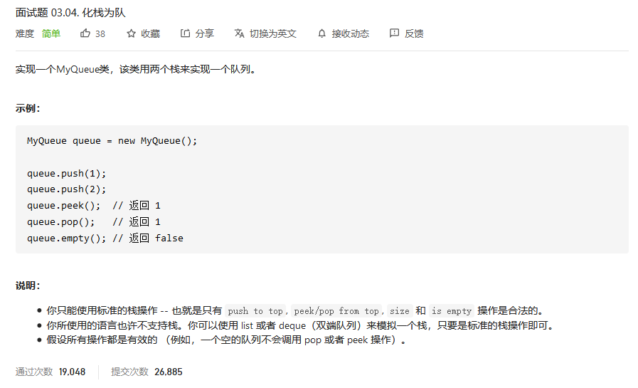
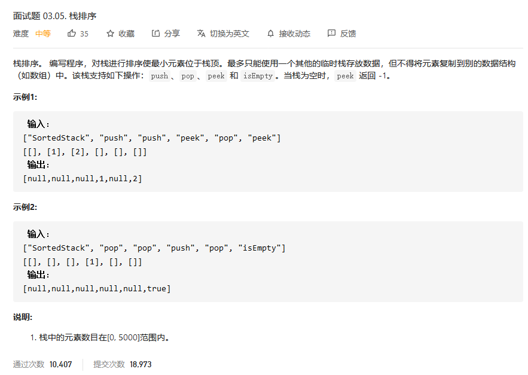
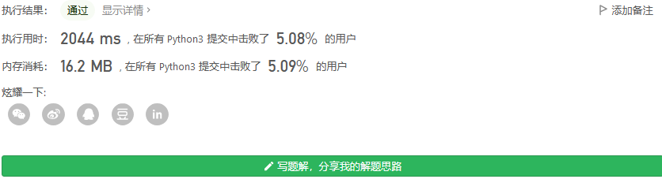
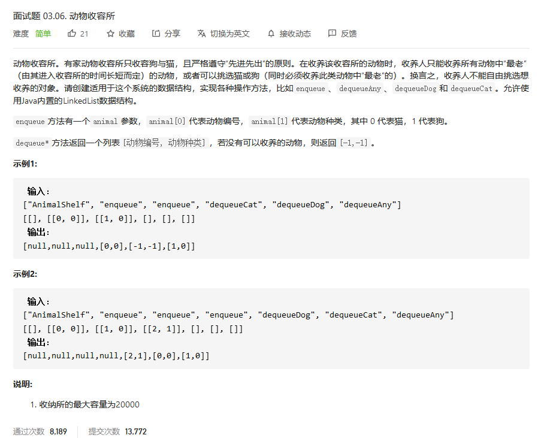
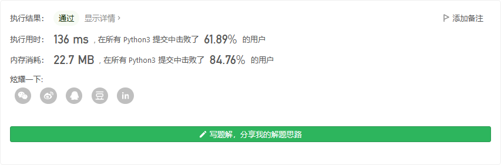
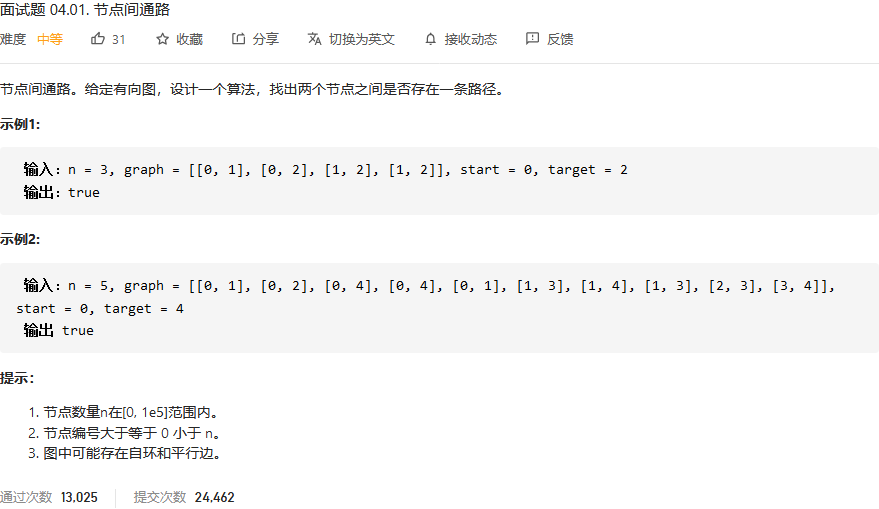
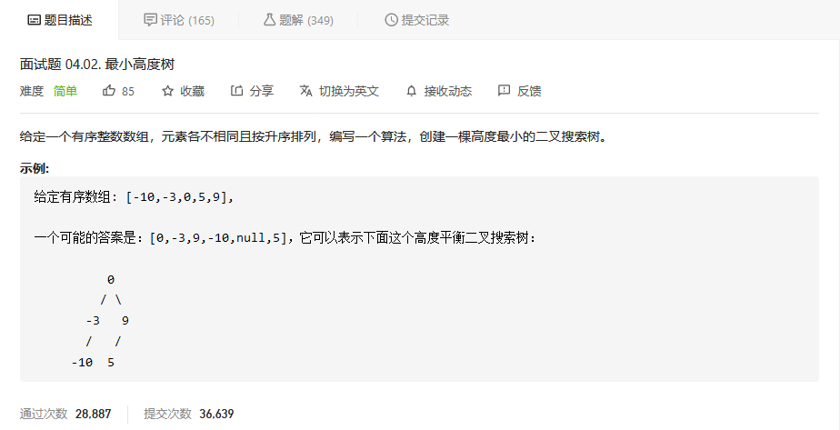
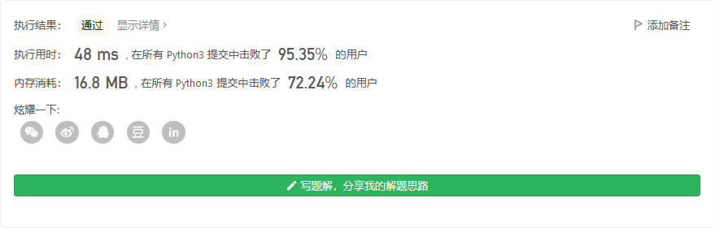

# 程序员面试金典

## 化栈为队



```python


```


## 栈排序



```python
class SortedStack:

    def __init__(self):
        self.stack = []
        self.stackcopy = []
        self.stacklen = 0
        self.stackcopylen = 0

    def push(self, val: int) -> None:
        if self.stacklen == 0:
            self.stack.append(val)
            self.stacklen += 1
        else:
            while self.stack[-1] < val:
                self.stackcopy.append(self.stack[-1])
                self.stackcopylen += 1
                self.stack.pop()
                self.stacklen -=1
                if self.stacklen == 0:
                    break
            self.stack.append(val)
            self.stacklen += 1
            while self.stackcopy:
                self.stack.append(self.stackcopy[-1])
                self.stacklen += 1
                self.stackcopy.pop()
                self.stackcopylen -=1


    def pop(self) -> None:
        if self.stacklen:
            self.stack.pop()
            self.stacklen -= 1


    def peek(self) -> int:
        if self.stacklen:
            return self.stack[-1]
        else:
            return -1


    def isEmpty(self) -> bool:
        if self.stacklen:
            return False
        else:
            return True
```



## 动物收容所



```python
class AnimalShelf:

    def __init__(self):
        self.dog = []
        self.cat = []
        self.dognum = 0
        self.catnum = 0

    def enqueue(self, animal: List[int]) -> None:
        if animal[1]:
            self.dog.append(animal)
            self.dognum +=1
        else:
            self.cat.append(animal)
            self.catnum+=1

    def dequeueAny(self) -> List[int]:
        if self.dognum<1 and self.catnum<1:
            return [-1,-1]
        if self.dognum <1 :
            return self.dequeueCat()
        if self.catnum <1:
            return self.dequeueDog()
        if self.cat[0][0] < self.dog[0][0]:
            return self.dequeueCat()
        else:
            return self.dequeueDog()


    def dequeueDog(self) -> List[int]:
        if self.dognum == 0:
            return [-1,-1]
        else:
            res = self.dog[0]
            del self.dog[0]
            self.dognum -= 1
            return res           

    def dequeueCat(self) -> List[int]:
        if self.catnum == 0:
            return [-1,-1]
        else:
            res = self.cat[0]
            del self.cat[0]
            self.catnum-=1
            return res
```



## 节点间通路



```python

```


## 最小高度树



```python
class Solution:
    def sortedArrayToBST(self, nums: List[int]) -> TreeNode:
        if not nums:
            return 
        mid = len(nums) // 2
        root = TreeNode(nums[mid])
        root.left = self.sortedArrayToBST(nums[: mid])
        root.right = self.sortedArrayToBST(nums[mid + 1: ])
        
        return root 
```

