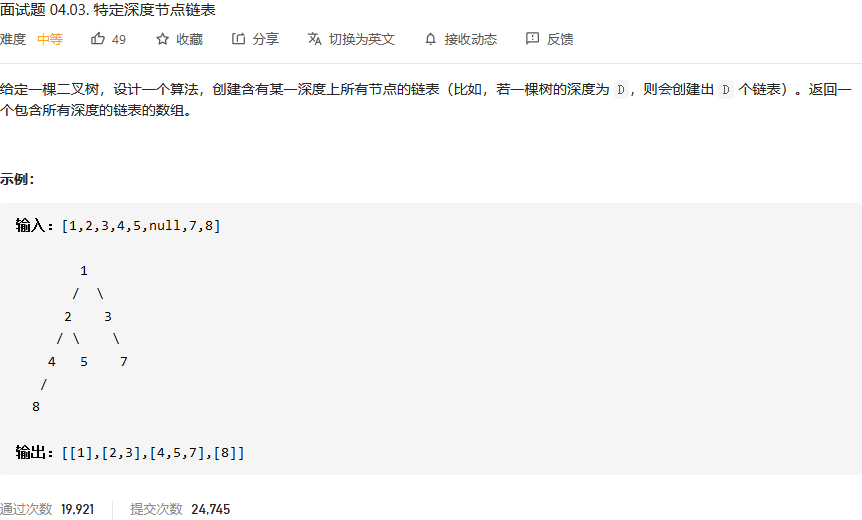
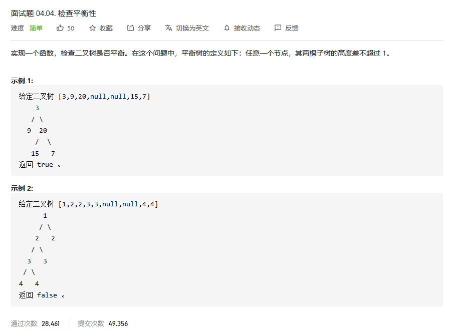
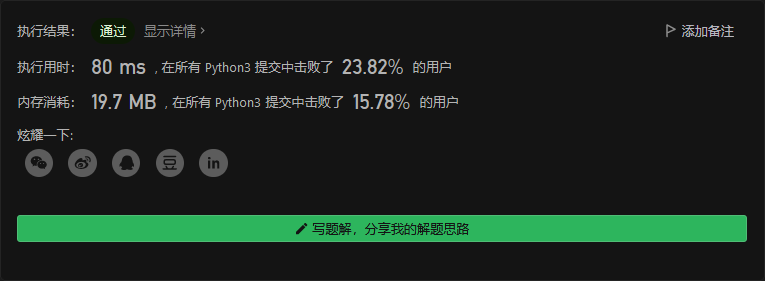
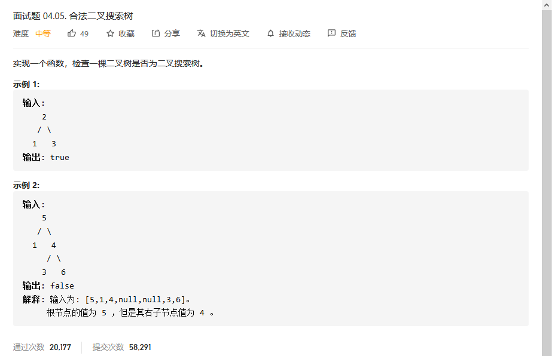
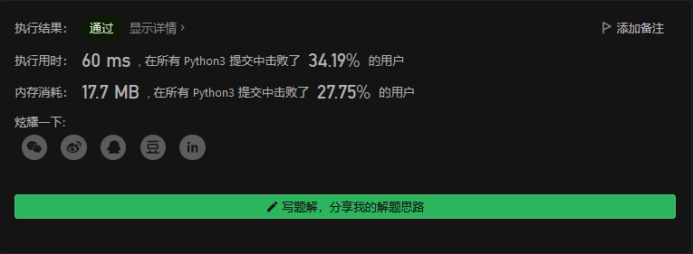
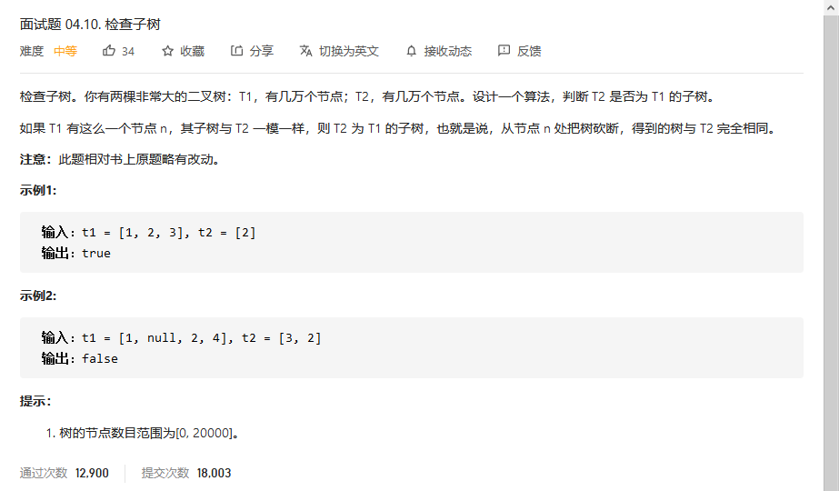
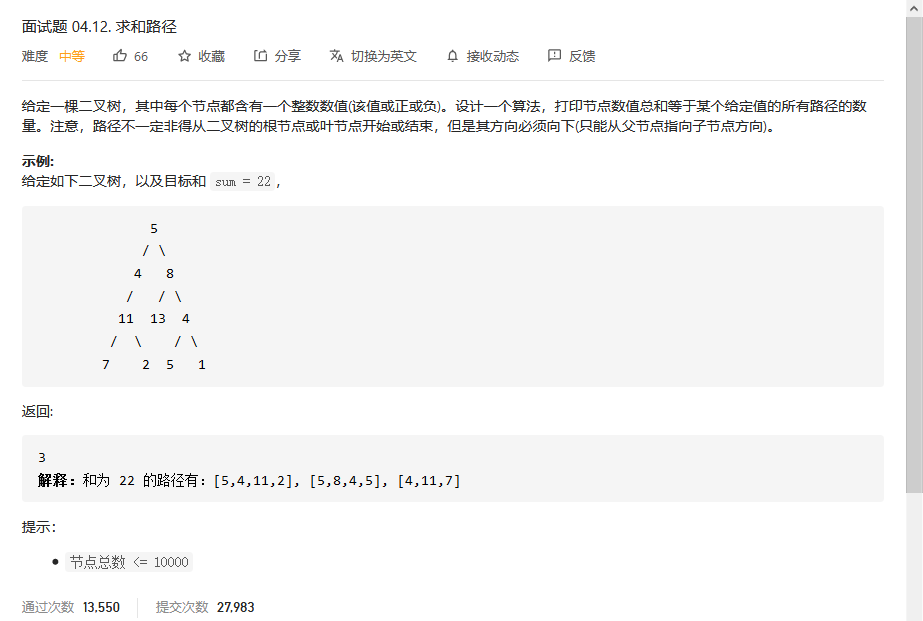

# 程序员面试金典

## 



```python

```


## 检查平衡性



```python
class Solution:
    def isBalanced(self, root: TreeNode) -> bool:
        # 计算以当前节点为根的树深度
        def Depth(root: TreeNode) -> int:
            if root:
                return 1 + max(Depth(root.left), Depth(root.right))
            return 0


        # 空树是AVL
        if not root:
            return True
        # 若左右子树深度超过1，非AVL
        if abs(Depth(root.left) - Depth(root.right)) > 1:
            return False
        # 递归执行，当出现不满足AVL性质的子树时，执行短路运算立即返回结果
        return self.isBalanced(root.left) and self.isBalanced(root.right)
```



## 合法二叉搜索树



```python
class Solution:
    def isValidBST(self, root: TreeNode) -> bool:
        res = []
        def findall(root):
            if root ==None:
                return 
            findall(root.left)
            res.append(root.val)
            findall(root.right)

        findall(root)
        if res==[] or len(res)==1:
            return True
        else:
            for i in range(1,len(res)):
                if res[i]<=res[i-1]:
                    return False
        return True

```



## 



```python

```


## 



```python

```

