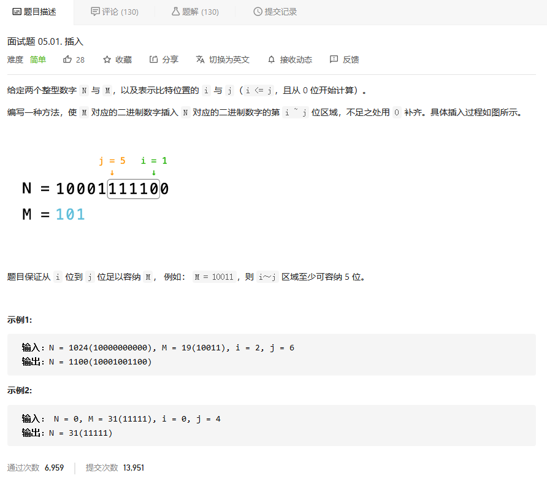
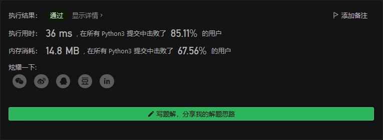

# 程序员面试金典

## 插入



```python
        M = M << i

        m_ = 0
        for num in range(j-i+1):
            m_ += pow(2,num)
        m_ = m_ << i

        return (N & (0xffffffff - m_)) | M
```



## 二进制数转字符串


```python
class Solution:
    def printBin(self, num: float) -> str:
        s = "0."
        n = 32
        while n:
            num *= 2
            r = num % 1
            p = int(num//1)
            if num%1 == 0:
                s = s+str(p)
                return s
            s = s+str(p)
            num = r
            n -= 1
        return 'ERROR'
```


## 


```python

```


## 


```python

```


## 整数转换


```python
class Solution:
    def convertInteger(self, A: int, B: int) -> int:
        return bin((A&0xffffffff)^(B&0xffffffff)).count('1')
```

