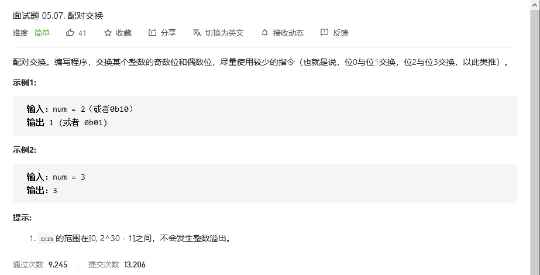
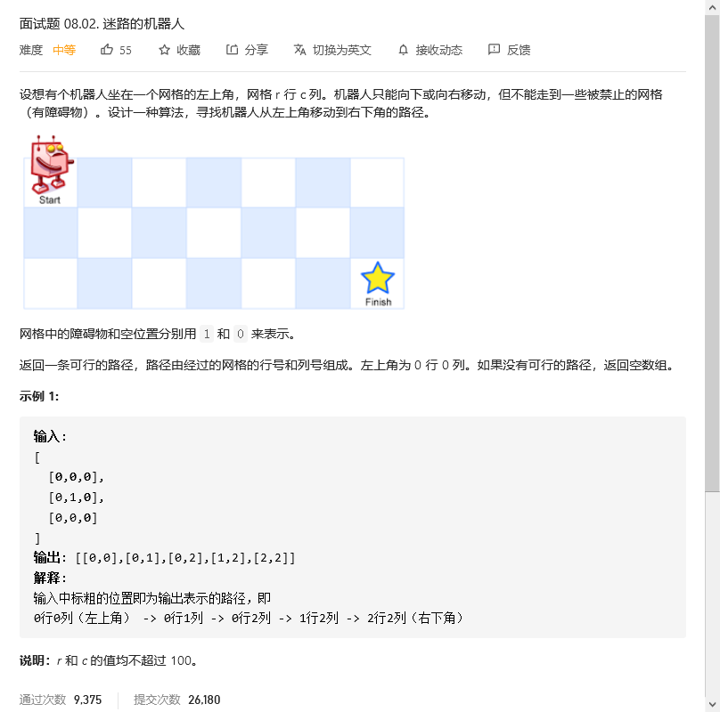

# 程序员面试金典

## 配对交换



```python
class Solution:
    def exchangeBits(self, num: int) -> int:
        return ((num & 0xaaaaaaaa) >> 1) | ((num & 0x55555555) << 1)
```


## 


```python

```


## 三步问题


```C++
class Solution {
public:
    int waysToStep(int n) {
        if (n >= 3)
        {
            int d0 = 1;
            int d1= 2;
            int d2 = 4;
            // 取模的除数
            int base = 1000000007;
            // 忽略初始3个值的计算，减少到3为止， 后续已经前面计算过了
            while (--n >= 3)
            {
                int t1 = d1;
                int t2 = d2;
                d2 = (((d0+d1) % base) + d2) % base;
                d0 = t1;
                d1 = t2;
            }

            return d2;
        }
        else
        // 考虑1-2情况，直接返回n即可
        return n;
    }
};
```


## 迷路的机器人



```python
class Solution:
    def pathWithObstacles(self, obstacleGrid: List[List[int]]) -> List[List[int]]:
        row = len(obstacleGrid)
        col = len(obstacleGrid[0])

        for c in range(1,col):
            obstacleGrid[0][c] += obstacleGrid[0][c-1] 

        for r in range(1,row):
            obstacleGrid[r][0] += obstacleGrid[r-1][0]

        for r in range(1,row):
            for c in range(1, col):
                obstacleGrid[r][c] += min(obstacleGrid[r-1][c], obstacleGrid[r][c-1])

        if obstacleGrid[row-1][col-1]:
            return []
        else:
            path = []
            row = row -1 
            col = col -1
            while(row or col):
                path.insert(0,[row,col])
                if row==0:
                    col -= 1
                    continue
                if col == 0:
                    row -= 1
                    continue

                if obstacleGrid[row-1][col]==0:
                    row -= 1
                    continue
                else:
                    col -= 1
                    continue
            path.insert(0,[row,col])
            return path
```


## 魔术索引


```python
class Solution:
    def findMagicIndex(self, nums: List[int]) -> int:
        length = len(nums)
        for i in range(length):
            if i == nums[i]:
                return i
        return -1
```

