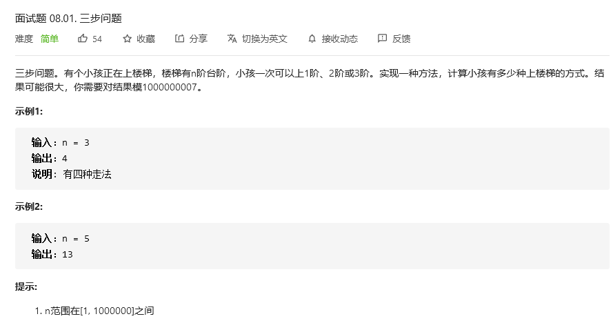
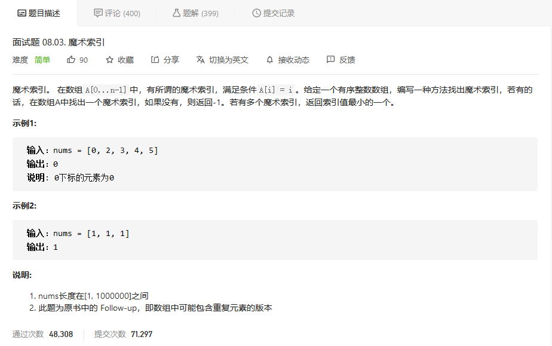
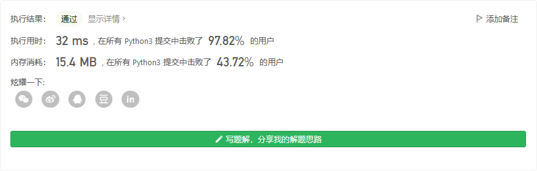

# 程序员面试金典

## 


```python

```


## 


```python

```


## 三步问题



```C++
class Solution {
public:
    int waysToStep(int n) {
        if (n >= 3)
        {
            int d0 = 1;
            int d1= 2;
            int d2 = 4;
            // 取模的除数
            int base = 1000000007;
            // 忽略初始3个值的计算，减少到3为止， 后续已经前面计算过了
            while (--n >= 3)
            {
                int t1 = d1;
                int t2 = d2;
                d2 = (((d0+d1) % base) + d2) % base;
                d0 = t1;
                d1 = t2;
            }

            return d2;
        }
        else
        // 考虑1-2情况，直接返回n即可
        return n;
    }
};
```


## 


```python

```


## 魔术索引



```python
class Solution:
    def findMagicIndex(self, nums: List[int]) -> int:
        length = len(nums)
        for i in range(length):
            if i == nums[i]:
                return i
        return -1
```

