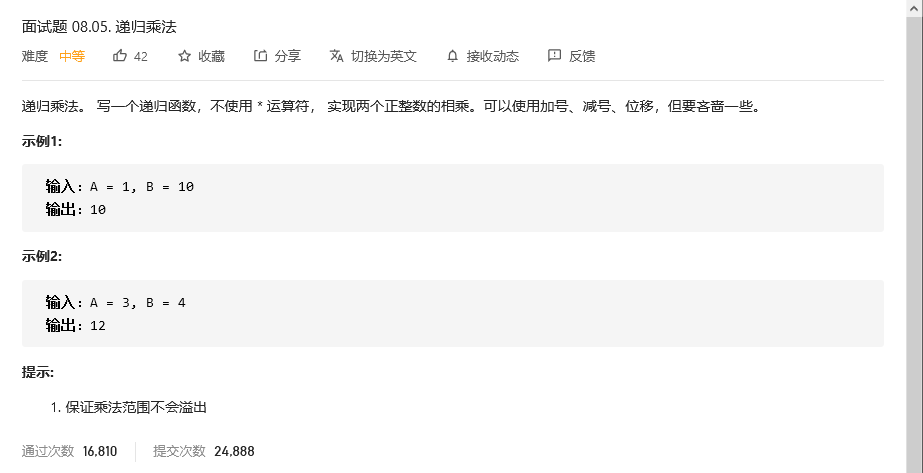
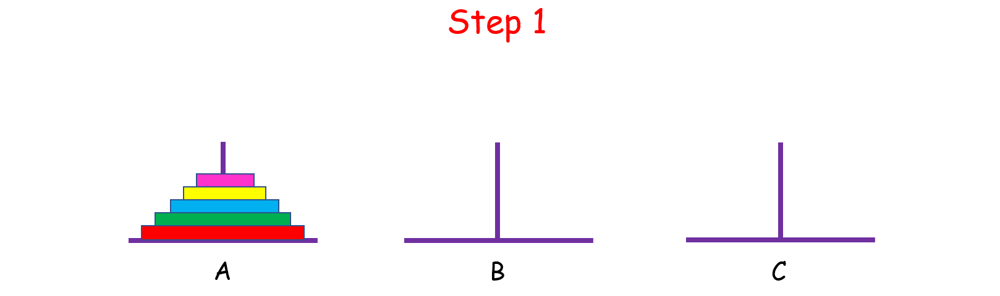

# 程序员面试金典

## 幂集


### 回溯(方法1)


```python
class Solution:
    def subsets(self, nums: List[int]) -> List[List[int]]:
        res = []
        def backtrack(nums, path, res):
            res.append(path)
            if nums == []:
                return 
            for i in range(len(nums)):
                backtrack(nums[i+1:] , path + [nums[i]], res)
        
        backtrack(nums, [], res)

        return res
```


## 递归乘法



```python
class Solution:
    def multiply(self, A: int, B: int) -> int:
        if B == 1:
            return A
        else:
            return A+self.multiply(A,B-1)
```

题目名字就已经告诉我们怎么去解决这个问题了，使用**递归**。


## 汉诺塔问题

### 问题描述

有 A,B,C 三根柱子，A 上面有 n 个盘子，我们想把 A 上面的盘子移动到 C 上，但是要满足以下三个条件：

1. 每次只能移动一个盘子;
2. 盘子只能从柱子顶端滑出移到下一根柱子;
3. 盘子只能叠在比它大的盘子上。


### 解题思路：递归与分治

这是一道递归方法的经典题目，乍一想还挺难理清头绪的，我们不妨先从简单的入手。

假设 `n = 1`,只有一个盘子，很简单，直接把它从 A 中拿出来，移到 C 上；

如果 `n = 2` 呢？这时候我们就要借助 B 了，因为小盘子必须时刻都在大盘子上面，共需要 4 步。


如果 `n > 2` 呢？思路和上面是一样的，我们把 n 个盘子也看成两个部分，一部分有 1 个盘子，另一部分有 n - 1 个盘子。



观察上图，你可能会问：“那 n - 1 个盘子是怎么从 A 移到 C 的呢？”

注意，**当你在思考这个问题的时候，就将最初的 n 个盘子从 A 移到 C 的问题，转化成了将 n - 1 个盘子从 A 移到 C 的问题**， 依次类推，直至转化成 1 个盘子的问题时，问题也就解决了。这就是分治的思想。

而实现分治思想的常用方法就是递归。不难发现，如果原问题可以分解成若干个与原问题结构相同但规模较小的子问题时，往往可以用递归的方法解决。具体解决办法如下：

1. `n = 1` 时，直接把盘子从 A 移到 C；
2. `n > 1` 时，
   1. 先把上面 n - 1 个盘子从 A 移到 B（子问题，递归）；
   2. 再将最大的盘子从 A 移到 C；
   3. 再将 B 上 n - 1 个盘子从 B 移到 C（子问题，递归）。


```python
class Solution:
    def hanota(self, A: List[int], B: List[int], C: List[int]) -> None:
        """
        Do not return anything, modify C in-place instead.
        """
        n = len(A)
        self.move(n, A, B, C)
    # 定义move 函数移动汉诺塔
    def move(self,n, A, B, C):
        if n == 1:
            C.append(A[-1])
            A.pop()
            return 
        else:
            self.move(n-1, A, C, B)  # 将A上面n-1个通过C移到B
            C.append(A[-1])          # 将A最后一个移到C
            A.pop()                  # 这时，A空了
            self.move(n-1,B, A, C)   # 将B上面n-1个通过空的A移到C
```

### 复杂度分析：世界会毁灭吗

- 时间复杂度：`O(2^n−1)`。一共需要移动的次数。
- 空间复杂度：`O(1)`。

当 `n = 64`时，也就是有 64 个盘子的时候，如果每秒移动一个盘子，大约需要 1.8×10*19秒...

那个时候地球会毁灭吗？ ——也许会，也许不会。


## 无重复字符串的排列组合


```python
class Solution:
    def permutation(self, S: str) -> List[str]:
        res = []
        nums = [s for s in S]
        def dfs(num, path,res):
            if len(num) ==0:
                res.append(path)
                return 
            for i in range(len(num)):
                nums = num.copy()
                nums.pop(i)
                dfs(nums,path +num[i],res)
        
        dfs(nums, '', res)
        return res
```


## 有重复字符串的排列组合


```python
class Solution:
    def permutation(self, S: str) -> List[str]:
        res = []
        nums = [s for s in S]
        def dfs(num, path,res):
            if len(num) ==0:
                if path in res:
                    return 
                res.append(path)
                return 
            for i in range(len(num)):
                nums = num.copy()
                nums.pop(i)
                dfs(nums,path +num[i],res)
        
        dfs(nums, '', res)
        return res
```

