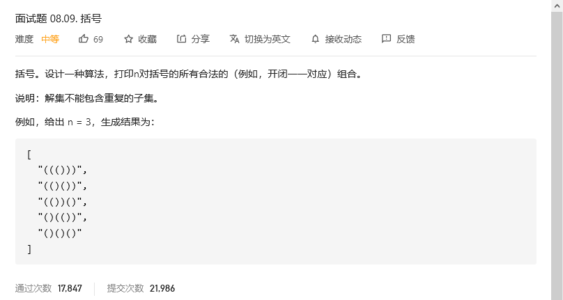
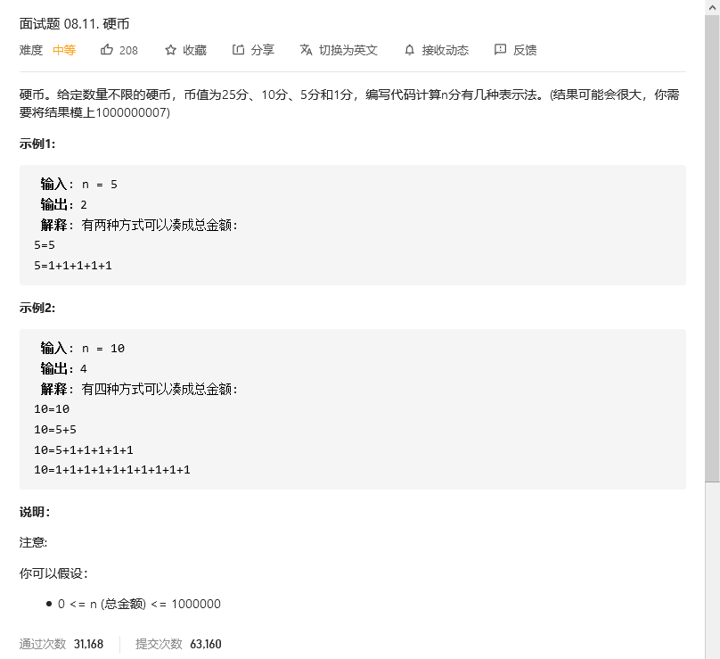

# 程序员面试金典

## 括号



### 解题思路

`回溯`的灵魂就是画出`树结构图`，画这个图我也是参考了其它题解，因为我一直不知道这种左右括号的树型图应该怎么画，没有任何想法。


出图之后，我发现这其实就是一个满二叉树，我们只需要DFS所有节点即可。个人的经验是千万别想着一口吃个胖纸，先把最基本的实现，然后再去改进。所以我先把所有组合给生成出来，即`DFS`所有节点。

```python
class Solution:
    def generateParenthesis(self, n: int) -> List[str]:
        if n <= 0: return []
        res = []

        def dfs(paths):
            if len(paths) == n * 2:  # 因为括号都是成对出现的
                res.append(paths)
                return

            dfs(paths + '(')
            dfs(paths + ')')

        dfs('')
        return res
```

输出的结果如下:

`['((((', '((()', '(()(', '(())', '()((', '()()', '())(', '()))', ')(((', ')(()', ')()(', ')())', '))((', '))()', ')))(', '))))']`

我们发现有一些结果是我们不需要的，比如`((((`，比如`))))`.观察不需要的括号特点，`((((`实际上已经超过n了，我们生成同一方向的括号只需要n个即可，在生成的时候我们要限制住左括号与右括号生成的数量.这时我增加了left与right参数，分别代表左括号与右括号的数量，每生成一个我就增加一个。那结束DFS的条件首先就需要把不符合的给过滤掉，` ( > n` 或 `) > n `或 `) > (`当然 `) > n `这个条件也可以没有，因为 `) > ( `条件已经给控制住了。

```python
def dfs(paths, left, right):
    if left > n or right > left: return
    if len(paths) == n * 2:  # 因为括号都是成对出现的
        res.append(paths)
        return

    dfs(paths + '(', left + 1, right)  # 生成一个就加一个
    dfs(paths + ')', left, right + 1)
```

`['((()))', '(()())', '(())()', '()(())', '()()()']`

```python
class Solution:
    def generateParenthesis(self, n: int) -> List[str]:
        if n <= 0: return []
        res = []

        def dfs(paths, left, right):
            if left > n or right > left: return
            if len(paths) == n * 2:  # 因为括号都是成对出现的
                res.append(paths)
                return

            dfs(paths + '(', left + 1, right)  # 生成一个就加一个
            dfs(paths + ')', left, right + 1)

        dfs('', 0, 0)
        return res
```


## 


```python

```


## 硬币



```python

```


## 


```python

```


## 


```python

```

