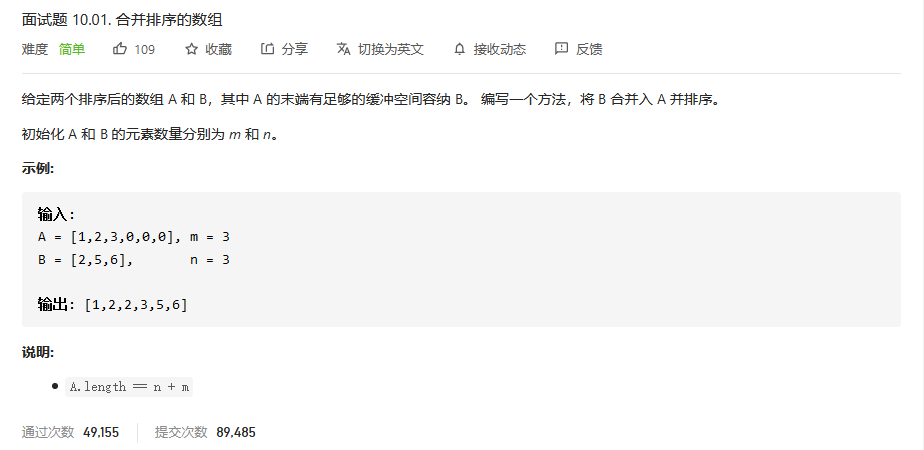
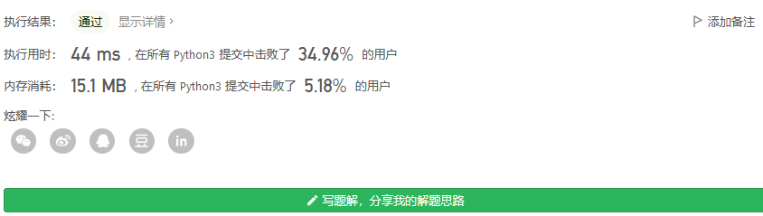
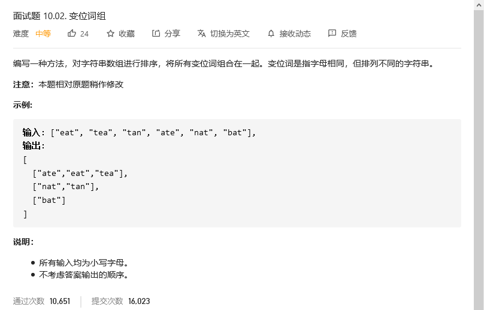
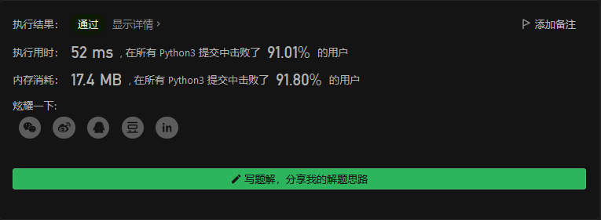
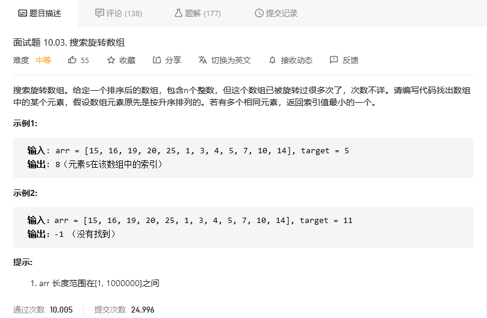
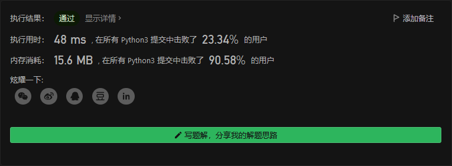
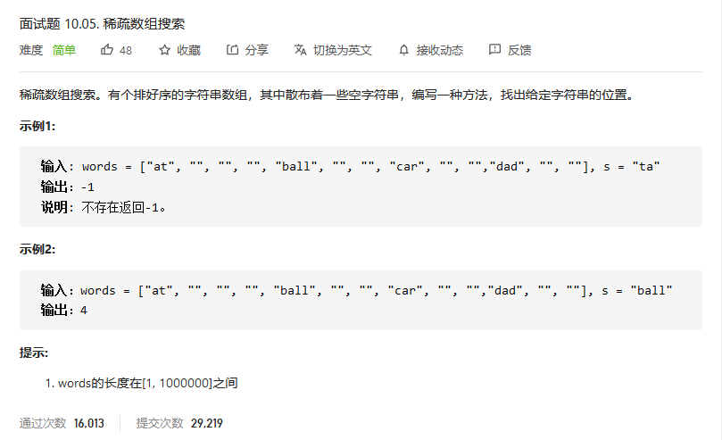
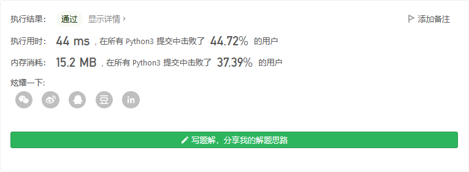

# 程序员面试金典

## 


```python

```


## 合并排序的数组



```python
class Solution:
    def merge(self, A: List[int], m: int, B: List[int], n: int) -> None:
        """
        Do not return anything, modify A in-place instead.
        """
        if n:
            A[m] = B[0]
            point = m
            while(point>0):
                if A[point]<A[point-1]:
                    mid = A[point-1]
                    A[point-1] = A[point]
                    A[point] = mid
                    point -= 1
                else:
                    break
            return self.merge(A,m+1,B[1:],n-1)
        else:
            return A
```

递归



## 变位词组



```python
class Solution:
    def groupAnagrams(self, strs: List[str]) -> List[List[str]]:
        res = []
        mid = {}
        for i in strs:
            sort_s = ''.join(sorted(i))
            try:
                a = mid[sort_s]
                a.append(i)
                mid[sort_s] = a
            except:
                mid[sort_s] = [i]
        for key in mid:
            res.append(mid[key])
        return res
```



## 搜索旋转数组



```python
class Solution:
    def search(self, arr: List[int], target: int) -> int:
        for i in range(len(arr)):
            if arr[i]==target:
                return i

        return -1
```



## 稀疏数组搜索



```python
class Solution:
    def findString(self, words: List[str], s: str) -> int:
        first = 0
        end = len(words)-1
        while(end - first > 1):
            mid = (first+end)//2
            mid2 = mid
            while(words[mid2]==""):
                if mid2 + 1<end:
                    mid2+=1
                    continue
                end = mid
                break
            if words[mid2]==s:
                return mid2
            elif words[mid2]<s:
                first = mid2
            else:
                end = mid
        
        if words[first]==s:
            return first
        elif words[end]==s:
            return end
        else:
            return -1
```

二分查找。

