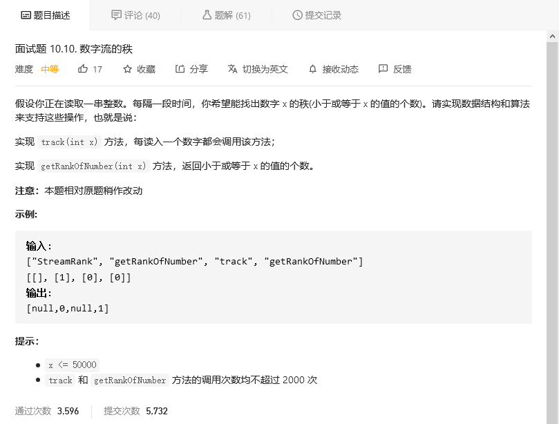

# 程序员面试金典

## 排序矩阵查找


### 暴力搜索
```python
class Solution:
    def searchMatrix(self, matrix: List[List[int]], target: int) -> bool:
        for i in range(len(matrix)):
            for j in range(len(matrix[0])):
                if target==matrix[i][j]:
                    return True
        return False
```


## 数字流的秩



```python
class StreamRank:

    def __init__(self):
        self.list = []


    def track(self, x: int) -> None:
        self.list.append(x)
        self.list.sort(reverse=True)


    def getRankOfNumber(self, x: int) -> int:
        self.track(x)
        index = self.list.index(x)
        if index == len(self.list)-1:
            self.list.pop(index)
            return 0
        num = len(self.list)-index-1
        self.list.pop(index)
        return num
```


## 


```python

```


## 交换数字


### 返回list

```python
class Solution:
    def swapNumbers(self, numbers: List[int]) -> List[int]:
        return [numbers[1], numbers[0]]
```

这个可能不太符合题目要求。


### 加减法

```python
class Solution:
    def swapNumbers(self, numbers: List[int]) -> List[int]:
        numbers[0] += numbers[1]
        numbers[1] = numbers[0] - numbers[1]
        numbers[0] -= numbers[1]
        return numbers
```


### 异或（可以防止溢出）


```python
class Solution:
    def swapNumbers(self, numbers: List[int]) -> List[int]:
        numbers[0] ^= numbers[1]
        numbers[1] ^= numbers[0]
        numbers[0] ^= numbers[1]
        return numbers
```

两次异或得到原值。


## 单词频率


```python
class WordsFrequency:

    def __init__(self, book):
        self.words = {}
        for word in book:
            try:
                if self.words[word]:
                    self.words[word] +=1
            except:
                self.words[word] = 1

    def get(self, word: str) -> int:
        try:
            if self.words[word]:
                return self.words[word]
        except:
            return 0
```

算哈希，用字典存储单词频率，key为单词，value为频率。

