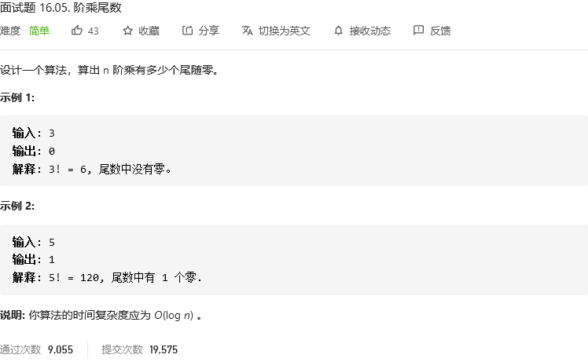
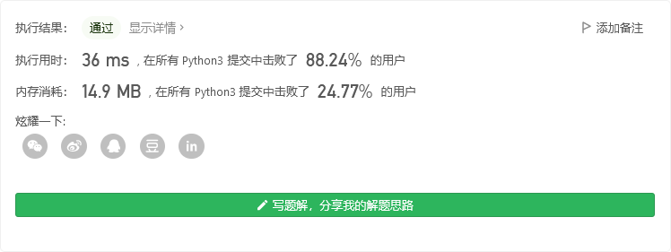
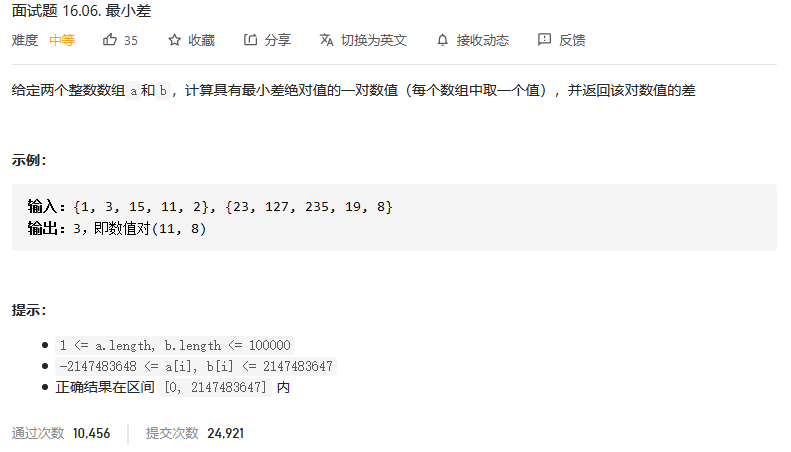
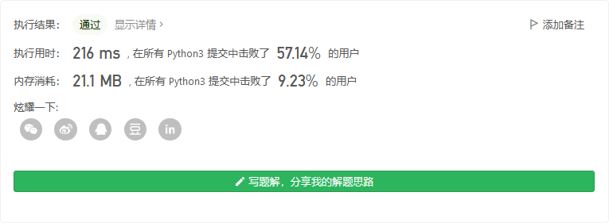
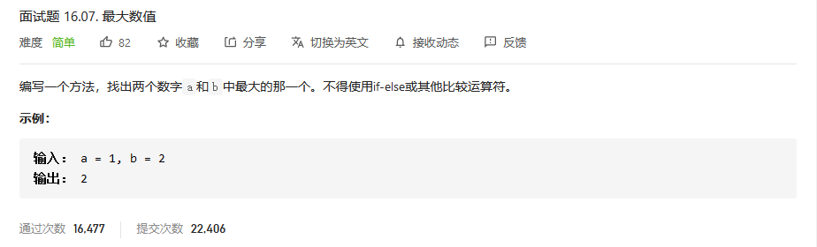
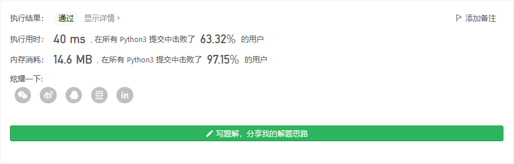

# 程序员面试金典

## 


```python

```


## 


```python

```


## 阶乘尾数



```python
class Solution:
    def trailingZeroes(self, n: int) -> int:
        num = 0
        while(n>0):
            n = n//5
            num += n
        return num
```

尾数为0，说明有10，说明因子有2*5
显然2比5多，5的个数就是尾数0的个数



## 最小差



```python
class Solution:
    def smallestDifference(self, a: List[int], b: List[int]) -> int:
        if not a or not b:
            return 0

        # 先排序，便于双指针遍历
        a.sort()
        b.sort()

        # 双指针
        a_index = 0
        b_index = 0

        diff = float('inf')
        while a_index < len(a) and b_index < len(b):
            # 更新最小差值
            diff = min(diff, abs(a[a_index] - b[b_index]))
            if a[a_index] - b[b_index] > 0:
                # a > b, 则b前进（因为已经排过序，前进的值更大），这样才可能让差值更小
                b_index += 1
            else:
                a_index += 1

        return abs(diff)
```



## 最大数值



```python
class Solution:
    def maximum(self, a: int, b: int) -> int:
        return max([a,b])
```

