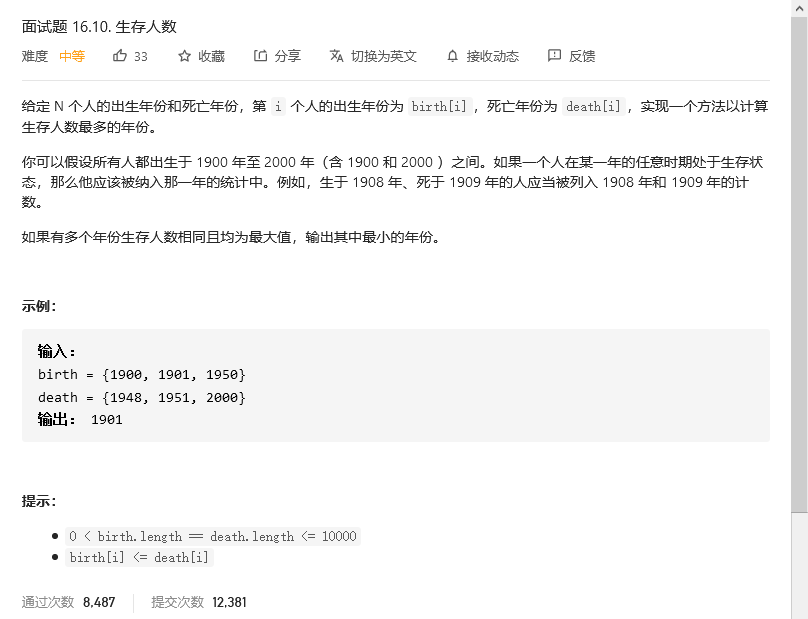
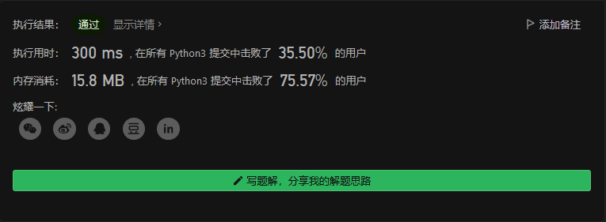
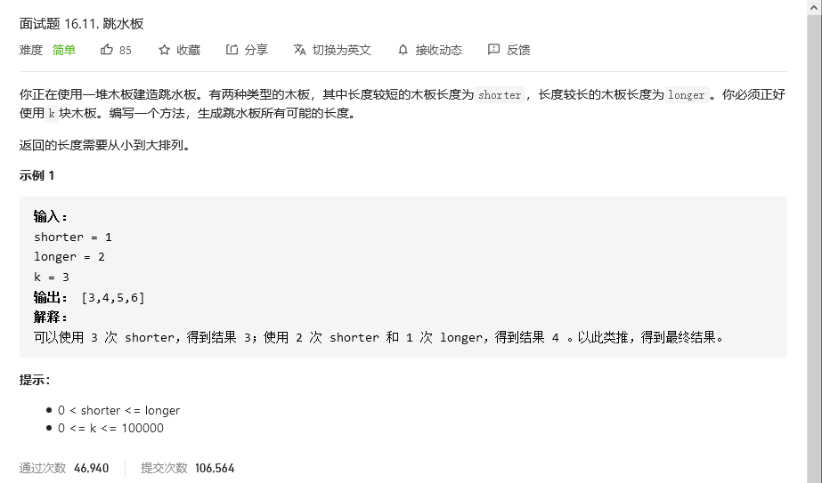
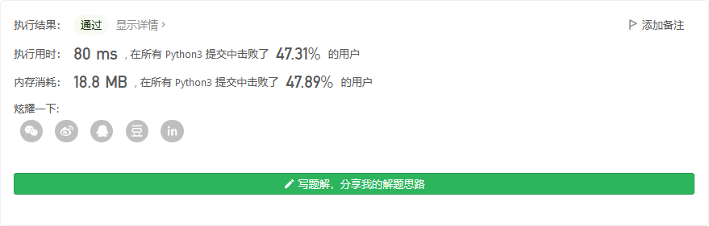
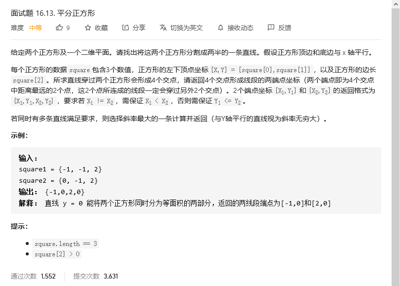
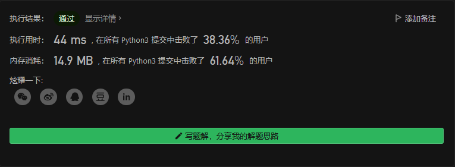

# 程序员面试金典

## 


```python

```


## 


```python

```


## 生存人数



```python
class Solution:
    def maxAliveYear(self, birth: List[int], death: List[int]) -> int:
        base = min(birth)
        top = max(death)
        livenum = [0]*(top-base+1)
        for i in range(len(birth)):
            for j in range(birth[i]-base,death[i]-base+1):
                livenum[j] +=1
        year = base+livenum.index(max(livenum))
        return year
```



## 跳水板



```python
class Solution:
    def divingBoard(self, shorter: int, longer: int, k: int) -> List[int]:
        if k == 0:
            return []
        if shorter==longer:
            return [shorter*k]

        val = []
        for i in range(k+1):
            val.append(shorter*(k-i)+longer*i)
        return val
```



## 平分正方形



```python
class Solution:
    def cutSquares(self, square1: List[int], square2: List[int]) -> List[float]:
        # 正方形1的中心点
        midx1 = square1[0]+square1[2]/2
        midy1 = square1[1]+square1[2]/2
        # 正方形2的中心点
        midx2 = square2[0]+square2[2]/2
        midy2 = square2[1]+square2[2]/2

        # 评分两个正方形的直线
        # 斜率无穷大
        if midx1==midx2:
            return [midx1,min(square1[1],square2[1]),midx1,max(sum(square2[1:]),sum(square1[1:]))]
        # 斜率
        k = (midy2-midy1)/(midx2-midx1)
        # 截距
        b = midy2-k*midx2

        if k>=0:
            if square1[1]>=square1[0]*k+b:
                mins1x1 = (square1[1]-b)/k
                mins1y1 = square1[1]
                maxs1x1 = (square1[1]+square1[2]-b)/k
                maxs1y1 = square1[1]+square1[2]
            else:
                mins1x1 = square1[0]
                mins1y1 = square1[0]*k+b
                maxs1x1 = square1[0]+square1[2]
                maxs1y1 = (square1[0]+square1[2])*k+b

            if square2[1]>=square2[0]*k+b:
                mins2x1 = (square2[1]-b)/k
                mins2y1 = square2[1]
                maxs2x1 = (square2[1]+square2[2]-b)/k
                maxs2y1 = square2[1]+square2[2]
            else:
                mins2x1 = square2[0]
                mins2y1 = square2[0]*k+b
                maxs2x1 = square2[0]+square2[2]
                maxs2y1 = (square2[0]+square2[2])*k+b
        else:
            if square1[1]+square1[2]>=square1[0]*k+b:
                mins1x1 = square1[0]
                mins1y1 = square1[0]*k+b
                maxs1x1 = square1[0]+square1[2]
                maxs1y1 = (square1[0]+square1[2])*k+b
            else:
                mins1x1 = (square1[1]-b)/k
                mins1y1 = square1[1]
                maxs1x1 = (square1[1]+square1[2]-b)/k
                maxs1y1 = square1[1]+square1[2]


            if square2[1]+square2[2]>=square2[0]*k+b:
                mins2x1 = square2[0]
                mins2y1 = square2[0]*k+b
                maxs2x1 = square2[0]+square2[2]
                maxs2y1 = (square2[0]+square2[2])*k+b
            else:
                mins2x1 = (square2[1]-b)/k
                mins2y1 = square2[1]
                maxs2x1 = (square2[1]+square2[2]-b)/k
                maxs2y1 = square2[1]+square2[2]

        x = [mins1x1,maxs1x1,mins2x1,maxs2x1]
        y = [mins1y1,maxs1y1,mins2y1,maxs2y1]

        return [min(x),y[x.index(min(x))],max(x),y[x.index(max(x))]]
```


