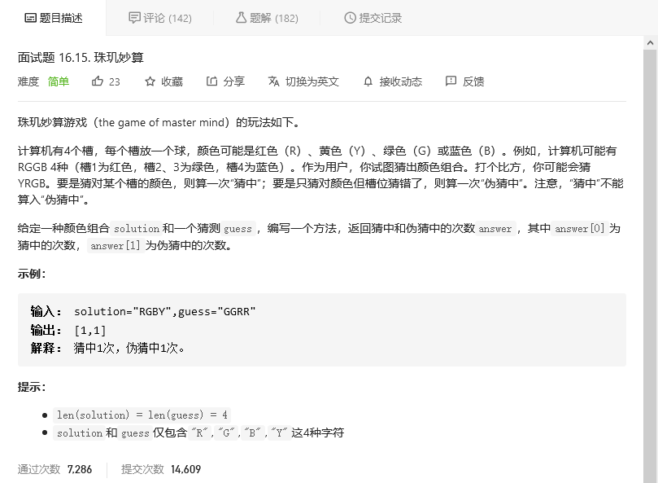
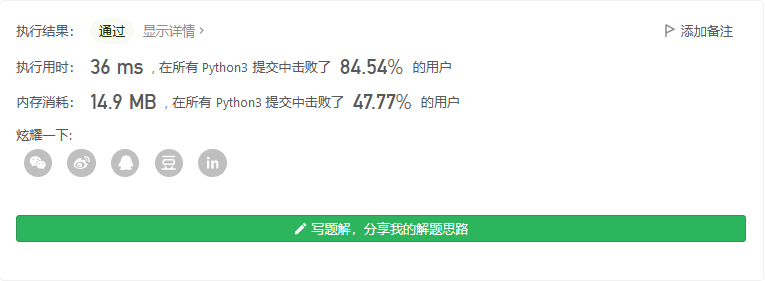
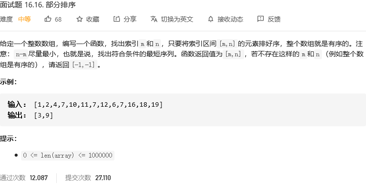
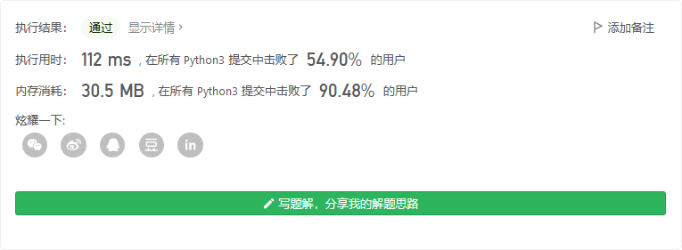
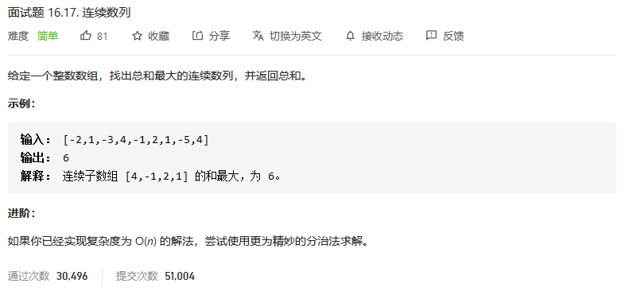
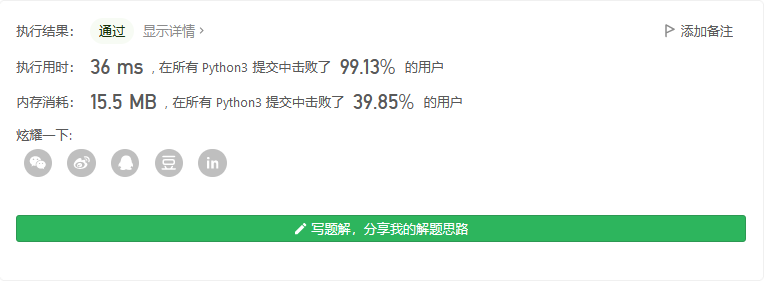

# 程序员面试金典

## 


```python

```


## 珠玑妙算



```python
class Solution:
    def masterMind(self, solution: str, guess: str) -> List[int]:
        answer0 = 0
        answer1 = 0

        s1 = {'R':0,'G':0,'B':0,'Y':0}
        g1 = {'R':0,'G':0,'B':0,'Y':0}

        for i in range(4):
            if solution[i]==guess[i]:
                answer0 += 1
            else:
                s1[solution[i]] += 1
                g1[guess[i]] += 1
        
        for key in s1:
            answer1 += min(s1[key],g1[key])
        
        return [answer0, answer1]
```



## 部分排序



```python
class Solution:
    def subSort(self, array: List[int]) -> List[int]:
        if array == []:
            return [-1,-1]

        pos = sorted(array)
        start = 0
        for i in range(len(array)):
            if pos[i]==array[i]:
                continue
            else:
                start = i
                break

        if start == 0 and pos[0]==array[0]:
            return [-1,-1]

        end = len(array)-1
        point = end
        while point>=0:
            if pos[point]==array[point]:
                point-=1
                continue
            else:
                end = point
                break
        
        if end == len(array)-1 and pos[end]==array[end]:
            return [-1,-1]

        return [start,end]
```



## 连续数列



### 方法一：动态规划

假设 `nums` 数组的长度是 `n`，下标从 `0` 到 `n−1`。

我们用 `f(i)` 代表以第 `i` 个数结尾的`「连续子数组的最大和」`，那么很显然我们要求的答案就是：

    `max_{0<=i<=in1}\{f(i)\}`

因此我们只需要求出每个位置的 `f(i)`，然后返回 `f` 数组中的最大值即可。那么我们如何求 `f(i) `呢？我们可以考虑 `nums[i]` 单独成为一段还是加入 `f(i−1)`对应的那一段，这取决于 `nums[i]`和 `f(i−1)+nums[i]`的大小，我们希望获得一个比较大的，于是可以写出这样的动态规划转移方程：

    `f(i)=max⁡{f(i−1)+nums[i],nums[i]}`

不难给出一个时间复杂度 `O(n)`、空间复杂度 `O(n)` 的实现，即用一个 `f` 数组来保存 `f(i)`的值，用一个循环求出所有` f(i)`。考虑到` f(i)`只和 `f(i−1)` 相关，于是我们可以只用一个变量 `pre` 来维护对于当前 `f(i)` 的 `f(i−1)`的值是多少，从而让空间复杂度降低到 `O(1)`，这有点类似「滚动数组」的思想。

```python
class Solution:
    def maxSubArray(self, nums: List[int]) -> int:
        fi = [nums[0]]
        for i in range(1,len(nums)):
            fi.append(max(fi[i-1]+nums[i], nums[i]))
        return max(fi)
```



## 


```python

```

