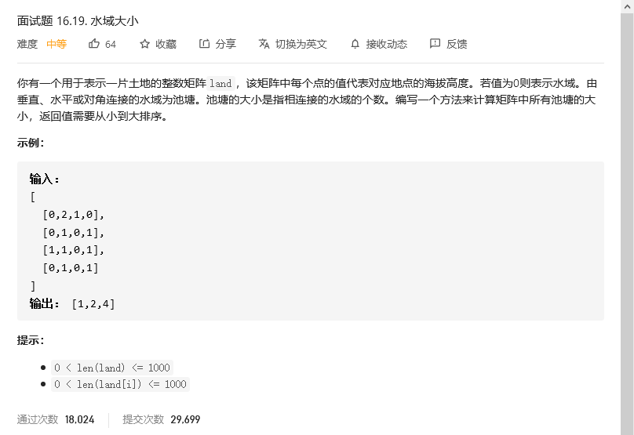
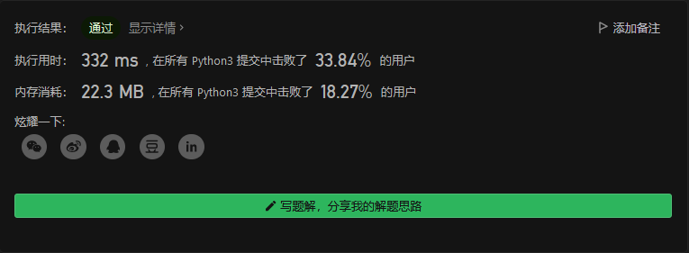
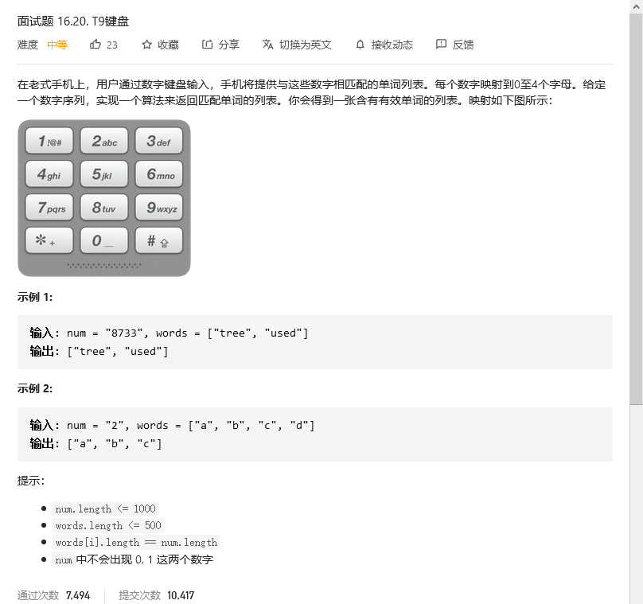
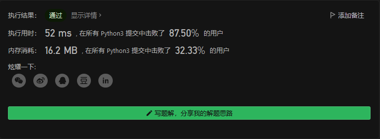
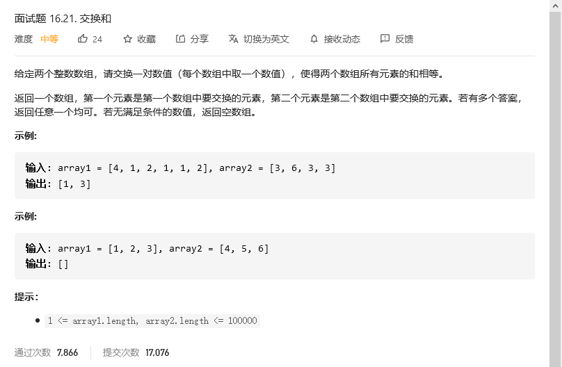
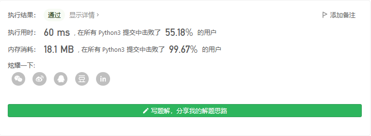

# 程序员面试金典

## 水域大小



### 解法——dfs

dfs模板带返回值。基本思路就是深度优先搜索，需要注意的是这里不是传统的上下左右四个方向搜索，而是上、下、左、右、左上、右上、左下、右下共8个方向都要搜索。需要建立visited数组标记已访问过的位置，防止重复访问。越界也要提前返回。起点从0值开始，每找到一个0计算统计加1。虽然也可以不用visited数组，直接修改原数组，但是`修改输入总归不是好的编程规范`，建议用visited数组标记访问过，不修改原数组。

```python
class Solution:
    def pondSizes(self, land: List[List[int]]) -> List[int]:
        M = len(land)
        N = len(land[0])
        dirs = [[-1, -1], [-1, 0], [-1, 1], [0, -1], [0, 1], [1, -1], [1, 0], [1, 1]] # 8个方向
        res = []

        def dfs(land, i, j) :
            if (i < 0 or i >= M or j < 0 or j >= N or visited[i][j] or land[i][j] > 0) :
                return 0

            visited[i][j] = True
            res = 1
            for dir in dirs :
                ni = i + dir[0]
                nj = j + dir[1]
                res += dfs(land, ni, nj)

            return res
            
        visited = [[False] * N for _ in range(0, M)]
        for i in range(0, M) :
            for j in range(0, N) :
                if (not visited[i][j] and land[i][j] == 0) :
                    res.append(dfs(land, i, j))

        res.sort()
        return res
```



## 



```python
class Solution:
    def getValidT9Words(self, num: str, words: List[str]) -> List[str]:
        ## 回溯算法，但是超时了
        # num_str = {'2':['a','b','c'], '3':['d','e','f'], '4':['g','h','i'], '5':['j','k','l'], '6':['m','n','o'], '7':['p','q','r','s'], '8':['t','u','v'], '9':['w','x','y','z']}
        # res = []
        # def findall(nums, path):
        #     if nums == []:
        #         if path in words:
        #             res.append(path)
        #         return 
        #     for i in nums[0]:
        #         findall(nums[1:], path+i)
        # nums = []
        # for i in num:
        #     nums.append(num_str[i])
        # findall(nums, '')
        # return res

        ## 回溯+剪枝 超时
        # num_str = {'2':['a','b','c'], '3':['d','e','f'], '4':['g','h','i'], '5':['j','k','l'], '6':['m','n','o'], '7':['p','q','r','s'], '8':['t','u','v'], '9':['w','x','y','z']}
        # res = []
        # def findall(nums, path):
        #     if nums == []:
        #         if path in words:
        #             res.append(path)
        #         return 
        #     for i in nums[0]:
        #         for j in words:
        #             if j[:len(path+i)]==path+i:
        #                 findall(nums[1:], path+i)
        #                 break         
        # nums = []
        # for i in num:
        #     nums.append(num_str[i])
        # findall(nums, '')
        # return res

        kb = {'2':'abc', '3':'def', '4':'ghi', '5':'jkl', '6':'mno', '7':'pqrs', '8':'tuv', '9':'wxyz'}
        ns = list(num)
        candidate = words
        for i, n in enumerate(ns):
            candidate = [w for w in candidate if w[i] in kb[n]]

        return candidate
```



## 交换和



```python
class Solution:
    def findSwapValues(self, array1: List[int], array2: List[int]) -> List[int]:
        sum1 = sum(array1)
        sum2 = sum(array2)
        delta = sum2-sum1
        if delta % 2 != 0:
            return []
        
        delta = delta//2
        s2 = set(array2)
        for i in range(len(array1)):
            if array1[i]+delta in s2:
                return [array1[i], array1[i]+delta]
        return []
```



## 


```python

```


## 


```python

```

