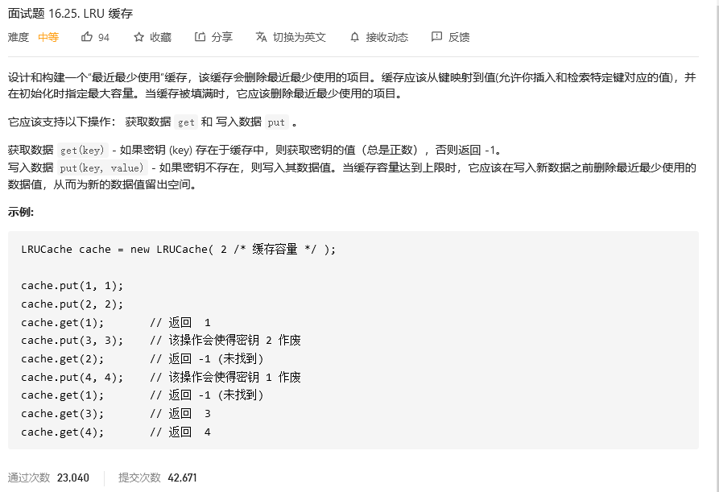
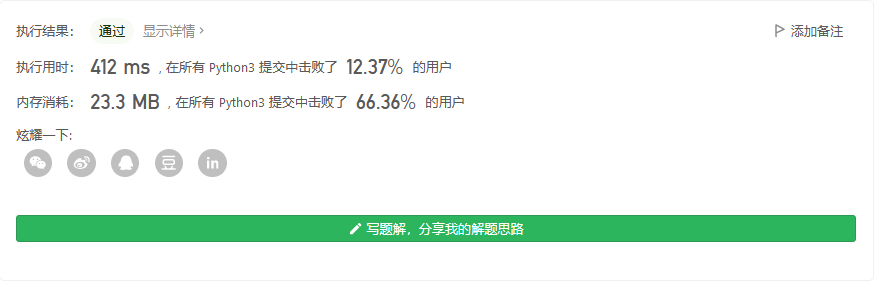
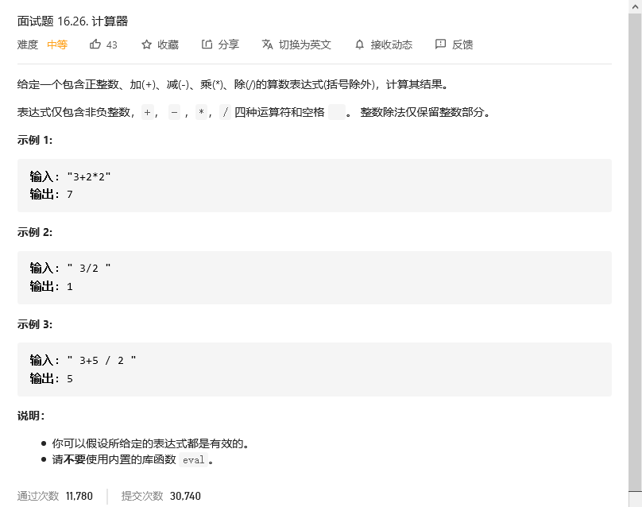
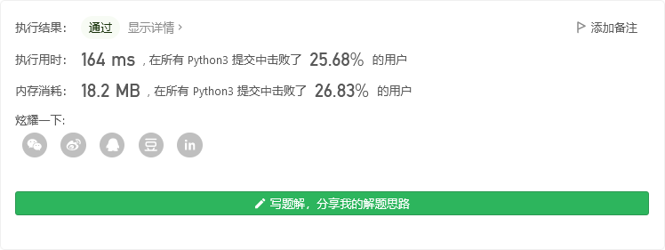
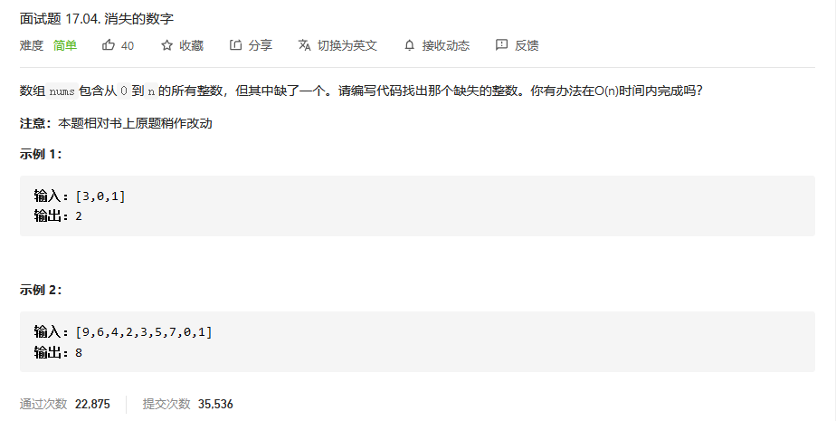
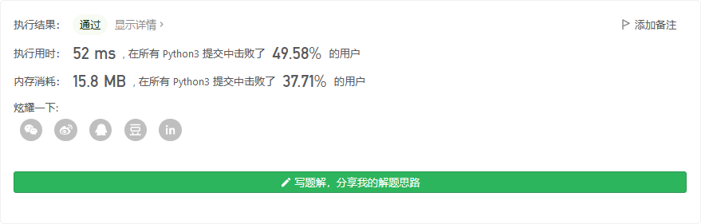

# 程序员面试金典

## LRU缓存



```python
class LRUCache:

    def __init__(self, capacity: int):
        self.cap = capacity # 容量，常熟
        self.len = 0 # 缓存数目，动态，判断是否满
        self.lru = {} # 缓存key-value
        self.keylist = [] # 每使用一次key，在list中删除，然后再排在list的最后

    def get(self, key: int) -> int:
        try:
            self.keylist.pop(self.keylist.index(key))
            self.keylist.append(key)
            return self.lru[key]
        except:
            return -1

    def put(self, key: int, value: int) -> None:
        try:
            a = self.lru[key]
            self.keylist.pop(self.keylist.index(key))
            self.keylist.append(key)
            self.lru[key] =value
        except:
            if self.len == self.cap:
                self.lru.pop(self.keylist.pop(0))
                self.lru[key] = value
                self.keylist.append(key)
            else:
                self.lru[key] = value
                self.keylist.append(key)
                self.len+=1
```



## 计算器



```python
class Solution:
    def calculate(self, s: str) -> int:
        numlist = ['0','1','2','3','4','5','6','7','8','9']
        oplist = ['+','-','*','/']
        stack = []
        for i in s: # 分离数字和运算符
            if i == ' ':
                    continue
            if stack:
                if i in numlist:
                    if stack[-1] not in oplist:
                        stack[-1] = stack[-1]*10+int(i)
                    else:
                        stack.append(int(i))
                else:
                    stack.append(i)
            else:
                stack.append(int(i))

        if len(stack)<2:
            return sum(stack)
        i = 0
        stack2 = []
        while i < len(stack): # 计算乘法和除法
            if stack[i] not in oplist:
                stack2.append(stack[i])
            elif stack[i] == "*":
                stack2[-1] *= stack[i+1]
                i+=2
                continue
            elif stack[i] == "/":
                stack2[-1] = stack2[-1] // stack[i+1]
                i+=2
                continue
            else:
                stack2.append(stack[i])
            i+= 1
            
        i = 0
        sum1 =stack2[i]
        while i+1< len(stack2): # 计算加法和减法
            if stack2[i+1] == "+":
                sum1 += stack2[i+2]
            else:
                sum1 -= stack2[i+2]
            i+=2
        return sum1
```




## 不用加号的加法


```python
class Solution:
    def add(self, a: int, b: int) -> int:
        return sum([a,b])
```


## 消失的数字



```python
class Solution:
    def missingNumber(self, nums: List[int]) -> int:
        nums2 = [i for i in range(len(nums)+1)]
        for i in nums:
            nums2[i] = -1
        i = len(nums)
        while(i>-1):
            if nums2[i] == i:
                return i
            i-=1
```



## 


```python

```

