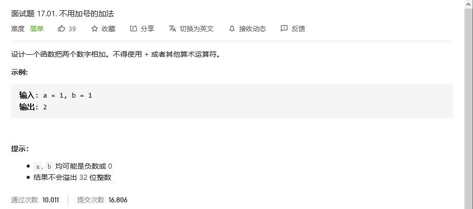
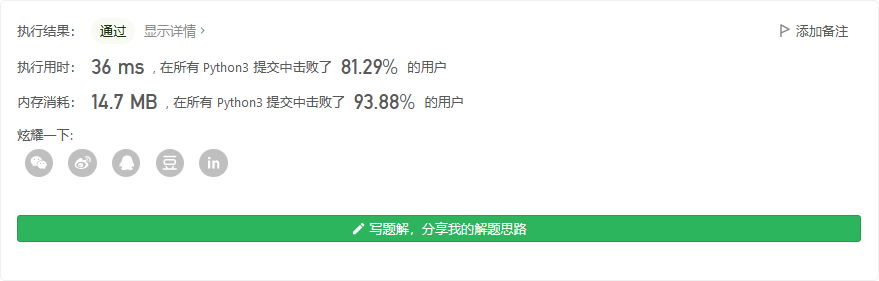

# 程序员面试金典

## 


```python

```


## 


```python

```


## 不用加号的加法



```python
class Solution:
    def add(self, a: int, b: int) -> int:
        return sum([a,b])
```



## 消失的数字


```python
class Solution:
    def missingNumber(self, nums: List[int]) -> int:
        nums2 = [i for i in range(len(nums)+1)]
        for i in nums:
            nums2[i] = -1
        i = len(nums)
        while(i>-1):
            if nums2[i] == i:
                return i
            i-=1
```


## 


```python

```

