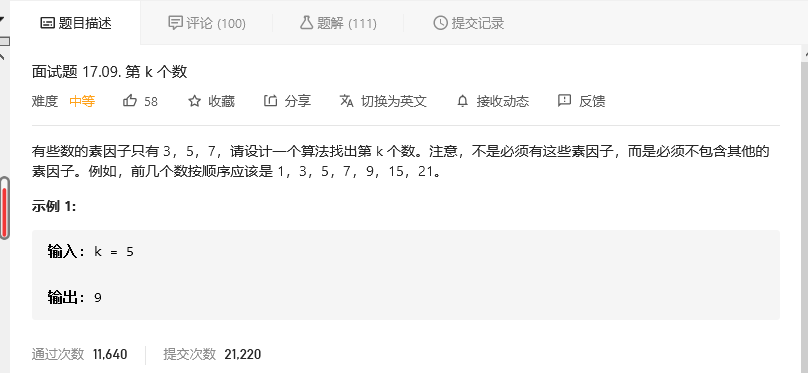
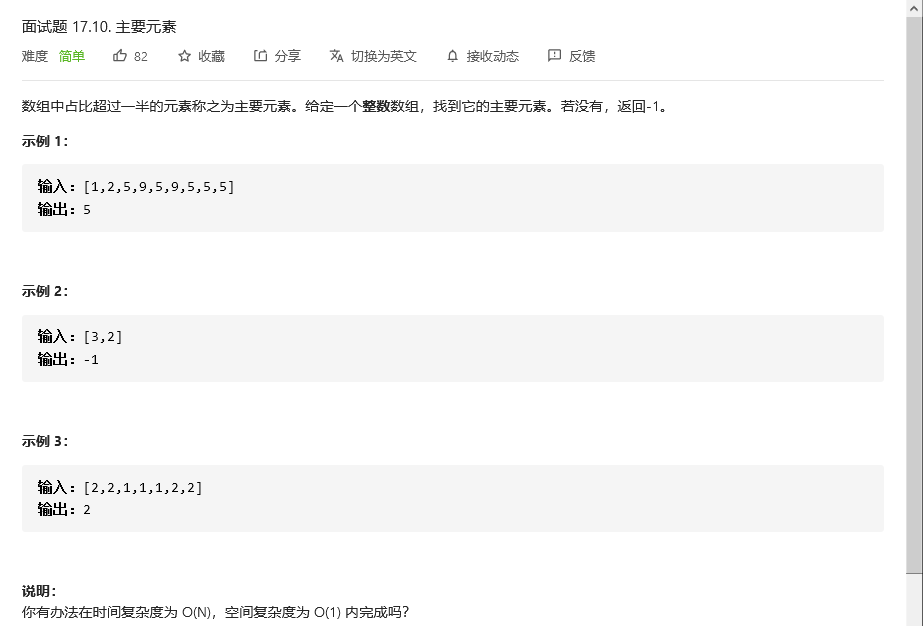
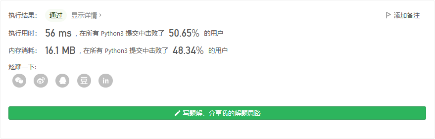

# 程序员面试金典

## 


```python

```


## 


```python

```


## 


```python

```


## 



```python

```


## 主要元素



```python
class Solution:
    def majorityElement(self, nums: List[int]) -> int:
        num = 0 # 数组长度
        ele = {} # 哈希

        # 每个元素的出现次数
        for i in nums:
            try:
                if ele[i]:
                    ele[i] += 1
            except:
                ele[i] = 1
            num+=1
        
        # 找到主要元素
        for i in nums:
            if ele[i]>num/2:
                return i
        return -1
```

