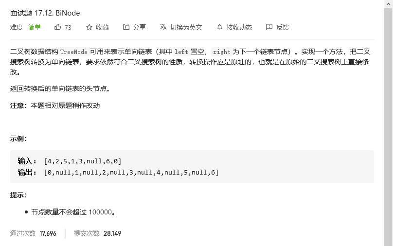
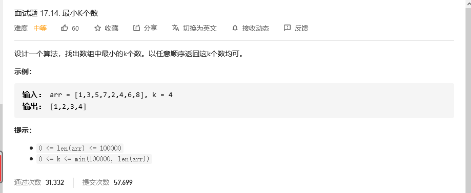

# 程序员面试金典

## 单词距离


```python
class Solution:
    def findClosest(self, words: List[str], word1: str, word2: str) -> int:
        # pos = 0
        # index = {}
        # for word in words:
        #     try:
        #         if index[word]:
        #             index[word].append(pos)
        #             pos +=1
        #     except:
        #         index[word] = [pos]
        #         pos +=1
        
        # word1list = index[word1]
        # word2list = index[word2]
        # d = []
        # for i in word1list:
        #     for j in word2list:
        #         d.append(abs(i-j))

        word1list = []
        word2list = []
        pos = 0
        d =[]
        for word in words:
            if word == word1:
                word1list.append(pos)
            elif word == word2:
                word2list.append(pos)
            pos +=1
        for i in word1list:
            for j in word2list:
                d.append(abs(i-j))

        return min(d)
```


## BiNode



```python
# Definition for a binary tree node.
# class TreeNode:
#     def __init__(self, x):
#         self.val = x
#         self.left = None
#         self.right = None

class Solution:
    def convertBiNode(self, root: TreeNode) -> TreeNode:
        head = TreeNode(0)
        a = []

        def findall(root):
            if root==None:
                return 
            findall(root.left)
            a.append(TreeNode(root.val))
            findall(root.right)

        findall(root)
        pos = head
        for i in a:
            pos.right = i
            pos = pos.right
        return head.right
```

树的中序遍历


## 


```python

```


## 最小K个数



### 方法一：利用python数组的排序算法

```python
class Solution:
    def smallestK(self, arr: List[int], k: int) -> List[int]:
        if arr == [] or k ==0:
            return []
        
        if len(arr) <= k:
            return arr
        else:
            arr.sort()
            return arr[0:k]  
```


### 方法二：堆(官方)

我们用一个大根堆实时维护数组的前 k 小值。首先将前 k 个数插入大根堆中，随后从第 k+1 个数开始遍历，如果当前遍历到的数比大根堆的堆顶的数要小，就把堆顶的数弹出，再插入当前遍历到的数。最后将大根堆里的数存入数组返回即可。在下面的代码中，由于 C++ 语言中的堆（即优先队列）为大根堆，我们可以这么做。而 Python 语言中的对为小根堆，因此我们要对数组中所有的数取其相反数，才能使用小根堆维护前 k 小值

```python
class Solution:
    def smallestK(self, arr: List[int], k: int) -> List[int]:
        if k == 0:
            return list()

        hp = [-x for x in arr[:k]]
        heapq.heapify(hp)
        for i in range(k, len(arr)):
            if -hp[0] > arr[i]:
                heapq.heappop(hp)
                heapq.heappush(hp, -arr[i])
        ans = [-x for x in hp]
        return ans
```


## 


```python

```

