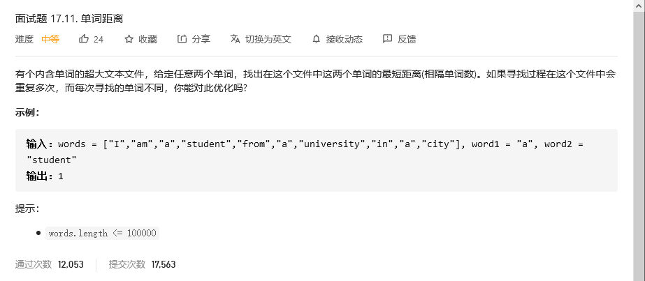

# 程序员面试金典

## 单词距离



```python
class Solution:
    def findClosest(self, words: List[str], word1: str, word2: str) -> int:
        # pos = 0
        # index = {}
        # for word in words:
        #     try:
        #         if index[word]:
        #             index[word].append(pos)
        #             pos +=1
        #     except:
        #         index[word] = [pos]
        #         pos +=1
        
        # word1list = index[word1]
        # word2list = index[word2]
        # d = []
        # for i in word1list:
        #     for j in word2list:
        #         d.append(abs(i-j))

        word1list = []
        word2list = []
        pos = 0
        d =[]
        for word in words:
            if word == word1:
                word1list.append(pos)
            elif word == word2:
                word2list.append(pos)
            pos +=1
        for i in word1list:
            for j in word2list:
                d.append(abs(i-j))

        return min(d)
```


## 


```python

```


## 


```python

```


## 


```python

```


## 


```python

```

