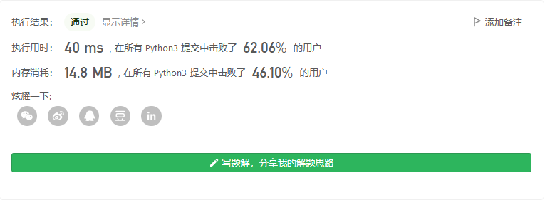
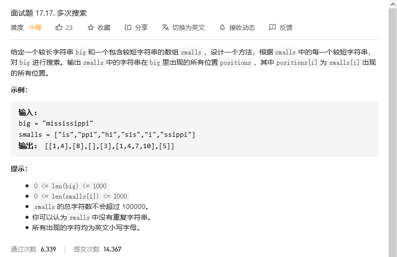
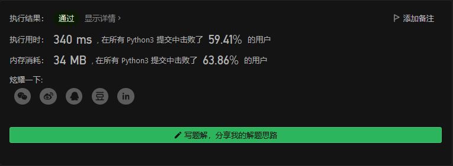
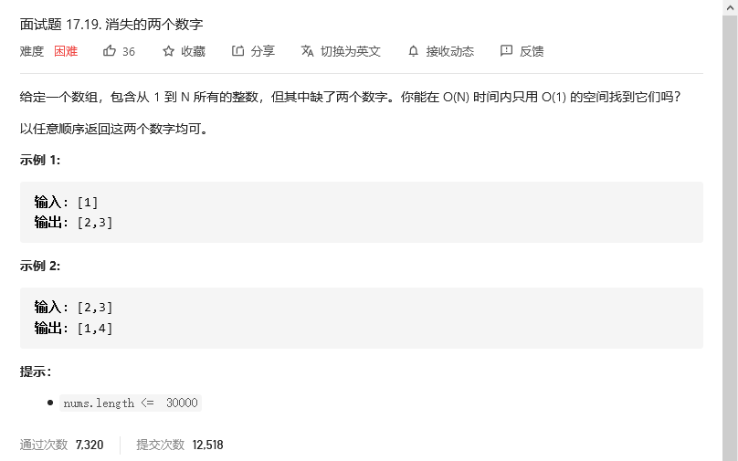
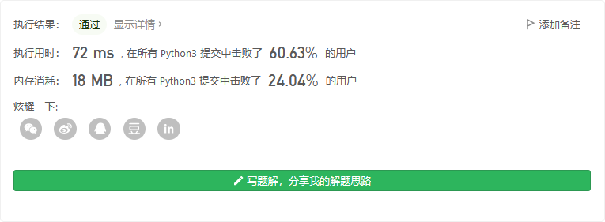
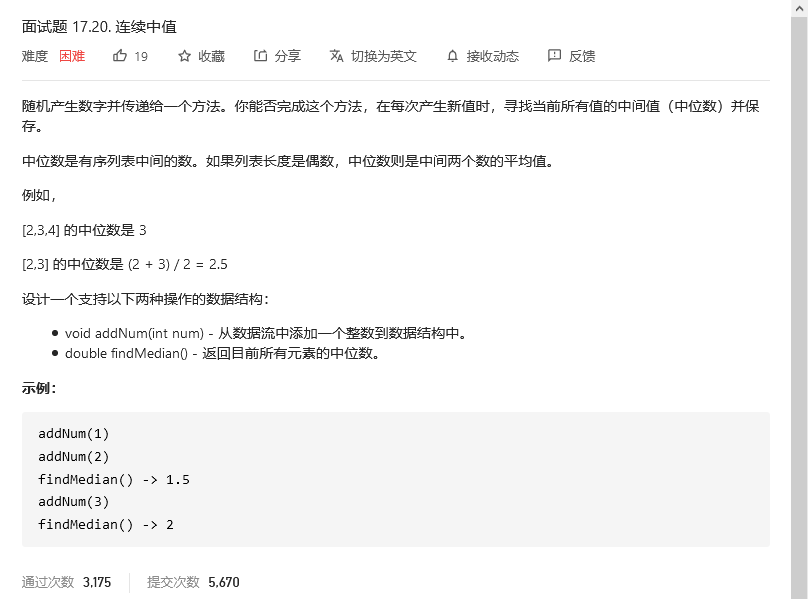
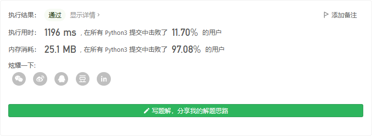

# 程序员面试金典

## 按摩师


### 方法一：递归——超出时间限制

```python
class Solution:
    def massage(self, nums):
        if nums==[]:
            return 0

        if len(nums) <= 2:
            return max(nums)
        
        if len(nums) == 3:
            return max(nums[1],nums[0]+nums[2])

        return max(nums[0]+self.massage(nums[2:]),self.massage(nums[1:])) 

nums = [183,219,57,193,94,233,202,154,65,240,97,234,100,249,186,66,90,238,168,128,177,235,50,81,185,165,217,207,88,80,112,78,135,62,228,247,211]
s = Solution()
print(s.massage(nums))
```

### 方法二：动态规划（官方）

定义 `dp[i][0]` 表示考虑前 `i` 个预约，第 `i` 个预约不接的最长预约时间，`dp[i][1]`表示考虑前 `i`个预约，第 `i` 个预约接的最长预约时间。

从前往后计算 `dp` 值，假设我们已经计算出前 `i−1` 个 `dp` 值，考虑计算 `dp[i][0/1]` 的答案。

首先考虑 `dp[i][0]` 的转移方程，由于这个状态下第 `i` 个预约是不接的，所以第 `i−1` 个预约接或不接都可以，故可以从 `dp[i−1][0]` 和 `dp[i−1][1]` 两个状态转移过来，转移方程即为：

`dp[i][0]=max(dp[i−1][0],dp[i−1][1])`

对于 `dp[i][1]` ，由于这个状态下第 `i `个预约要接，根据题目要求按摩师不能接受相邻的预约，所以第 `i−1`个预约不能接受，故我们只能从 `dp[i−1][0]` 这个状态转移过来，转移方程即为：

`dp[i][1]=dp[i−1][0]+nums[i]`

其中 `nums[i]` 表示第 `i` 个预约的时长。

最后答案即为 `max(dp[n][0],dp[n][1])`，其中 `n` 表示预约的个数。

再回来看转移方程，我们发现计算 `dp[i][0/1]`时，只与前一个状态 `dp[i−1][0/1]` 有关，所以我们可以不用开数组，只用两个变量 `dp0`,`dp1​` 分别存储 `dp[i−1][0]` 和 `dp[i−1][1]` 的答案，然后去转移更新答案即可。

```python
class Solution:
    def massage(self, nums: List[int]) -> int:
        dp0 = 0 # 不接
        dp1 = 0 # 接
        for i in nums:
            p0 = dp0
            dp0 = max(dp0,dp1) 
            dp1 = p0+i
        return max(dp0,dp1)
```



## 多次搜索



```python
class Solution:
    def multiSearch(self, big: str, smalls: List[str]) -> List[List[int]]:
        res = []
        for small in smalls:
            indices = []
            tlen = len(small)
            if tlen > 0:
                for i in range(len(big)-tlen+1):
                    if big[i:i+tlen] == small:
                        indices.append(i)
            res.append(indices)
        return res
```



## 


```python

```


## 消失的两个数字



```python
class Solution:
    def missingTwo(self, nums: List[int]) -> List[int]:
        if nums==[]:
            return [1,2]
        nums.sort()
        arr = []
        j = 1
        i = 0
        while i < len(nums):
            if nums[i] == j:
                j+=1
                i+=1
                continue
            else:
                arr.append(j)
                j+=1
        if len(arr)==0:
            return [nums[-1]+1,nums[-1]+2]
        elif len(arr)==1:
            return arr+[nums[-1]+1]
        else:
            return arr
```



## 连续中值



```python
class MedianFinder:

    def __init__(self):
        """
        initialize your data structure here.
        """
        self.table = []
        self.length = 0


    def addNum(self, num: int) -> None:
        self.table.append(num)
        self.table.sort()
        self.length += 1

    def findMedian(self) -> float:
        if self.length==0:
            return 0
        midan = self.length//2
        if self.length%2:
            return self.table[midan]
        else:
            return (self.table[midan]+self.table[midan-1])/2
```

