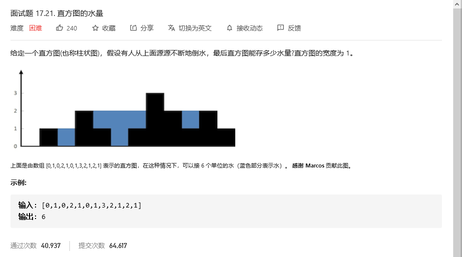
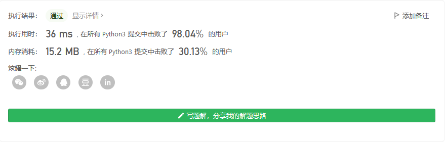
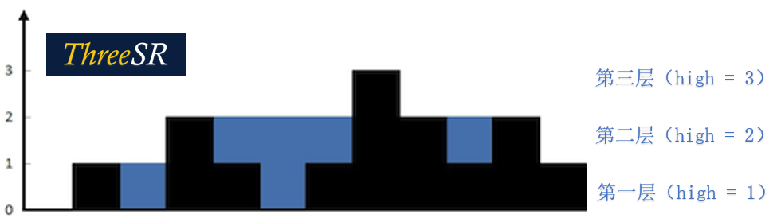
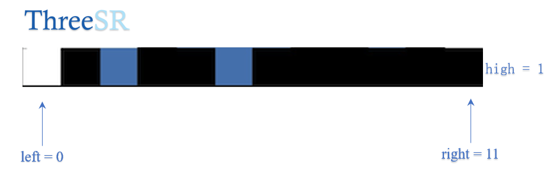
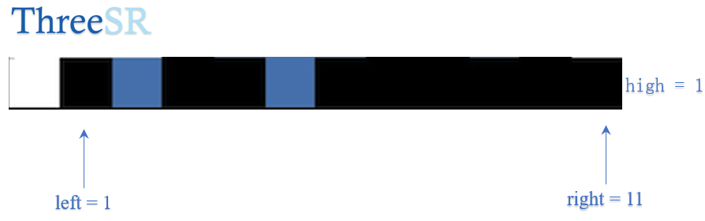
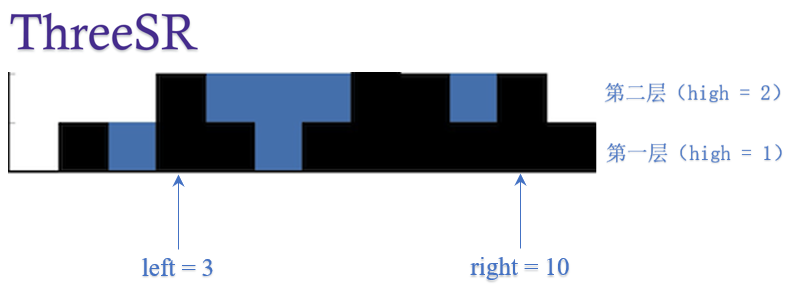
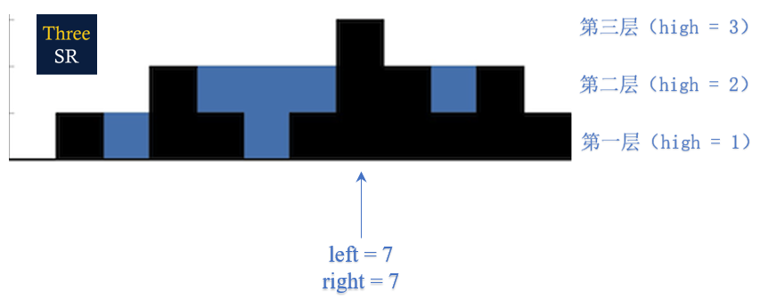
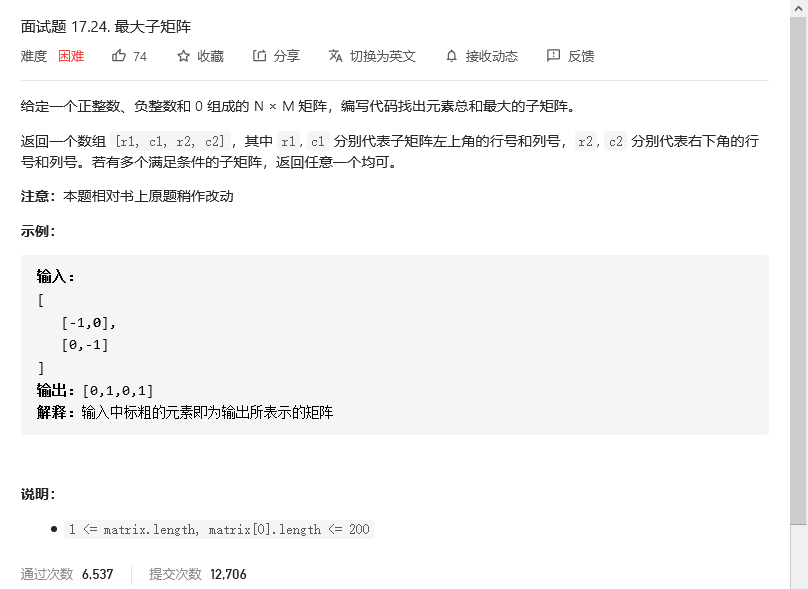

# 程序员面试金典

## 直方图的水量



```python
class Solution:
    def trap(self, height: List[int]) -> int:
        if not height:
            return 0
        left = 0
        right = len(height)-1
        volumn = 0
        trapsum = sum(height)

        for i in range(1,max(height)+1):
            while(height[left]<i):
                left+=1
            while(height[right]<i):
                right-=1
            volumn+=right-left+1
        return volumn-trapsum
```



### 思路(双指针)

核心精神：`总体积减去柱子体积就是水的容量`

- 利用左右指针的下标差值计算出每一层雨水和柱子的体积。如下图，第一层体积为11，第二层为8，第三层为1。累加得到整体体积volume = 20（注意：每一层从左边第一个方格到右边最后一个方格之间一定是被蓝黑两种颜色的方格填满，不会存在空白，所以我们可以这么求值）
- 计算柱子的总体积Sum，就是height：[0,1,0,2,1,0,1,3,2,1,2,1]数组之和14
- 返回结果volume − Sum就是雨水的体积。



### 图示过程 

#### 初始

一开始，`left=0，right=11，high=1 （high代表当前层数）`。当左右指针指向的区域高度小于high时，左右指针都向中间移动，直到指针指向区域大于等于high的值。若不小于high，则指针不移动。


#### 第一层

第一层，`high=1,left`向右移动到`left = 1，right`保持不动。所以第一层体积为`volume1 = right - left + 1 = 11`，这里记得在`right - left`之后加一！



#### 第二层

第二层，`high = 2，left`一直向右移动到`left = 3，right`向左移动到`right = 10`。所以`volume2 = right - left + 1 = 8`



#### 第三层

第三层，`high = 3,left`和`right`向中间移动直至重合。因为重合的时候仍然有体积，所以注意：循环条件里一定要写`left <= right`,而不是`left < right`。此时`volume3 = right - left + 1 = 1`。



## 


```python

```


## 


```python

```


## 最大子矩阵

其实和[连续数列](./071_075.md#连续数列)的想法是一样的，使用动态规划的算法，只是原本的数列变成了矩阵而已。



```python

```


## 


```python

```

