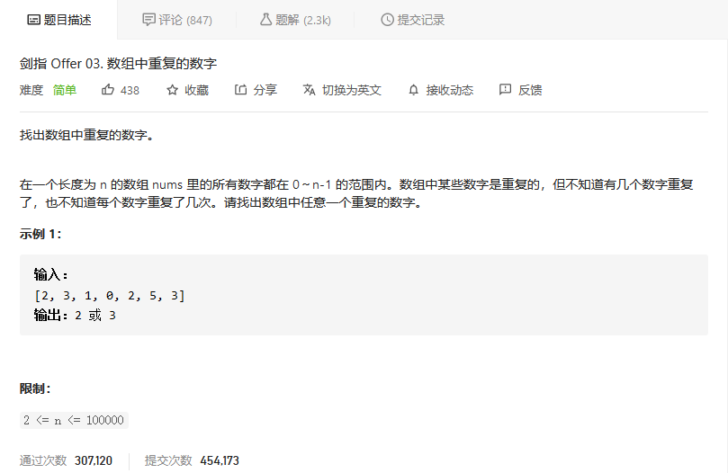
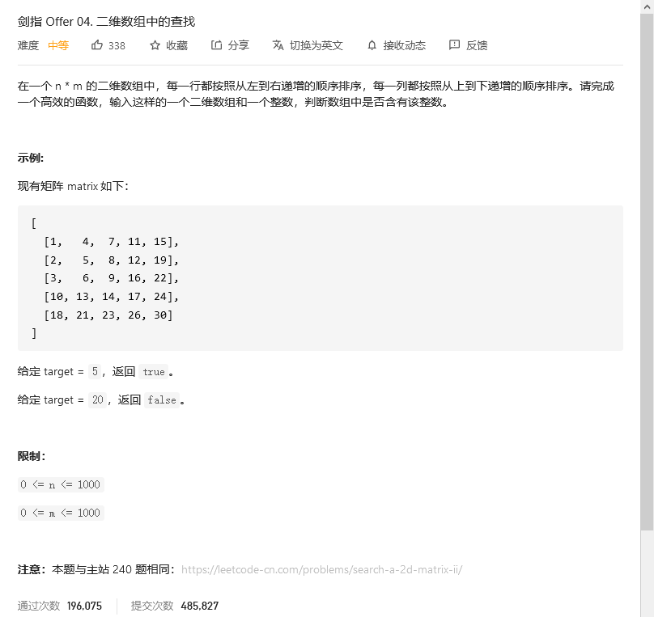
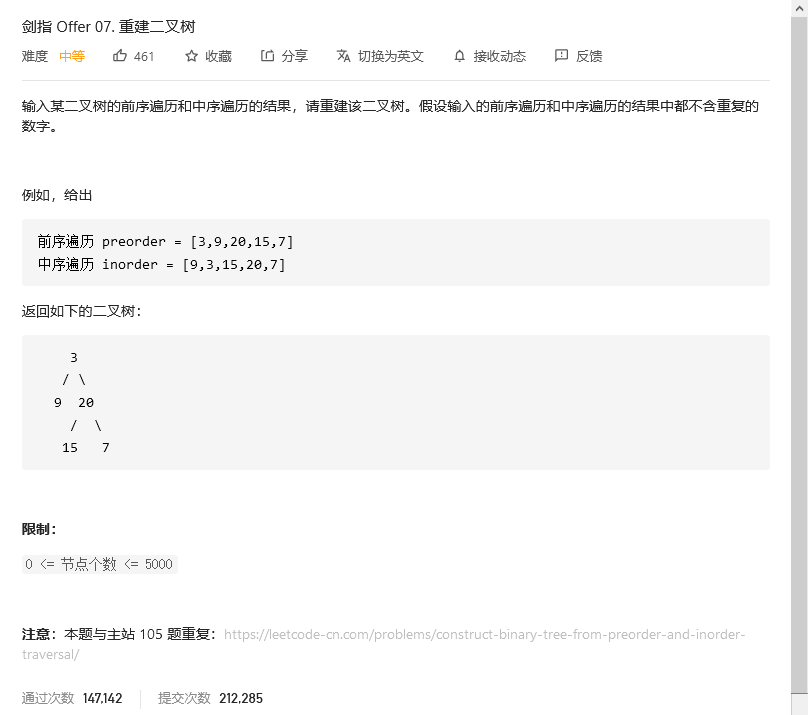

# 剑指offer

## 数组中重复的数字



```python
class Solution:
    def findRepeatNumber(self, nums: List[int]) -> int:
        num = [0]*len(nums)
        for i in nums:
            num[i] += 1
            if num[i] > 1:
                return i
```


## 二维数组中的查找



```python
class Solution:
    def findNumberIn2DArray(self, matrix: List[List[int]], target: int) -> bool:
        for i in range(len(matrix)):
            for j in range(len(matrix[0])):
                if matrix[i][j] == target:
                    return True

        return False
```


## 替换空格


```python
class Solution:
    def replaceSpace(self, s: str) -> str:
        newstr = ''
        for i in s:
            if i == ' ':
                newstr += '%20'
            else:
                newstr += i
        return newstr
```


## 从尾到头打印链表


```python
class Solution:
    def reversePrint(self, head: ListNode) -> List[int]:
        res = []
        pos = head
        while pos != None:
            res.append(pos.val)
            pos = pos.next
        res.reverse()
        return res
```


## 重建二叉树



### 解题思路：

前序遍历性质： 节点按照 [ 根节点 | 左子树 | 右子树 ] 排序。
中序遍历性质： 节点按照 [ 左子树 | 根节点 | 右子树 ] 排序。

    以题目示例为例：

        前序遍历划分 [ 3 | 9 | 20 15 7 ]
        中序遍历划分 [ 9 | 3 | 15 20 7 ]

根据以上性质，可得出以下推论：

1. 前序遍历的首元素 为 树的根节点 node 的值。
2. 在中序遍历中搜索根节点 node 的索引 ，可将 中序遍历 划分为 [ 左子树 | 根节点 | 右子树 ] 。
3. 根据中序遍历中的左 / 右子树的节点数量，可将 前序遍历 划分为 [ 根节点 | 左子树 | 右子树 ] 。


    通过以上三步，可确定 三个节点 ：1.树的根节点、2.左子树根节点、3.右子树根节点。对于树的左、右子树，仍可使用以上步骤划分子树的左右子树。

以上子树的递推性质是 **分治算法** 的体现，考虑通过递归对所有子树进行划分。

**分治算法解析**：

1. **递推参数**： 根节点在前序遍历的索引 root 、子树在中序遍历的左边界 left 、子树在中序遍历的右边界 right ；
2. **终止条件**： 当 left > right ，代表已经越过叶节点，此时返回 null;
3. **递推工作**：
   1. 建立根节点 node ： 节点值为 preorder[root] ；
   2. 划分左右子树： 查找根节点在中序遍历 inorder 中的索引 i ；
   3. 构建左右子树： 开启左右子树递归；
4. **返回值**： 回溯返回 node ，作为上一层递归中根节点的左 / 右子节点；

    为了提升效率，本文使用哈希表 dic 存储中序遍历的值与索引的映射，查找操作的时间复杂度为 O(1)

||根节点索引|中序遍历左边界|中序遍历右边界|
|:---:|:---:|:---:|:---:|
|左子树|root + 1|left|i - 1|
|右子树|i - left + root + 1|i + 1|right|

    i - left + root + 1含义为 根节点索引 + 左子树长度 + 1


```python
class Solution:
    def buildTree(self, preorder: List[int], inorder: List[int]) -> TreeNode:
        def recur(root, left, right):
            if left > right: return                               # 递归终止
            node = TreeNode(preorder[root])                       # 建立根节点
            i = dic[preorder[root]]                               # 划分根节点、左子树、右子树
            node.left = recur(root + 1, left, i - 1)              # 开启左子树递归
            node.right = recur(i - left + root + 1, i + 1, right) # 开启右子树递归
            return node                                           # 回溯返回根节点

        dic, preorder = {}, preorder
        for i in range(len(inorder)):
            dic[inorder[i]] = i
        return recur(0, 0, len(inorder) - 1)
```

