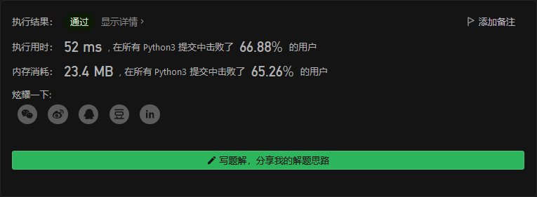
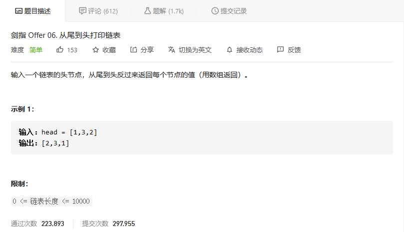

# 剑指offer

## 数组中重复的数字


```python
class Solution:
    def findRepeatNumber(self, nums: List[int]) -> int:
        num = [0]*len(nums)
        for i in nums:
            num[i] += 1
            if num[i] > 1:
                return i
```



## 二维数组中的查找


```python
class Solution:
    def findNumberIn2DArray(self, matrix: List[List[int]], target: int) -> bool:
        for i in range(len(matrix)):
            for j in range(len(matrix[0])):
                if matrix[i][j] == target:
                    return True

        return False
```


## 替换空格


```python
class Solution:
    def replaceSpace(self, s: str) -> str:
        newstr = ''
        for i in s:
            if i == ' ':
                newstr += '%20'
            else:
                newstr += i
        return newstr
```


## 从尾到头打印链表



```python
class Solution:
    def reversePrint(self, head: ListNode) -> List[int]:
        res = []
        pos = head
        while pos != None:
            res.append(pos.val)
            pos = pos.next
        res.reverse()
        return res
```


## 


```python

```

