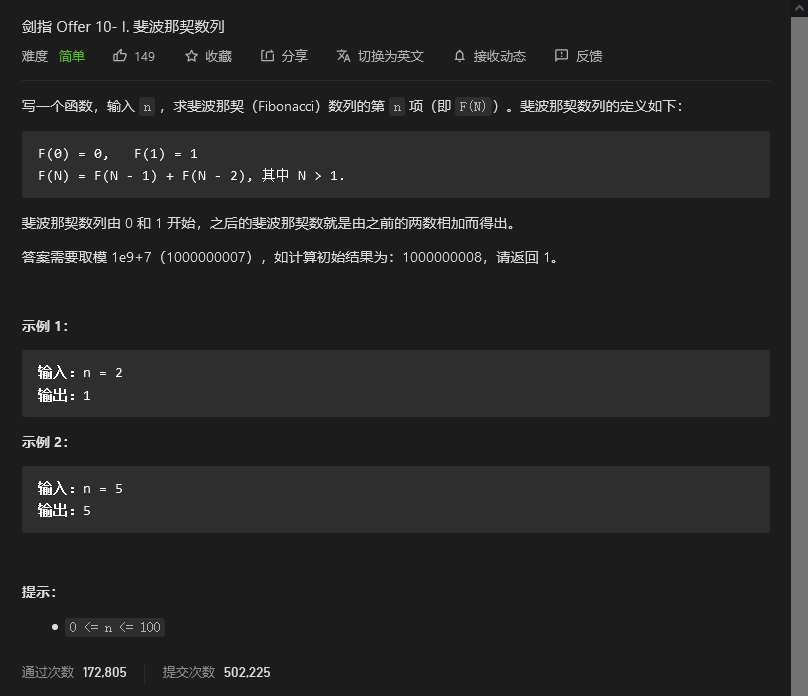

# 剑指offer

## 用两个栈实现队列


```python
class CQueue:
    def __init__(self):
        self.appendstack = []
        self.appendstacklen = 0
        self.deletestack = []
        self.deletestacklen = 0

    def appendTail(self, value: int) -> None:
        self.appendstack.append(value)
        self.appendstacklen += 1

    def deleteHead(self) -> int:
        if self.appendstacklen + self.deletestacklen == 0:
            return -1
        if self.deletestacklen == 0:
            while self.appendstacklen:
                self.deletestack.append(self.appendstack.pop())
                self.appendstacklen -=1
                self.deletestacklen +=1
        self.deletestacklen -=1
        return self.deletestack.pop()
```


## 斐波那契数列



```python
class Solution:
    def fib(self, n: int) -> int:
        fibna = [0,1]
        if n == 0 or n==1:
            return fibna[n]
        while n>1:
            next = sum(fibna)
            fibna[0] = fibna[1]
            fibna[1] = next%1000000007
            n-=1
        return fibna[1]
```


## 青蛙跳台阶问题


```python
class Solution:
    def numWays(self, n: int) -> int:
        fibna = [1,2]
        if n == 0:
            return 1
        if n<3:
            return fibna[n-1]
        while n>2:
            next = fibna[0]+fibna[1]
            fibna[0] = fibna[1]
            fibna[1] = next%1000000007
            n-=1
        return fibna[1]
```


## 旋转数组的最小数字


```python
class Solution:
    def minArray(self, numbers: List[int]) -> int:
        minnum = float('inf')
        for i in numbers:
            if i<minnum:
                minnum = i
        return minnum
```


## 


```python

```

