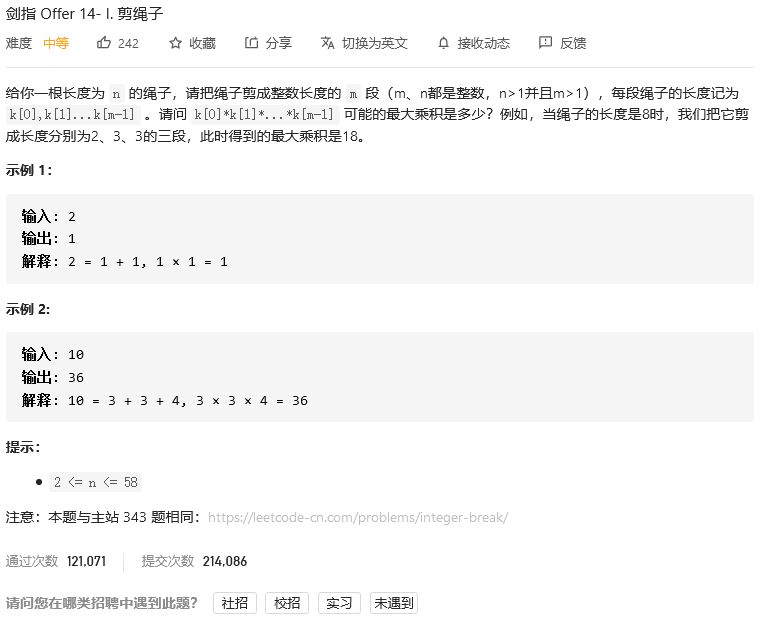

# 剑指offer

## 机器人的运动范围


```python
class Solution:
    def movingCount(self, m: int, n: int, k: int) -> int:
        # m*n 方格
        grid = []
        for i in range(m):
            grid.append([0]*n)            
        
        # 边界
        r_min, r_max, c_min, c_max = 0, m-1, 0, n-1

        def next(r, c, k):
            if r<r_min or r>r_max or c<c_min or c>c_max:# 是否超出边界
                return 0
            if grid[r][c]:# 是否已经走过
                return 0
            s = [int(i) for i in str(r)+str(c)]
            if sum(s)>k: # 是否可以走
                return 0
            else: # 可以走的话，+1，并递归其他四条路径
                grid[r][c] +=1
                return 1+next(r-1,c,k)+next(r,c-1,k)+next(r,c+1,k)+next(r+1,c,k)
        
        return next(0,0,k)
```


## 剪绳子



```python
class Solution:
    def cuttingRope(self, n: int) -> int:
        maxnum = 0
        for i in range(2,n+1):
            length1 = n//i
            length2 = n//i + 1
            maxnum = max(maxnum, pow(length1,i-1)*(n-(i-1)*length1), pow(length2,i-1)*(n-(i-1)*length2))
        return maxnum
```


## 剪绳子II


```python
class Solution:
    def cuttingRope(self, n: int) -> int:
        maxnum = 0
        for i in range(2,n+1):
            length1 = n//i
            length2 = n//i + 1
            q1 = pow(length1,i-1)*(n-(i-1)*length1)
            q2 = pow(length2,i-1)*(n-(i-1)*length2)
            maxnum = max(maxnum, q1, q2)
            
        return maxnum%1000000007
```


## 二进制中1的个数


```python
class Solution:
    def hammingWeight(self, n: int) -> int:
        return bin(n).count('1')
```


## 数值的整数次方


```python
class Solution:
    def myPow(self, x: float, n: int) -> float:
        if n ==0:
            return 1
        elif n==1:
            return x
        elif n==-1:
            return 1/x
        else:
            return self.myPow(x,n%2)*self.myPow(x*x, n//2)
```

