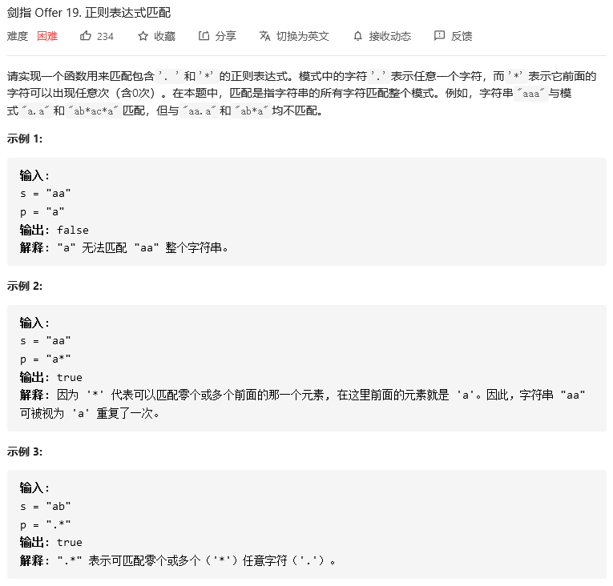
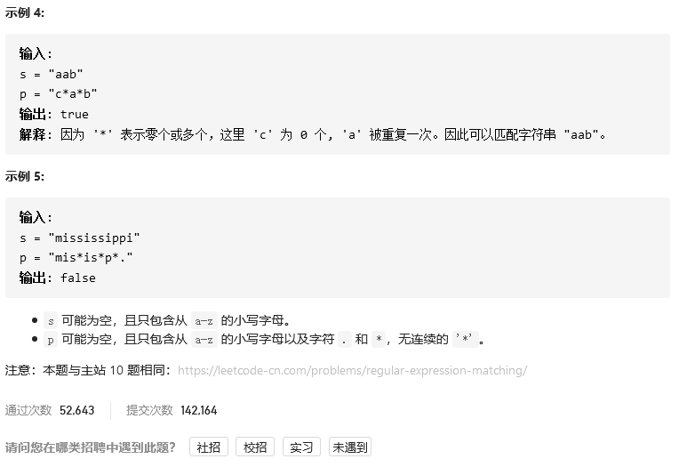
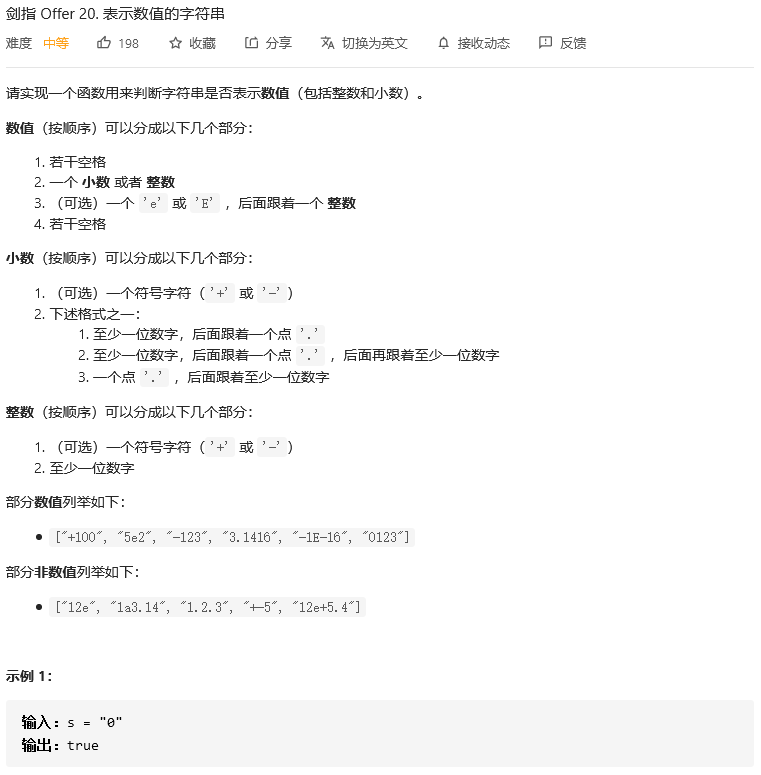
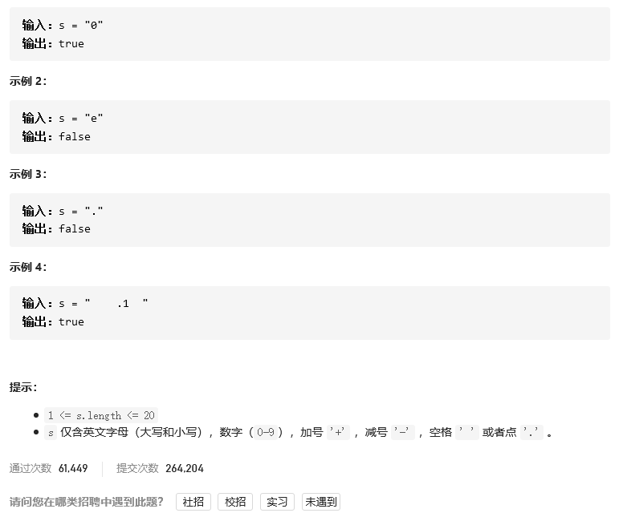
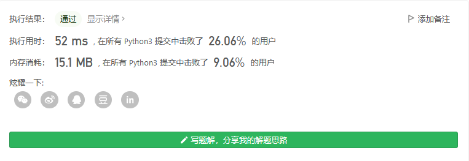

# 剑指offer

## 打印从1到最大的n位数


```python
class Solution:
    def printNumbers(self, n: int) -> List[int]:
        return [i for i in range(1,pow(10,n))]
```


## 删除链表的节点


```python
# Definition for singly-linked list.
# class ListNode:
#     def __init__(self, x):
#         self.val = x
#         self.next = None
class Solution:
    def deleteNode(self, head: ListNode, val: int) -> ListNode:
        if head.val == val:
            return head.next
        pos = head
        while pos.next != None:
            if pos.next.val == val:
                pos.next = pos.next.next
                break
            pos = pos.next
        return head
```


## 正则表达式匹配





```python

```


## 表示数值的字符串





```python
```



## 调整数组顺序使奇数位于偶数前面


```python
class Solution:
    def exchange(self, nums: List[int]) -> List[int]:
        single = []
        double = []
        for i in nums:
            if i%2:
                single.append(i)
            else:
                double.append(i)
        single.extend(double)
        return single
```

