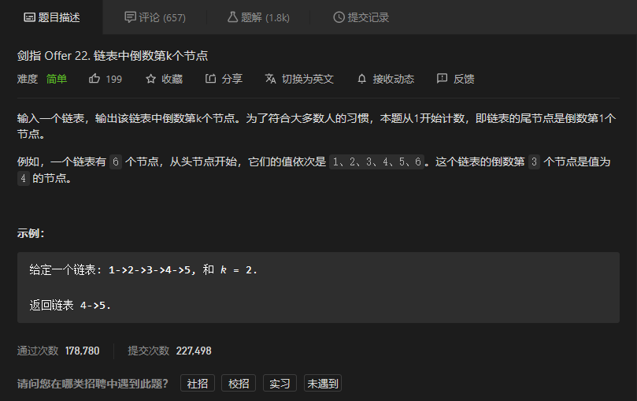
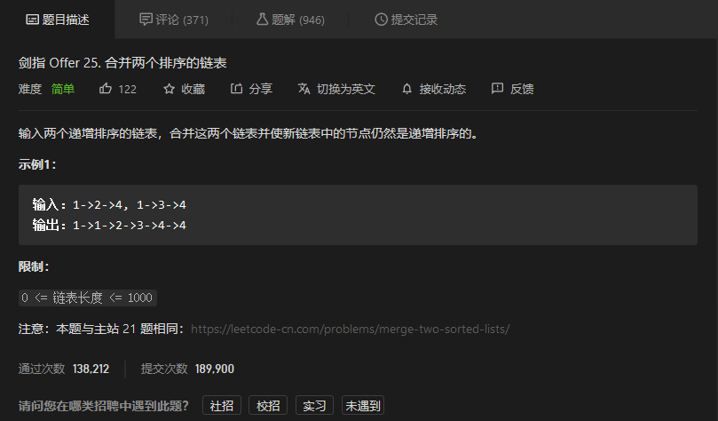
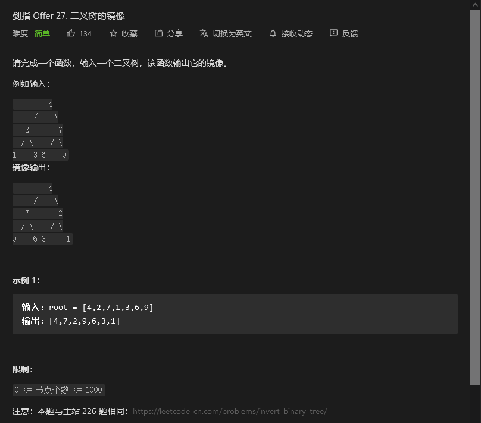

# 剑指offer

## 链表中倒数第k个节点



```python
# Definition for singly-linked list.
# class ListNode:
#     def __init__(self, x):
#         self.val = x
#         self.next = None

class Solution:
    def getKthFromEnd(self, head: ListNode, k: int) -> ListNode:
        klist = [0]*k
        kpointer = 0
        pos = head
        while pos != None:
            klist[kpointer] = pos
            pos = pos.next
            kpointer = (kpointer+1)%k
        return klist[kpointer]
```


## 反转链表


```python
# Definition for singly-linked list.
# class ListNode:
#     def __init__(self, x):
#         self.val = x
#         self.next = None

class Solution:
    def reverseList(self, head: ListNode) -> ListNode:
        if head == None:
            return head
        pos = head
        newhead = ListNode(0)
        while pos:
            newnode = ListNode(pos.val)
            newnode.next = newhead.next
            newhead.next = newnode
            pos = pos.next
        return newhead.next
```


## 合并两个排序的链表



```python
class Solution:
    def mergeTwoLists(self, l1: ListNode, l2: ListNode) -> ListNode:
        newlist = ListNode(0)
        newhead = newlist
        while l1 or l2:
            if l1 and l2:
                if l1.val < l2.val:
                    newlist.next = ListNode(l1.val)
                    l1 = l1.next
                else:
                    newlist.next = ListNode(l2.val)
                    l2 = l2.next
            elif l1:
                newlist.next = ListNode(l1.val)
                l1 = l1.next
            elif l2:
                newlist.next = ListNode(l2.val)
                l2 = l2.next
            else:
                break
            newlist = newlist.next
        return newhead.next
```


## 


```python

```


## 二叉树的镜像



```python
# Definition for a binary tree node.
# class TreeNode:
#     def __init__(self, x):
#         self.val = x
#         self.left = None
#         self.right = None

class Solution:
    def mirrorTree(self, root: TreeNode) -> TreeNode:
        if root:
            t = root.left
            root.left = root.right
            self.mirrorTree(root.left)
            root.right = t
            self.mirrorTree(root.right)
        return root
```

