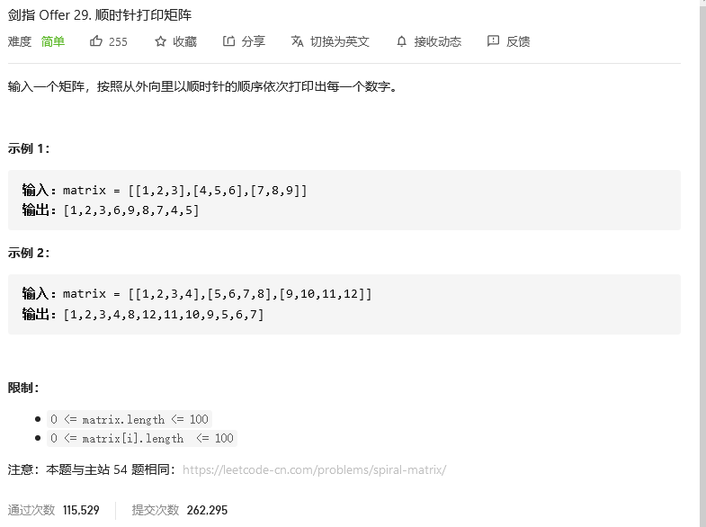
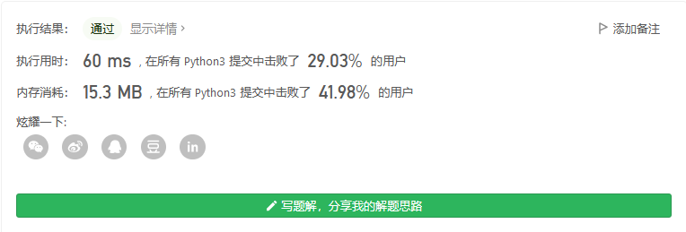
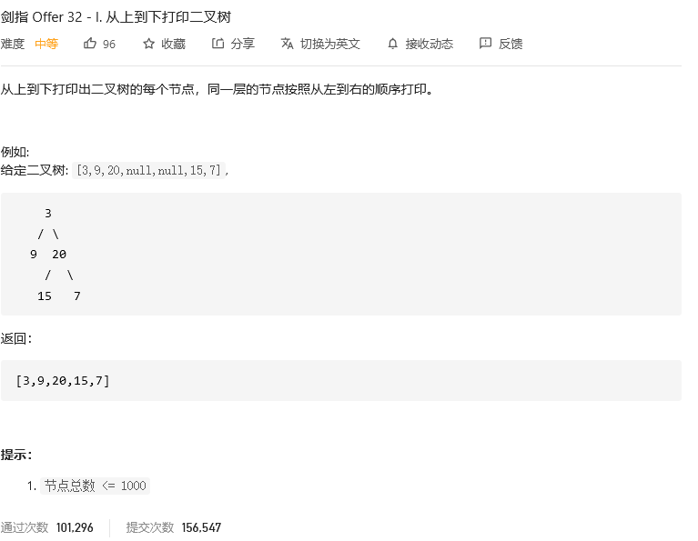
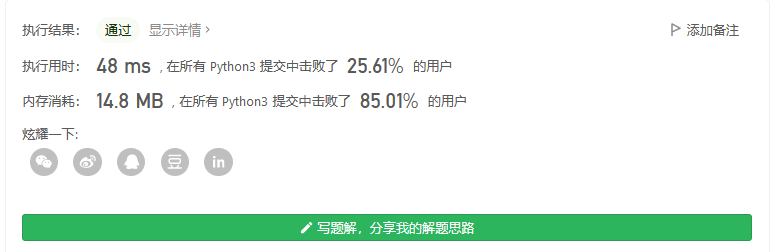

# 剑指offer

## 


```python

```


## 顺时针打印矩阵



### 解题思路

    根据题目示例 matrix = [[1,2,3],[4,5,6],[7,8,9]] 的对应输出 [1,2,3,6,9,8,7,4,5] 可以发现，顺时针打印矩阵的顺序是 “从左向右、从上向下、从右向左、从下向上” 循环。

因此，考虑设定矩阵的“左、上、右、下”四个**边界**，模拟以上矩阵遍历顺序。


**算法流程**：

1. **空值处理**： 当 `matrix` 为空时，直接返回空列表 `[]` 即可。
2. **初始化**： 矩阵 左、右、上、下 四个边界 `l , r , t , b `，用于打印的结果列表 `res` 。
3. **循环打印**： “从左向右、从上向下、从右向左、从下向上” 四个方向循环，每个方向打印中做以下三件事 （各方向的具体信息见下表） ；
   1. 根据边界打印，即将元素按顺序添加至列表 res 尾部；
   2. 边界向内收缩 `1` （代表已被打印）；
   3. 判断是否打印完毕（`边界是否相遇`），若打印完毕则跳出。
4. **返回值**： 返回 `res` 即可。

|打印方向|1. 根据边界打印|2. 边界向内收缩|3. 是否打印完毕|
|:---:|:---:|:---:|:---:|
|从左向右|左边界`l` ，右边界 `r`|上边界 `t` 加 `1`|是否 `t > b`|
|从上向下|上边界`t` ，下边界 `b`|右边界 `r` 减 `1`|是否 `l > r`|
|从右向左|右边界 `r`| ，左边界`l`|下边界 `t` 减 `1`|是否 `t > b`|
|从下向上|下边界 `b` ，上边界`t`|左边界`l` 加 `1`|是否 `l > r`|

```python
class Solution:
    def spiralOrder(self, matrix:[[int]]) -> [int]:
        if not matrix: return []
        l, r, t, b, res = 0, len(matrix[0]) - 1, 0, len(matrix) - 1, []
        while True:
            for i in range(l, r + 1): res.append(matrix[t][i]) # left to right
            t += 1
            if t > b: break
            for i in range(t, b + 1): res.append(matrix[i][r]) # top to bottom
            r -= 1
            if l > r: break
            for i in range(r, l - 1, -1): res.append(matrix[b][i]) # right to left
            b -= 1
            if t > b: break
            for i in range(b, t - 1, -1): res.append(matrix[i][l]) # bottom to top
            l += 1
            if l > r: break
        return res
```



## 


```python

```


## 


```python

```


## 从上到下打印二叉树



### 解题思路：

- 题目要求的二叉树的 从上至下 打印（即`按层打印`），又称为二叉树的 `广度优先搜索`（`BFS`）。
- `BFS` 通常借助 `队列` 的`先入先出`特性来实现。


**算法流程**：

1. **特例处理**： 当树的根节点为空，则直接返回空列表 `[]` ；
2. **初始化**： 打印结果列表 `res = [] `，包含根节点的队列 `queue = [root] `；
3. **BFS 循环**： 当队列 `queue` 为空时跳出；
   1. **出队**： 队首元素出队，记为 `node`；
   2. **打印**： 将 `node.val` 添加至列表 `tmp` 尾部；
   3. **添加子节点**： 若 `node` 的左（右）子节点不为空，则将左（右）子节点加入队列 `queue` ；
4. **返回值**： 返回打印结果列表 `res` 即可。

    Python 中使用 collections 中的双端队列 deque() ，其 popleft() 方法可达到 O(1)O(1)O(1) 时间复杂度；列表 list 的 pop(0) 方法时间复杂度为 O(N)O(N)O(N) 。

```python
class Solution:
    def levelOrder(self, root: TreeNode) -> List[int]:
        if not root: return []
        res, queue = [], collections.deque()
        queue.append(root)
        while queue:
            node = queue.popleft()
            res.append(node.val)
            if node.left: queue.append(node.left)
            if node.right: queue.append(node.right)
        return res
```

