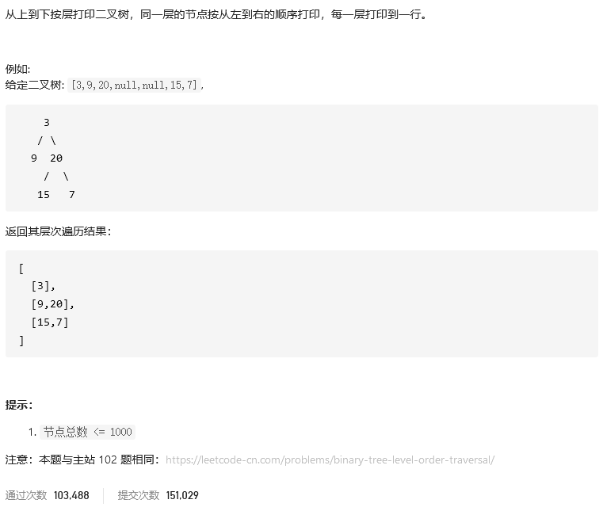
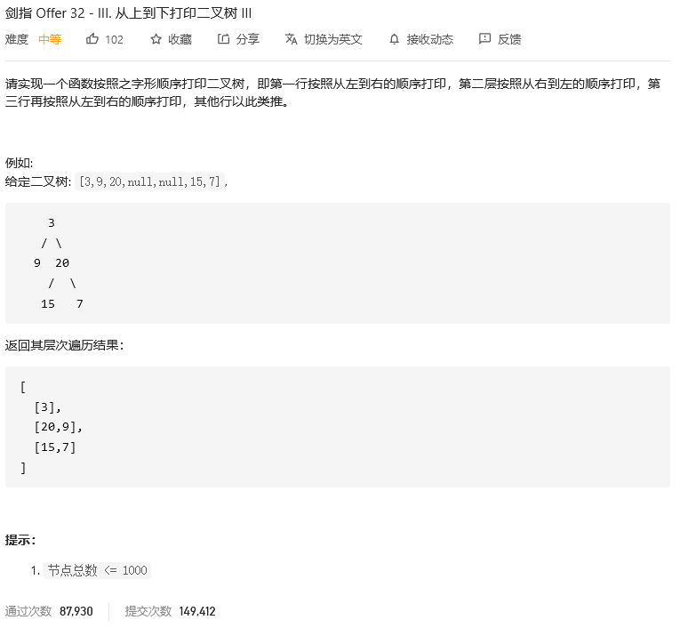
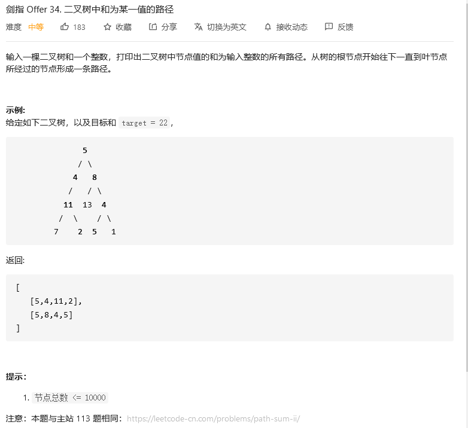

# 剑指offer

## 从上到下打印二叉树II



```python
class Solution:
    def levelOrder(self, root: TreeNode) -> List[List[int]]:
        if not root: return []
        res, queue = [], collections.deque()
        queue.append(root)
        while queue:
            tmp = []
            for _ in range(len(queue)):
                node = queue.popleft()
                tmp.append(node.val)
                if node.left: queue.append(node.left)
                if node.right: queue.append(node.right)
            res.append(tmp)
        return res
```


## 从上到下打印二叉树III



```python
class Solution:
    def levelOrder(self, root: TreeNode) -> List[List[int]]:
        if not root: return []
        res, queue = [], collections.deque()
        queue.append(root)
        flag = 1
        while queue:
            tmp = []
            num = len(queue)
            if flag:
                for _ in range(num):
                    node = queue.popleft()
                    tmp.append(node.val)
                    if node.left: queue.append(node.left)
                    if node.right: queue.append(node.right)
                res.append(tmp)
                flag = 0
            else:
                for _ in range(num):
                    node = queue.pop()
                    tmp.append(node.val)
                    if node.right: queue.appendleft(node.right)
                    if node.left: queue.appendleft(node.left)
                res.append(tmp) 
                flag = 1
        return res 
```


## 二叉搜索树的后序遍历序列


```python
class Solution:
    def verifyPostorder(self, postorder: List[int]) -> bool:
        class ListNode():
            def __init__(self,x) -> None:
                self.val = x
                self.left = None
                self.right = None
            
            def bulid(self,listval):
                for val in listval:
                    self.insert(val)
                    
            def insert(self, val):
                if self.val > val:
                    if self.left:
                        self.left.insert(val)
                    else:
                        self.left = ListNode(val)
                elif self.val < val:
                    if self.right:
                        self.right.insert(val)
                    else:
                        self.right = ListNode(val)

        def findall(root):
            if root:
                findall(root.left)
                findall(root.right)
                res.append(root.val)
            else:
                return 
                

        if postorder == []:
            return True
        a = postorder.copy()
        a.reverse()
        Tree = ListNode(a[0])
        Tree.bulid(a[1:])
        res = []
        findall(Tree)
        return res == postorder
```


## 二叉树中和为某一值的路径



```python
# Definition for a binary tree node.
# class TreeNode:
#     def __init__(self, val=0, left=None, right=None):
#         self.val = val
#         self.left = left
#         self.right = right
class Solution:
    def pathSum(self, root: TreeNode, target: int) -> List[List[int]]:
        res = []
        def findall(nums, path, psum):
            if nums:
                path.append(nums.val)
                psum += nums.val
                if psum == target and nums.left == None and nums.right == None: 
                    res.append(path)
                findall(nums.left, path.copy(), psum)
                findall(nums.right, path.copy(), psum)
        pos = root
        findall(pos, [], 0)
        return res
```


## 


```python

```


