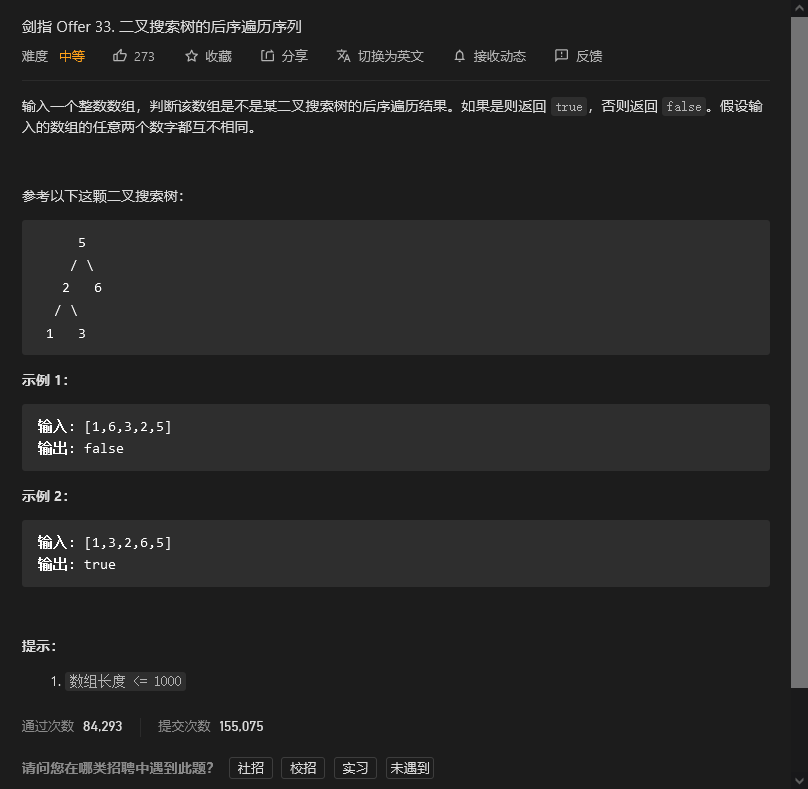

# 剑指offer

## 


```python

```


## 


```python

```


## 二叉搜索树的后序遍历序列



```python
class Solution:
    def verifyPostorder(self, postorder: List[int]) -> bool:
        class ListNode():
            def __init__(self,x) -> None:
                self.val = x
                self.left = None
                self.right = None
            
            def bulid(self,listval):
                for val in listval:
                    self.insert(val)
                    
            def insert(self, val):
                if self.val > val:
                    if self.left:
                        self.left.insert(val)
                    else:
                        self.left = ListNode(val)
                elif self.val < val:
                    if self.right:
                        self.right.insert(val)
                    else:
                        self.right = ListNode(val)

        def findall(root):
            if root:
                findall(root.left)
                findall(root.right)
                res.append(root.val)
            else:
                return 
                

        if postorder == []:
            return True
        a = postorder.copy()
        a.reverse()
        Tree = ListNode(a[0])
        Tree.bulid(a[1:])
        res = []
        findall(Tree)
        return res == postorder
```


## 


```python

```


## 


```python

```


