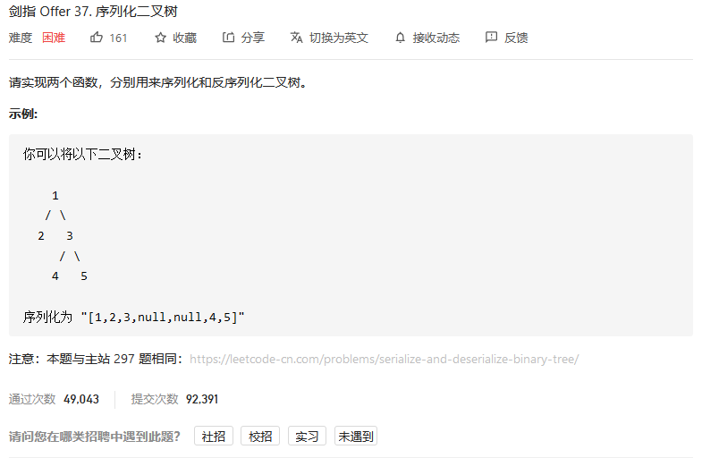
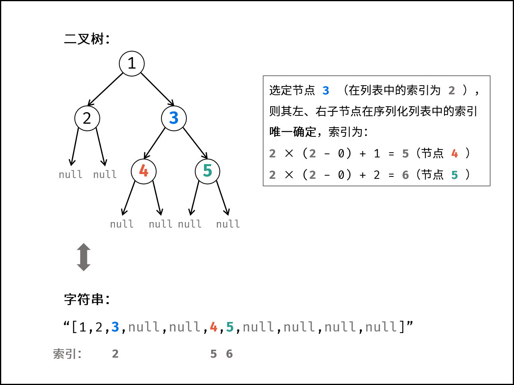
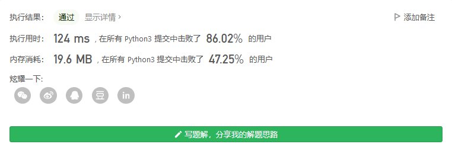
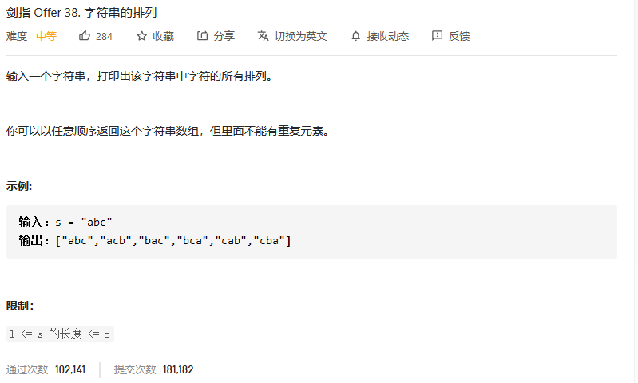
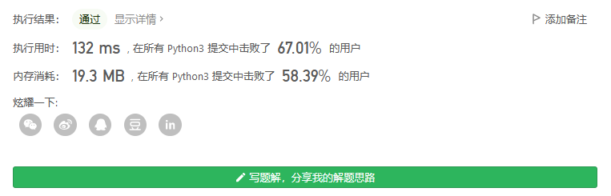
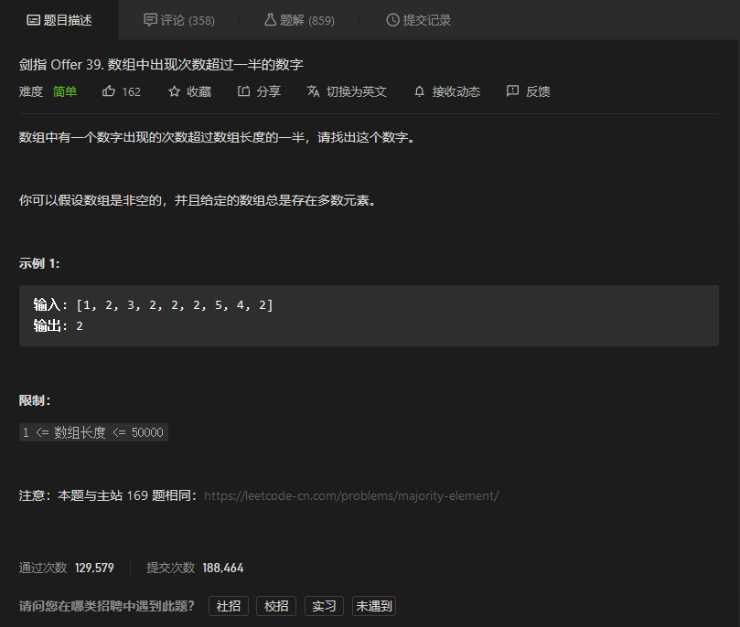
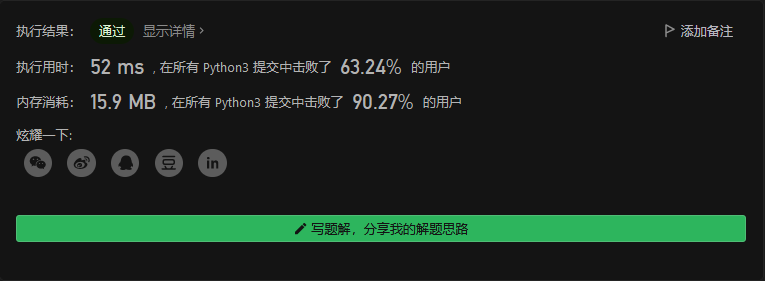
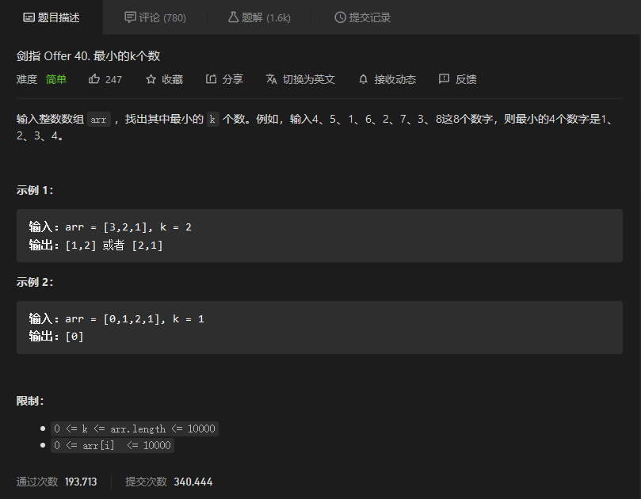

# 剑指offer

## 


```python

```


## 序列化二叉树



### 解题思路

通常使用的前序、中序、后序、层序遍历记录的二叉树的信息不完整，即唯一的输出序列可能对应着多种二叉树可能性。题目要求的 序列化 和 反序列化 是 `可逆操作` 。因此，序列化的字符串应携带 `完整的二叉树信息` 。

    观察题目示例，序列化的字符串实际上是二叉树的 “层序遍历”（BFS）结果，本文也采用层序遍历。

为完整表示二叉树，考虑将叶节点下的 `null` 也记录。在此基础上，对于列表中任意某节点 `node` ，其左子节点 `node.left` 和右子节点 `node.right` 在序列中的位置都是 **唯一确定** 的。如下图所示：



**序列化** `Serialize` ：

借助队列，对二叉树做层序遍历，并将越过叶节点的 `null` 也打印出来。

**算法流程**：

1. 特例处理： 若 root 为空，则直接返回空列表 "[]" ；
2. 初始化： 队列 queue （包含根节点 root ）；序列化列表 res ；
3. 层序遍历： 当 queue 为空时跳出；
   1. 节点出队，记为 node ；
   2. 若 node 不为空：① 打印字符串 node.val ，② 将左、右子节点加入 queue ；
   3. 否则（若 node 为空）：打印字符串 "null" ；
4. 返回值： 拼接列表，用 ',' 隔开，首尾添加中括号；

```python
class Codec:

    def serialize(self, root):
        """Encodes a tree to a single string.
        
        :type root: TreeNode
        :rtype: str
        """
        if not root: return "[]"
        queue = collections.deque()
        queue.append(root)
        res = []
        while queue:
            node = queue.popleft()
            if node:
                res.append(str(node.val))
                queue.append(node.left)
                queue.append(node.right)
            else: res.append("null")
        return '[' + ','.join(res) + ']'
        

    def deserialize(self, data):
        """Decodes your encoded data to tree.
        
        :type data: str
        :rtype: TreeNode
        """
        if data == "[]": return
        vals, i = data[1:-1].split(','), 1
        root = TreeNode(int(vals[0]))
        queue = collections.deque()
        queue.append(root)
        while queue:
            node = queue.popleft()
            if vals[i] != "null":
                node.left = TreeNode(int(vals[i]))
                queue.append(node.left)
            i += 1
            if vals[i] != "null":
                node.right = TreeNode(int(vals[i]))
                queue.append(node.right)
            i += 1
        return root
```



## 字符串的排列



```python
class Solution:
    def permutation(self, s: str) -> List[str]:
        res = []
        def findall(nums, path):
            if nums:
                for c in set(nums):
                    newnums = nums.copy()
                    newnums.remove(c)
                    findall(newnums, path+c)
            else:
                res.append(path)

        findall(list(s), '')
        return res
```



## 数组中出现次数超过一半的数字



```python
class Solution:
    def majorityElement(self, nums: List[int]) -> int:
        numsset = set(nums)
        for num in numsset:
            if nums.count(num) > len(nums)//2:
                return num
```



## 最小的k个数



```python
class Solution:
    def getLeastNumbers(self, arr: List[int], k: int) -> List[int]:
        arr.sort()
        return arr[:k]
```

