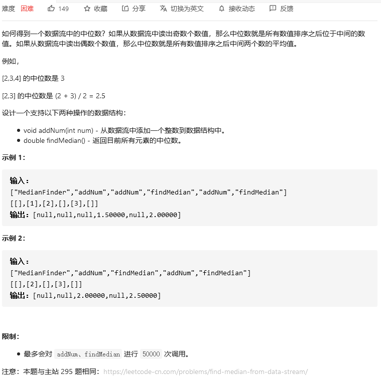
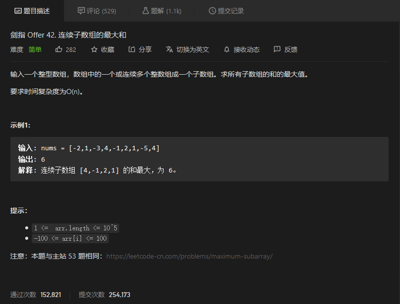
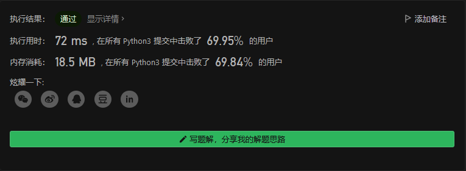

# 剑指offer

## 数据流中的中位数



```python
class MedianFinder:

    def __init__(self):
        """
        initialize your data structure here.
        """
        self.dataflow = []
        self.len = 0


    def addNum(self, num: int) -> None:
        if self.len <10:
            self.dataflow.append(num)
            self.dataflow.sort()
        else:
            first = 0
            end = self.len
            mid = (first+end)//2
            while end-first>1:
                if self.dataflow[mid]>num:
                    end = mid
                else:
                    first = mid
                mid = (first+end)//2
            self.dataflow.insert(end, num)
        self.len += 1
        

    def findMedian(self) -> float:
        if self.len:
            if self.len%2:
                return self.dataflow[self.len//2]  
            else:
                return (self.dataflow[self.len//2-1]+self.dataflow[self.len//2])/2
        else:
            return
```


## 连续子数组的最大和



```python
class Solution:
    def maxSubArray(self, nums: List[int]) -> int:
        maxsum = nums[0]
        res = maxsum
        for i in  nums[1:]:
            maxsum = max(maxsum+i,i)
            res = max(maxsum,res)
        return res
```



## 


```python

```


## 


```python

```


## 


```python

```

