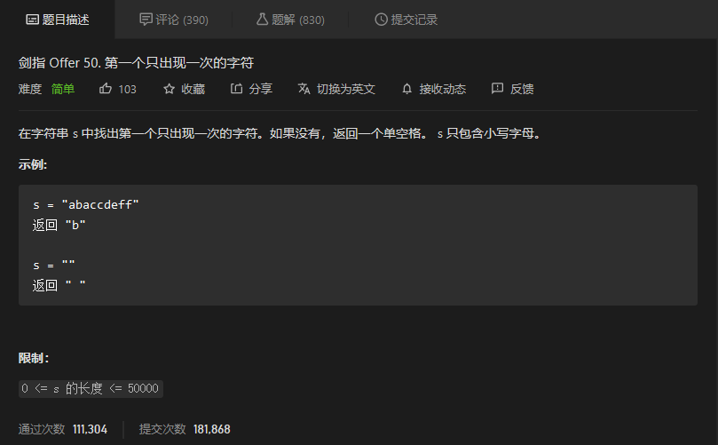
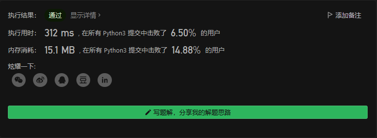

# 剑指offer

## 


```python

```


## 


```python

```


## 


```python

```


## 


```python

```


## 第一个只出现一次的字符



```python
class Solution:
    def firstUniqChar(self, s: str) -> str:
        strset = []
        strnum = []
        for i in s:
            if i in strset:
                strnum[strset.index(i)] += 1
                continue
            else:
                strset.append(i)
                strnum.append(1)
        try:
            return strset[strnum.index(1)]
        except:
            return ' '
```

