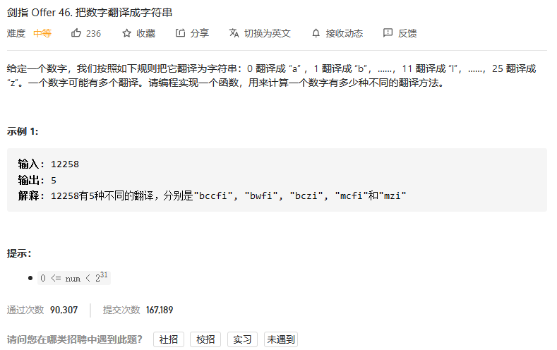
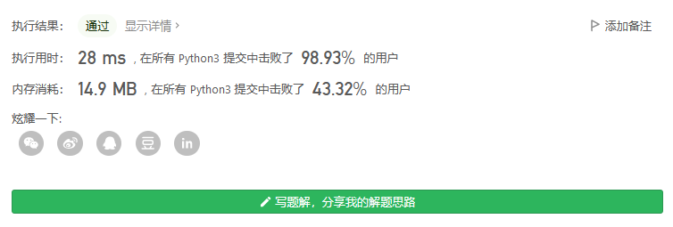
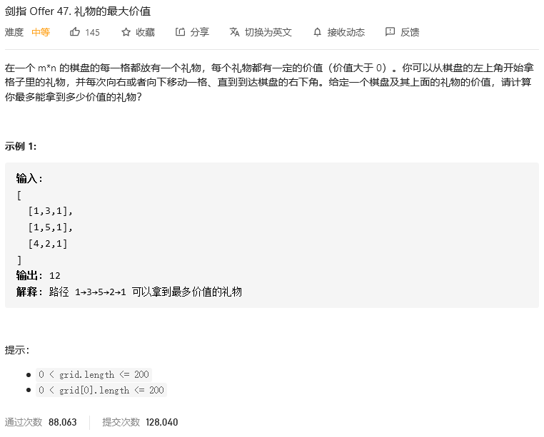
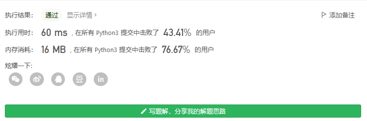
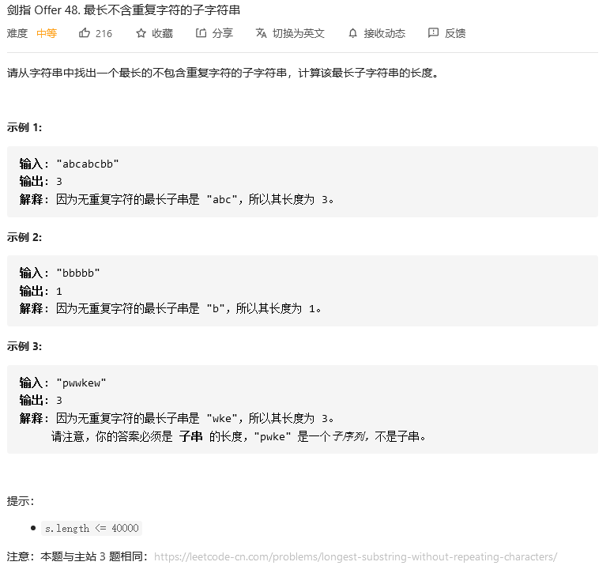
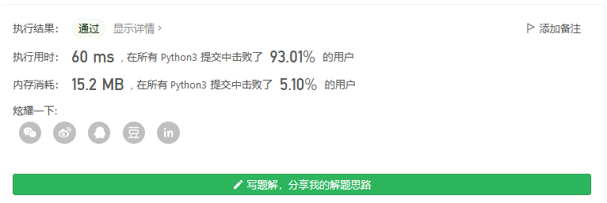
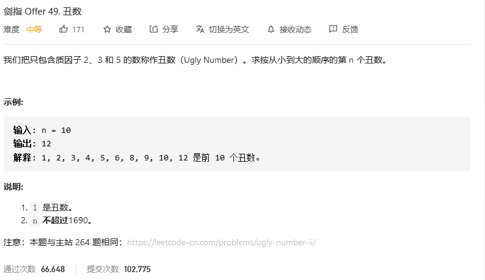
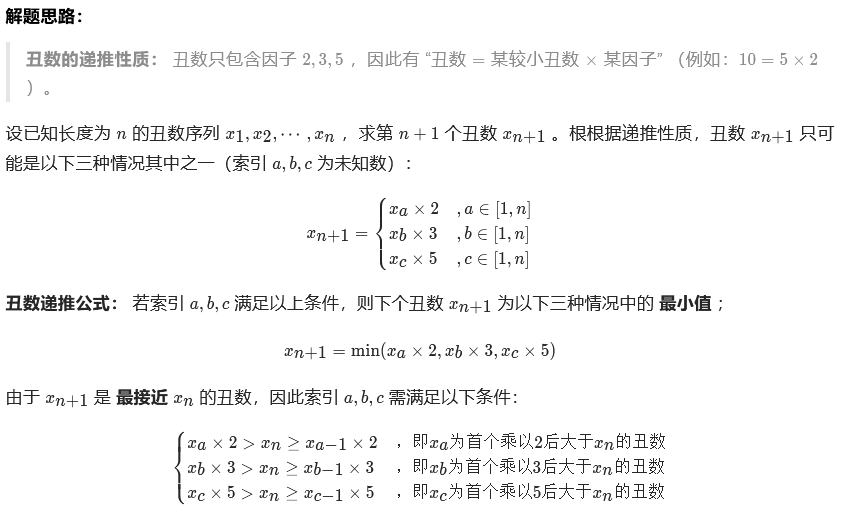
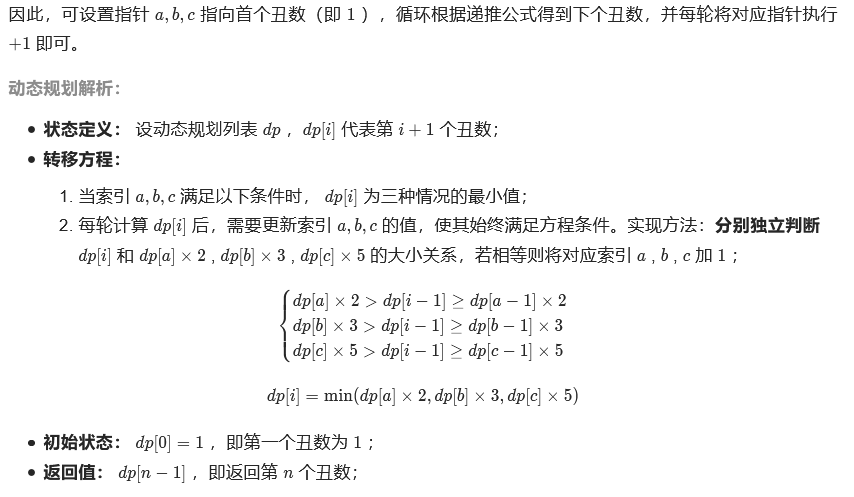
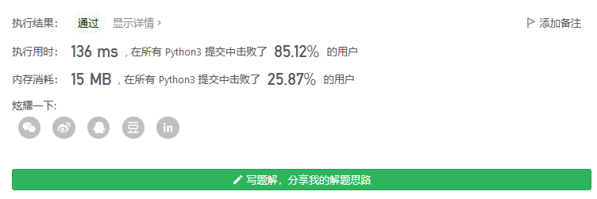

# 剑指offer

## 把数字翻译成字符串



```python
class Solution:
    def translateNum(self, num: int) -> int:
        num2char = {}
        for i in range(26):
            num2char[str(i)] = chr(ord('a')+i)

        res = []
        def findall(nums, path):
            if len(nums)==0:
                if path not in res:
                    res.append(path)
            elif len(nums)==1:
                findall([],path+num2char[nums[0]])
            else:
                findall(nums[1:],path+num2char[nums[0]])
                if int(nums[0]+nums[1])<26 and nums[0]!='0':
                    findall(nums[2:],path+num2char[nums[0]+nums[1]])

        findall([i for i in str(num)],'') 
        return len(res)
```



## 礼物的最大价值



动态规划，不要太简单。谁让我研究了一段时间动态时间规整呢^_^。

```python
class Solution:
    def maxValue(self, grid: List[List[int]]) -> int:
        for j in range(len(grid[0])):
            if j: grid[0][j] += grid[0][j-1]
        for i in range(len(grid)):
            if i: grid[i][0] += grid[i-1][0]
        if len(grid)>1 and len(grid[0])>1:
            for i in range(1,len(grid)):
                for j in range(1,len(grid[0])):
                    grid[i][j] += max(grid[i-1][j],grid[i][j-1])
            return grid[i][j]
        else:
            return max(max(grid))
```



## 最长不含重复字符的子字符串



```python
class Solution:
    def lengthOfLongestSubstring(self, s: str) -> int:
        if s:
            newstr = ''
            slist = []
            for i in s:
                if i not in newstr:
                    newstr += i
                else:
                    newstr = newstr[newstr.find(i):]
                    newstr += newstr[0]
                    newstr = newstr[1:]
                slist.append(len(newstr))
            return max(slist)
        else:
            return 0
```



## 丑数



### 解题思路






```python
class Solution:
    def nthUglyNumber(self, n: int) -> int:
        dp, a, b, c = [1] * n, 0, 0, 0
        for i in range(1, n):
            n2, n3, n5 = dp[a] * 2, dp[b] * 3, dp[c] * 5
            dp[i] = min(n2, n3, n5)
            if dp[i] == n2: a += 1
            if dp[i] == n3: b += 1
            if dp[i] == n5: c += 1
        return dp[-1]
```



## 第一个只出现一次的字符


```python
class Solution:
    def firstUniqChar(self, s: str) -> str:
        strset = []
        strnum = []
        for i in s:
            if i in strset:
                strnum[strset.index(i)] += 1
                continue
            else:
                strset.append(i)
                strnum.append(1)
        try:
            return strset[strnum.index(1)]
        except:
            return ' '
```

