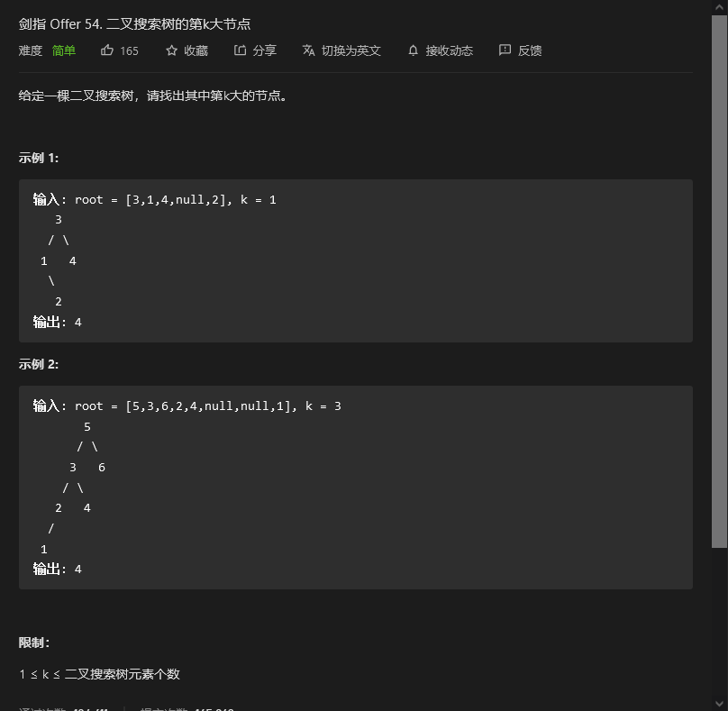

# 剑指offer

## 


```python

```


## 两个链表的第一个公共节点


```python
class Solution:
    def getIntersectionNode(self, headA: ListNode, headB: ListNode) -> ListNode:
        if headA == None or headB ==None:
            return 
        t1 = headA
        t2 = headB
        flag = -1
        while t1 != t2:
            if t1.next != None:
                t1 = t1.next 
            else:
                if flag==1:
                    break
                t1 = headB
                flag += 1
            t2 = t2.next if t2.next != None else headA
        if flag==1:
            return 
        else:
            return t1
```


## 在排序数组中查找数字I


```python
class Solution:
    def search(self, nums: List[int], target: int) -> int:
        if target not in nums:
            return 0
        first = nums.index(target)
        nums.reverse()
        end = nums.index(target)
        return (len(nums)-first-end)
```


## 0～n-1中缺失的数字


```python
class Solution:
    def missingNumber(self, nums: List[int]) -> int:
        first = 0
        end = len(nums)
        mid = (first+end)//2
        while end-first>1:
            if nums[mid] == mid:
                first = mid
            else:
                end = mid
            mid = (first+end)//2
        if first==nums[first]:
            return end
        else:
            return first
```


## 二叉搜索树的第k大节点



```python
class Solution:
    def kthLargest(self, root: TreeNode, k: int) -> int:
        res = []
        def findall(head):
            if head:
                findall(head.left)
                res.append(head.val)
                findall(head.right)
            else:
                return
        findall(root)
        return res[-k]
```

