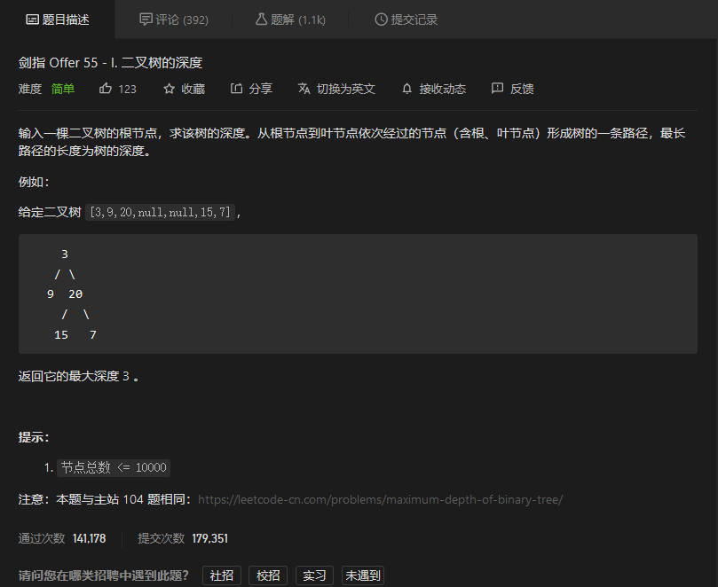
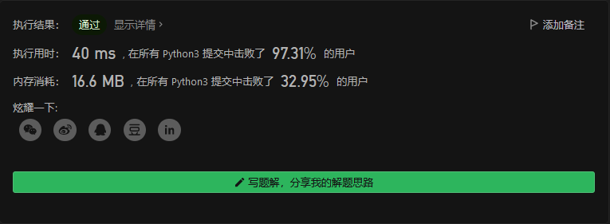
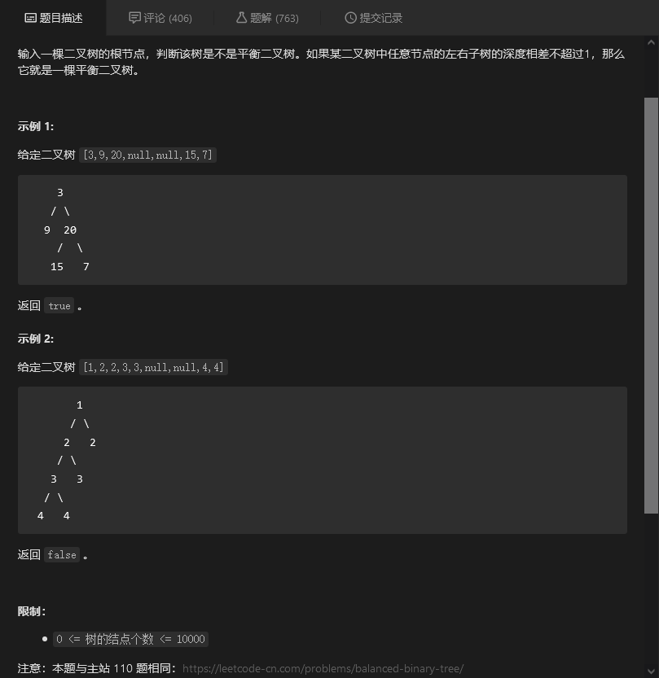
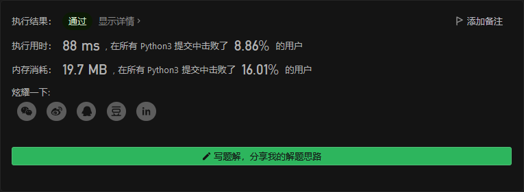
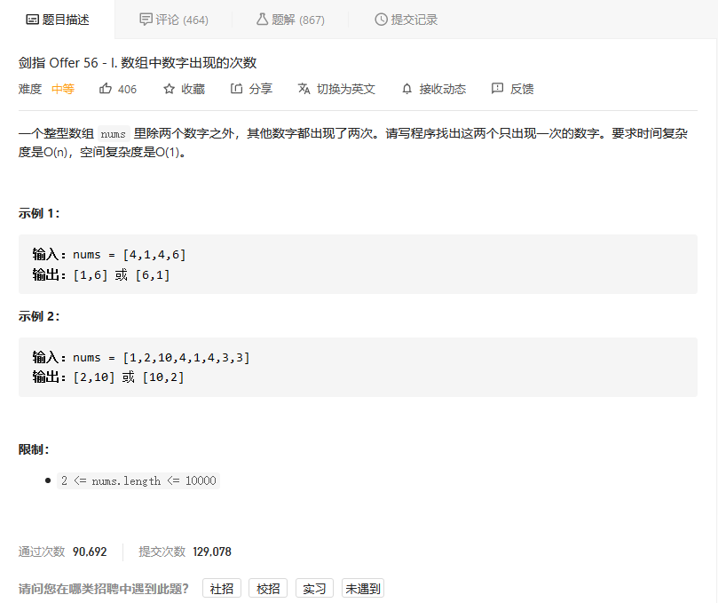
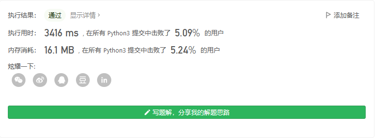
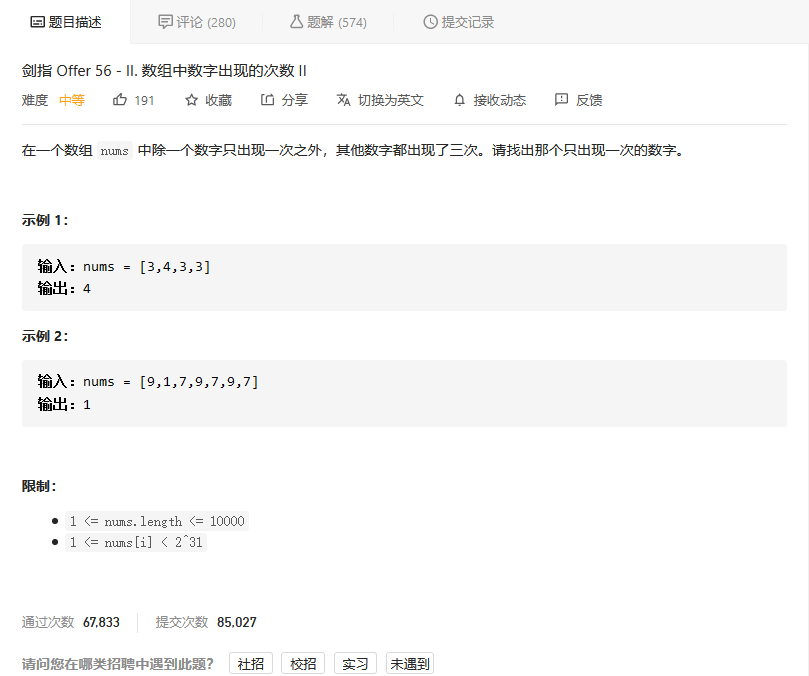
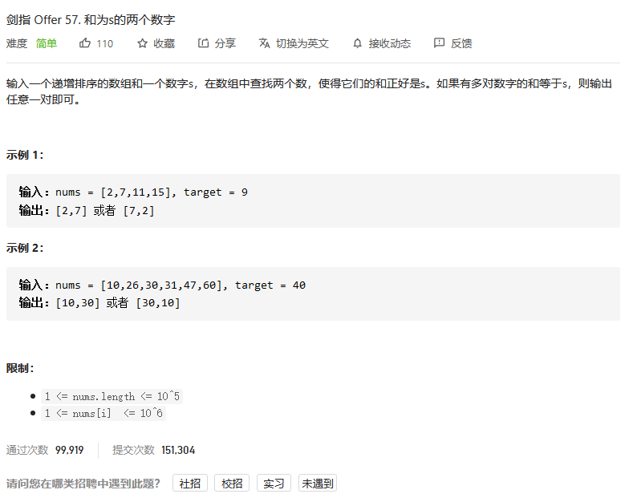
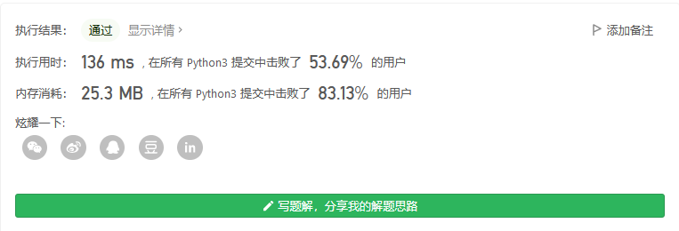

# 剑指offer

## 二叉树的深度



```python
class Solution:
    def maxDepth(self, root: TreeNode) -> int:
        if root:
            return 1+max(self.maxDepth(root.left),self.maxDepth(root.right))
        else:
            return 0
```



## 平衡二叉树



```python
class Solution:
    def isBalanced(self, root: TreeNode) -> bool:
        def maxDepth(node):
            if node:
                return 1+max(maxDepth(node.left),maxDepth(node.right))
            else:
                return 0
        
        def isb(node):
            return abs(maxDepth(root.left)-maxDepth(root.right))<=1 and self.isBalanced(root.left) and self.isBalanced(root.right)
            
        if root:
            return isb(root)
        else:
            return True
```



## 数组中数字出现的次数



### 暴力解法

```python
class Solution:
    def singleNumbers(self, nums: List[int]) -> List[int]:
        numset = set(nums)
        res = []
        for num in numset:
            if nums.count(num) == 1:
                res.append(num)
                if len(res) == 2:
                    break

        return res
```



### 分组异或

如果我们可以把所有数字分成两组，使得：

1. 两个只出现一次的数字在不同的组中；
2. 相同的数字会被分到相同的组中

那么对两个组分别进行异或操作，即可得到答案的两个数字。这是解决这个问题的关键。**那么如何实现这样的分组呢？**

1. 先对所有数字进行一次异或，得到两个出现一次的数字的异或值。
2. 在异或结果中找到任意为 1 的位。
3. 根据这一位对所有的数字进行分组
4. 在每个组内进行异或操作，得到两个数字。

```python
class Solution:
    def singleNumbers(self, nums: List[int]) -> List[int]:
        ret = functools.reduce(lambda x, y: x ^ y, nums)
        div = 1
        while div & ret == 0:
            div <<= 1
        a, b = 0, 0
        for n in nums:
            if n & div:
                a ^= n
            else:
                b ^= n
        return [a, b]
```


## 数组中数字出现的次数II



### 暴力解法

```python
class Solution:
    def singleNumber(self, nums: List[int]) -> int:
        numset = set(nums)
        for num in numset:
            if nums.count(num) == 1:
                return num
```


### 

```python

```


## 和为s的两个数字



```python
class Solution:
    def twoSum(self, nums: List[int], target: int) -> List[int]:
        # 双指针
        first = 0
        end = len(nums)-1
        res = []
        while nums[first] + nums[end] != target and first != end:
            if nums[first]+nums[end] > target:
                end -= 1
            else:
                first += 1
        if nums[first] + nums[end] == target:
            return [nums[first], nums[end]]
```

