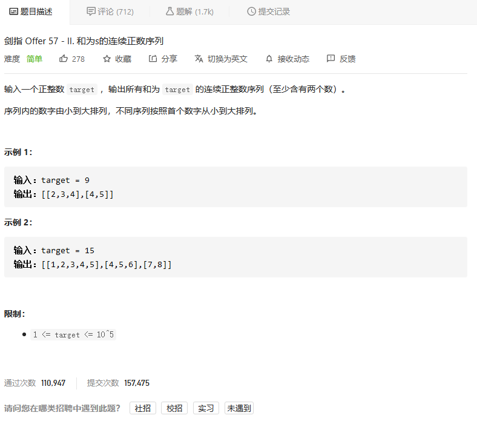
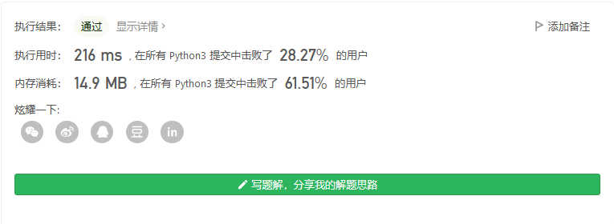
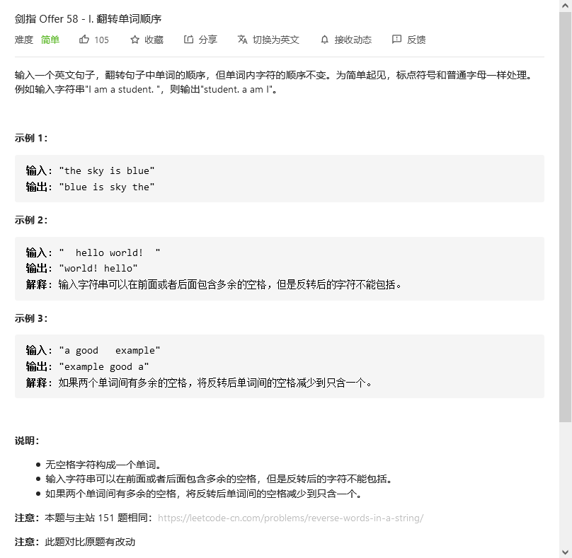
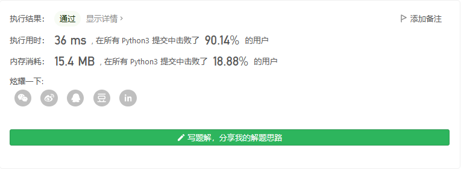
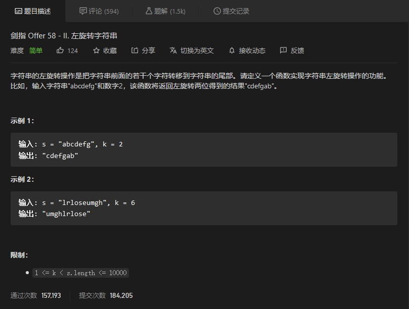
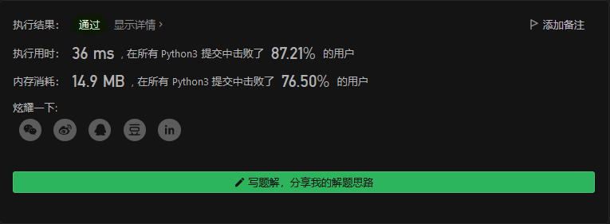
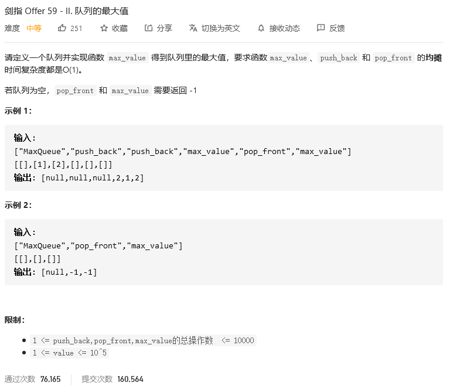
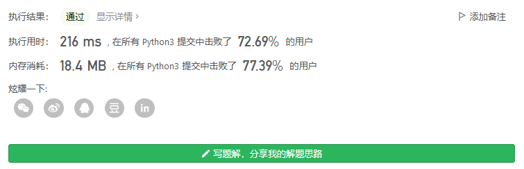

# 剑指offer

## 和为s的连续正数序列



```python
class Solution:
    def findContinuousSequence(self, target: int) -> List[List[int]]:
        res = []
        n = []
        nsum = 0
        for i in range(1,target):
            if nsum+i <target:
                nsum += i
                n.append(i)
            # elif nsum+i==target:
            #     nsum = target
            #     n.append(i)
            #     res.append(n.copy())
            else:
                while nsum + i >target:
                    nsum -= n.pop(0)
                n.append(i)
                nsum +=i
                if nsum==target:
                    res.append(n.copy())

        return res
```



## 翻转单词顺序



```python
class Solution:
    def reverseWords(self, s: str) -> str:
        s = s.split(' ')
        res = [i for i in s if i]
        res.reverse()
        s = ''
        for i in res:
            s += i + ' '
        s = s.strip(' ')
        return s
```



## 左旋转字符串



```python
class Solution:
    def reverseLeftWords(self, s: str, n: int) -> str:
        return s[n:]+s[:n]
```



## 


```python

```


## 队列的最大值



```python
class MaxQueue:

    def __init__(self):
        self.queue = collections.deque() 
        self.len = 0


    def max_value(self) -> int:
        if self.len:
            return max(self.queue)
        else:
            return -1

    def push_back(self, value: int) -> None:
        self.queue.append(value)
        self.len += 1


    def pop_front(self) -> int:
        if self.len:
            self.len -= 1
            return self.queue.popleft()
        else:
            return -1
```

