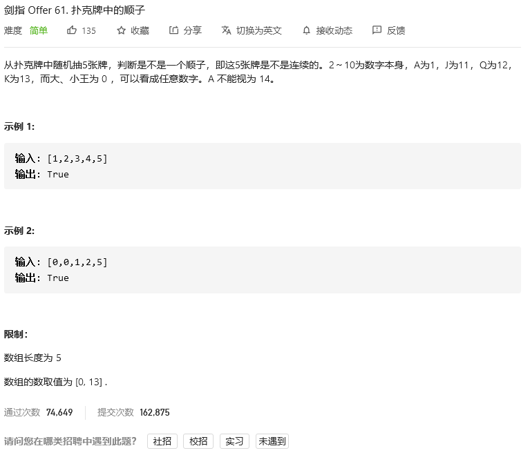
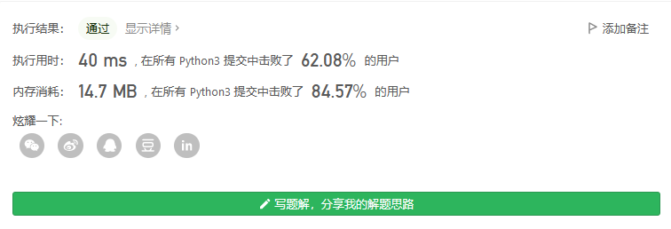
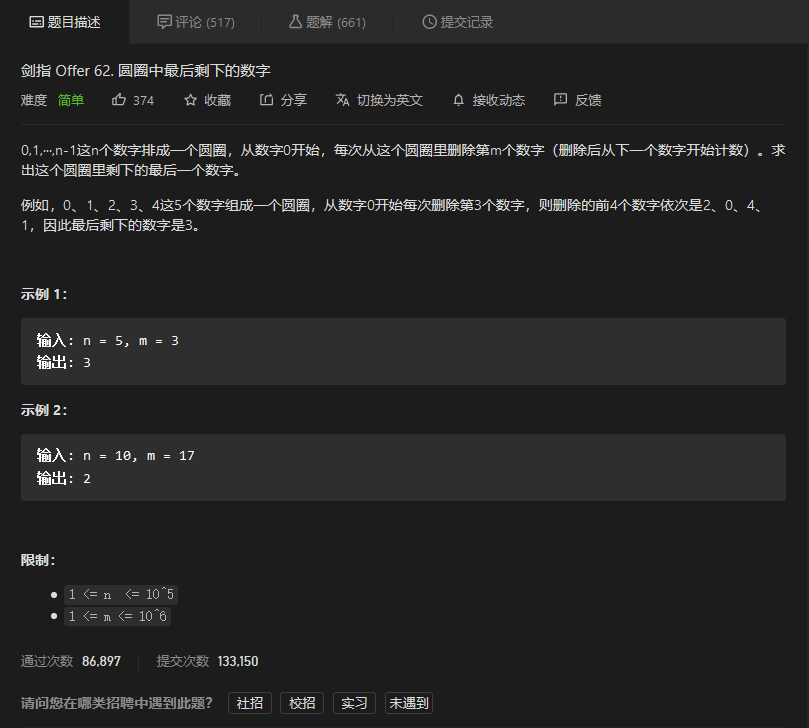
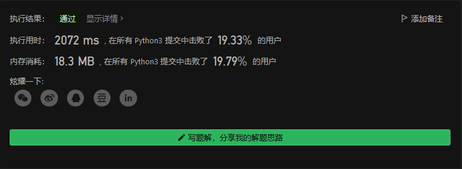
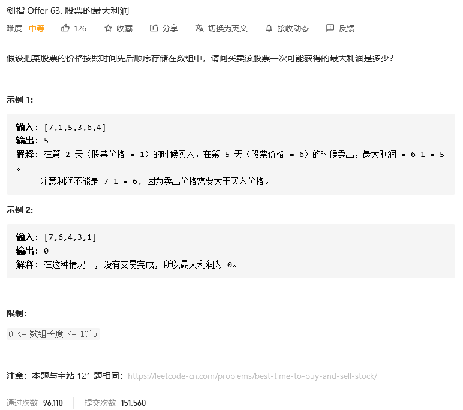
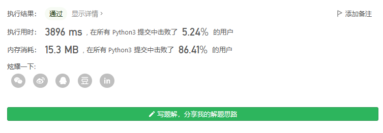
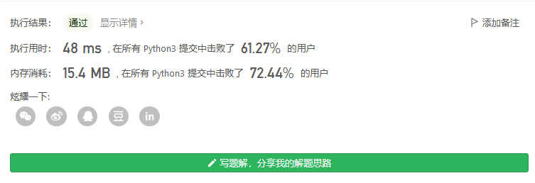
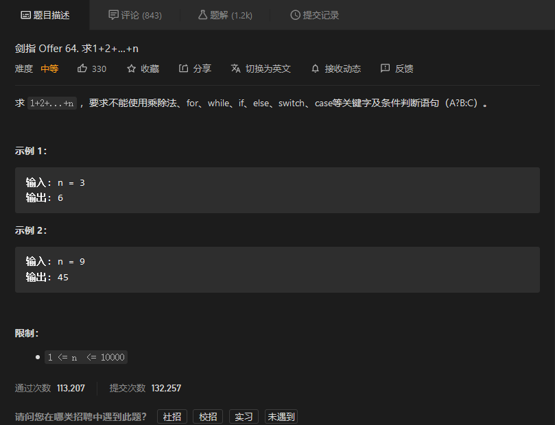
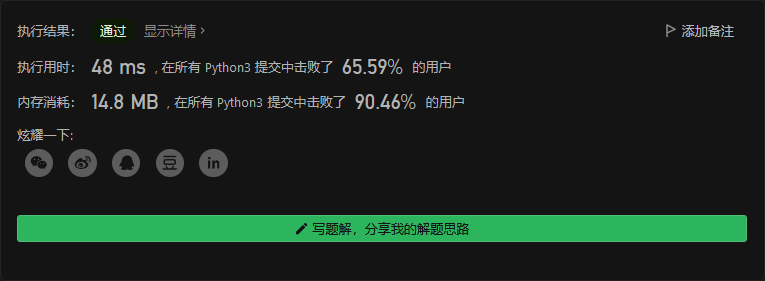

# 剑指offer

## 


```python

```


## 扑克牌中的顺子



```python
class Solution:
    def isStraight(self, nums: List[int]) -> bool:
        zeronum = 0
        numlist = []
        for i in nums:
            if i and i not in numlist:
                numlist.append(i)
            elif i==0:
                zeronum+=1
        if 5-len(numlist)>zeronum:
            return False
        elif max(numlist)-min(numlist)<5:
            return True
        else:
            return False
```



## 圆圈中最后剩下的数字



```python
class Solution:
    def lastRemaining(self, n: int, m: int) -> int:
        nums = [i for i in range(n)]
        index = 0
        while len(nums)>1:
            index = (index+m-1)%len(nums)
            nums.pop(index)
        return nums[0]
```



## 股票的最大利润



### 暴力解法

```python
class Solution:
    def maxProfit(self, prices: List[int]) -> int:
        if len(prices)<2:
            return 0
        maxmoney = 0
        for p in range(1,len(prices)):
            here = 0 if min(prices[:p])>= prices[p] else prices[p]-min(prices[:p])
            maxmoney = max(here, maxmoney)
        return maxmoney
```



### 记忆

```python
class Solution:
    def maxProfit(self, prices: List[int]) -> int:
        if len(prices)<2:
            return 0
        maxmoney = 0
        minprcie = prices[0]
        for p in range(1,len(prices)):
            here = 0 if minprcie >= prices[p] else prices[p]-minprcie
            maxmoney = max(here, maxmoney)
            minprcie = min(minprcie,prices[p])
        return maxmoney
```



## 求1+2+…+n



```python
class Solution:
    def sumNums(self, n: int) -> int:
        return (pow(n,2)+n)>>1
```

