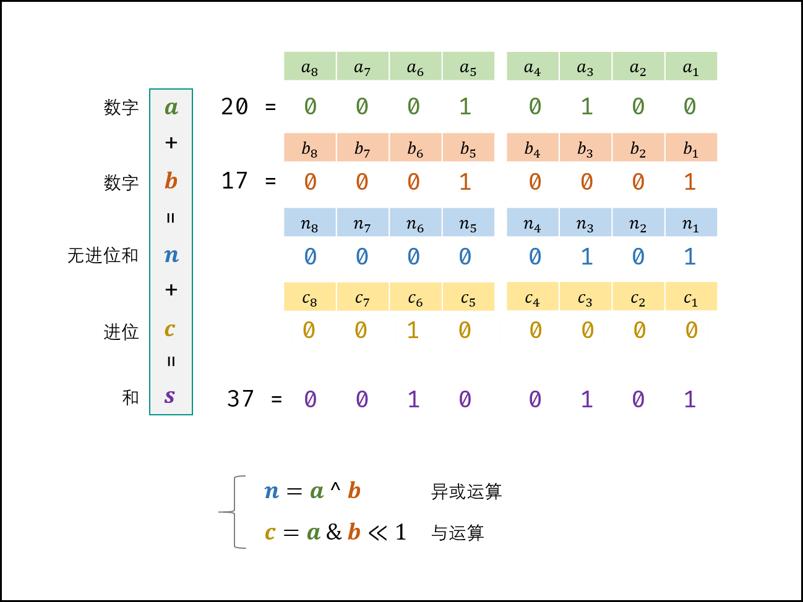
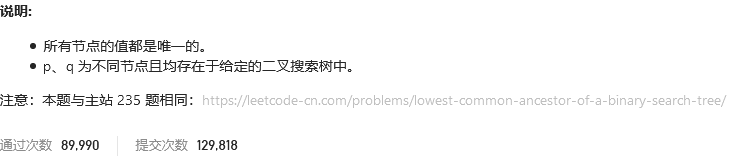

# 剑指offer

## 不用加减乘除做加法


### 位运算

本题考察对位运算的灵活使用，即使用位运算实现加法。

设两数字的二进制形式 `a,b` 其求和 `s=a+b`，`a(i)` 代表 `a` 的二进制第 `i` 位，则分为以下四种情况：

|`a(i)`|`b(i)`|**无进位和**`n(i)`|**进位**`c(i+1)`|
|:---:|:---:|:---:|:---:|
|0|0|0|0|
|0|1|1|0|
|1|0|1|0|
|1|1|0|1|

观察发现，**无进位和** 与 **异或运算** 规律相同，**进位** 和 **与运算** 规律相同（并**需左移一位**）。因此，无进位和 `n` 与进位 `c` 的计算公式如此。

（和s）=（非进位和n）+（进位c）。即可将 `s=a+b` 转化为：`s=a+b ==> s=n+c`.

循环求 n和 c ，直至进位 c=0；此时 s=n，返回 n 即可。




```python
class Solution:
    def add(self, a: int, b: int) -> int:
        x = 0xffffffff
        a, b = a & x, b & x
        while b != 0:
            a, b = (a ^ b), (a & b) << 1 & x
        return a if a <= 0x7fffffff else ~(a ^ x)
```


## 构建乘积数组


### 思路

1. 正向累乘
2. 反向累乘
3. 交叉相乘
   
```python
class Solution:
    def constructArr(self, a: List[int]) -> List[int]:
        B = [1]
        C = [1]
        for num in a:
            B.append(B[-1]*num)
        for i in range(len(a)-1,-1,-1):
            C.append(C[-1]*a[i])
        C.reverse()

        D = []
        for i in range(len(a)):
            D.append(B[i]*C[i+1])

        return D
```

```python
class Solution:
    def constructArr(self, a: List[int]) -> List[int]:
        B = [1]
        C = [1]
        for num in a:
            B.append(B[-1]*num)
        for i in range(len(a)-1,-1,-1):
            C.append(C[-1]*a[i])
        C.reverse()

        B.pop()
        for i in range(len(a)):
            B[i] *= C[i+1]

        return B
```


## 


```python

```


## 二叉搜索树的最近公共祖先




### [解题思路](https://leetcode-cn.com/problems/er-cha-sou-suo-shu-de-zui-jin-gong-gong-zu-xian-lcof/solution/mian-shi-ti-68-i-er-cha-sou-suo-shu-de-zui-jin-g-7/)

**祖先的定义**： 若节点 `p` 在节点 `root` 的左（右）子树中，或 `p=root` ，则称 `root` 是 `p` 的祖先。


**最近公共祖先的定义**： 设节点 `root` 为节点 `p,q` 的某公共祖先，若其左子节点 `root.left` 和右子节点 `root.right` 都不是 `p,q` 的公共祖先，则称 `root` 是 “最近的公共祖先” 。

根据以上定义，若 `root` 是 `p,q` 的 最近公共祖先 ，则只可能为以下情况之一：

1. `p` 和 `q` 在 `root` 的子树中，且分列 `root` 的 异侧（即分别在左、右子树中）；
2. `p=root`，且 `q` 在 `root` 的左或右子树中；
3. `q=root`，且 `p` 在 `root` 的左或右子树中；


本题给定了两个重要条件：① 树为 **二叉搜索树** ，② 树的所有节点的值都是 **唯一** 的。根据以上条件，可方便地判断 `p,q` 与 `root` 的子树关系，即：

1. 若 `root.val<p.val` ，则 `p` 在 `root` 右子树 中；
2. 若 `root.val>p.val` ，则 `p` 在 `root`  左子树 中；
3. 若 `root.val=p.val` ，则 `p` 在 `root` 指向 同一节点 。

### 方法一：迭代

1. **循环搜索**： 当节点 `root` 为空时跳出；
   1. 当 `p,q` 都在 `root` 的 右子树 中，则遍历至 `root.right` ；
   2. 否则，当 `p,q` 都在 `root` 的 左子树 中，则遍历至 `root.left`；
   3. 否则，说明找到了 `最近公共祖先` ，跳出。

```python
class Solution:
    def lowestCommonAncestor(self, root: 'TreeNode', p: 'TreeNode', q: 'TreeNode') -> 'TreeNode':
        while root:
            if root.val < p.val and root.val < q.val: # p,q 都在 root 的右子树中
                root = root.right # 遍历至右子节点
            elif root.val > p.val and root.val > q.val: # p,q 都在 root 的左子树中
                root = root.left # 遍历至左子节点
            else: break
        return root
```


优化：若可保证 `p.val<q.val` ，则在循环中可减少判断条件。

```python
class Solution:
    def lowestCommonAncestor(self, root: 'TreeNode', p: 'TreeNode', q: 'TreeNode') -> 'TreeNode':
        if p.val > q.val: p, q = q, p # 保证 p.val < q.val
        while root:
            if root.val < p.val: # p,q 都在 root 的右子树中
                root = root.right # 遍历至右子节点
            elif root.val > q.val: # p,q 都在 root 的左子树中
                root = root.left # 遍历至左子节点
            else: break
        return root
```


### 递归

1. **递推工作**：
   1. 当 `p,q` 都在 `root` 的 右子树 中，则开启递归 `root.right` 并返回；
   2. 否则，当 `p,q` 都在 `root` 的 左子树 中，则开启递归 `root.left` 并返回；
2. **返回值**： 最近公共祖先 `root` 。

```python
class Solution:
    def lowestCommonAncestor(self, root: 'TreeNode', p: 'TreeNode', q: 'TreeNode') -> 'TreeNode':
        if root.val < p.val:
            return self.lowestCommonAncestor(root.right, p, q)
        if root.val > q.val:
            return self.lowestCommonAncestor(root.left, p, q)
        return root
```


## 二叉树的最近公共祖先


### 递归

考虑通过**递归**对二叉树进行**后序遍历**，当遇到节点 `p` 或 `q` 时返回。从底至顶回溯，当节点 `p,q` 在节点 `root`的异侧时，节点 `root` 即为最近公共祖先，则向上返回 `root`。

1. **终止条件**：
   1. 当越过叶节点，则直接返回 `null`；
   2. 当 `root` 等于 `p,q` ，则直接返回 `root` ；
2. **递推工作**：
   1. 开启递归左子节点，返回值记为 `left` ；
   2. 开启递归右子节点，返回值记为 `right` ；
3. **返回值**： 根据 `left` 和 `right` ，可展开为四种情况；
   1. 当 `left` 和 `right` 同时为空 ：说明 `p,q` 的左 / 右子树中都不包含 `p,q` ，返回 `null` ；
   2. 当 `left` 和 `right` 同时不为空 ：说明 `p,q` 分列在 `root` 的 异侧 （分别在 左 / 右子树），因此 `root` 为最近公共祖先，返回 `root` ；
   3. 当 `left` 为空 ，`right` 不为空 ：`p,q` 都不在 `root` 的左子树中，直接返回 `right` 。具体可分为两种情况：
      1. `p,q` 其中一个在 `root` 的 右子树 中，此时`right` 指向 `p`（假设为 `p`）；
      2. `p,q` 两节点都在 `root` 的 右子树 中，此时的 `right` 指向 最近公共祖先节点 ；
   4. 当 `left` 不为空 ， `right` 为空 ：与情况 `3`. 同理；

```python
class Solution:
    def lowestCommonAncestor(self, root: TreeNode, p: TreeNode, q: TreeNode) -> TreeNode:
        if not root or root == p or root == q: return root
        left = self.lowestCommonAncestor(root.left, p, q)
        right = self.lowestCommonAncestor(root.right, p, q)
        if not left: return right
        if not right: return left
        return root
```

