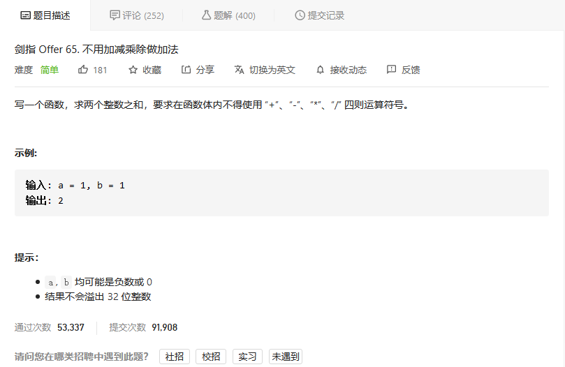

# 剑指offer

## 不用加减乘除做加法



### 位运算

本题考察对位运算的灵活使用，即使用位运算实现加法。

设两数字的二进制形式 `a,b` 其求和 `s=a+b`，`a(i)` 代表 `a` 的二进制第 `i` 位，则分为以下四种情况：

|`a(i)`|`b(i)`|**无进位和**`n(i)`|**进位**`c(i+1)`|
|:---:|:---:|:---:|:---:|
|0|0|0|0|
|0|1|1|0|
|1|0|1|0|
|1|1|0|1|

观察发现，**无进位和** 与 **异或运算** 规律相同，**进位** 和 **与运算** 规律相同（并**需左移一位**）。因此，无进位和 `n` 与进位 `c` 的计算公式如此。

（和s）=（非进位和n）+（进位c）。即可将 `s=a+b` 转化为：`s=a+b ==> s=n+c`.

循环求 n和 c ，直至进位 c=0；此时 s=n，返回 n 即可。


```python
class Solution:
    def add(self, a: int, b: int) -> int:
        x = 0xffffffff
        a, b = a & x, b & x
        while b != 0:
            a, b = (a ^ b), (a & b) << 1 & x
        return a if a <= 0x7fffffff else ~(a ^ x)
```


## 


```python

```


## 


```python

```


## 


```python

```


## 


```python

```

